# VMs Download and Setup
## Downloading
- First of all, we need to go and download [VirtualBox](https://www.virtualbox.org/wiki/Downloads), as we will be using it to make a full virtual environment. 
- Next, we download the virtual machine images from their corresponding websites. For this lab, we will be using Ubuntu Server and Kali.
    - [Ubuntu Server](https://ubuntu.com/download) — This will be used to mimic real servers within a enterprise environment.
    - [Kali Linux](https://www.kali.org/get-kali/#kali-platforms)— Kali has many tools that we can quickly use to attack our network.
## Setup 
After downloading those images, we need to setup the VMs. We initially need 3 VMs.    
- A firewall VM, which will connect between all the networks and filter traffic based on the rules we set.
- A DMZ VM, which will host a reverse proxy and SSH beacon for us to be able to connect from the admin computer.
- A kali VM located outside to attack the network.

---
### Example:
 For example, we can setup the firewall VM as follows:

- Basically, we rename the VM, choose the Ubuntu Server image we downloaded, and select where we store the VM files.
<p align="center">
  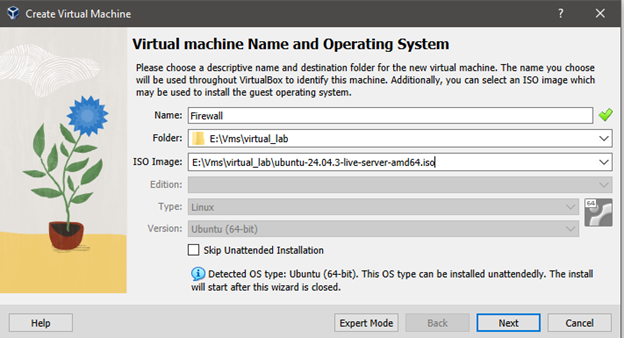
</p>

- The next step will ask you to enter Username, password, hostname, and domain name, but we this can all be configured within the initialization of the OS in the VM.
- Next, you should choose the amount of RAM and CPU you want the firewall to have. The firewall should not need a lot of resources, since it will only route traffic.
<p align="center">
  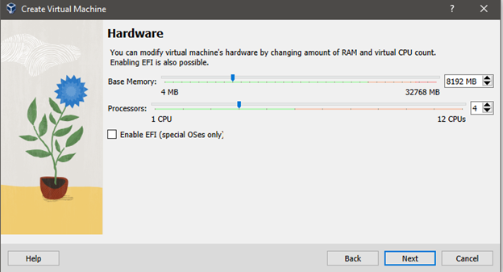
</p>

- Now you can go ahead and run the VM.
- Running the VMs for the first, you will need to setup some options inside the VM. The only important thing here is to  provide a username and a password that you will remember.
- You need to repeat the above steps for every VM.

---
# VirtualBox Network Settings Configuration

An important step in the process is to correctly setup network interfaces.

- **Note, before you complete this step, download the appropriate network troubleshooting tools, like net-tools, since you will lose internet connection until you correctly configure routing through the firewall.**

## Create Host-Only Networks
To mimic a network virtually, we can create two host-only networks for the internal and DMZ networks.

- Navigate in VirtualBox to Tools > Host-Only Networks
- Here you need to create two networks and configure them as follows:
<p align="center">
  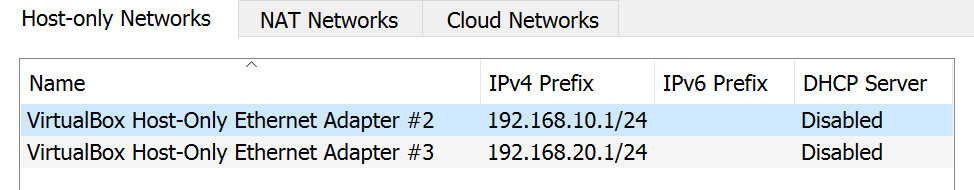
</p>
<p align="center">
  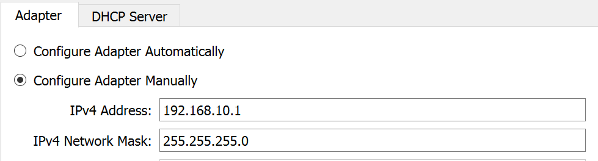
</p>
<p align="center">
  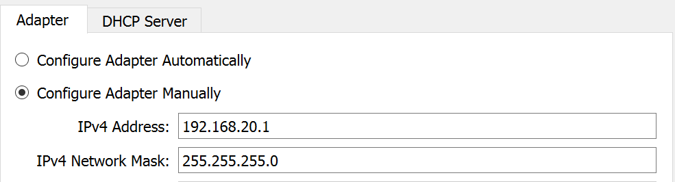
</p>

- Here, we will use the network 192.168.10.1/24 as the DMZ network.
- and 192.168.20.1/24 for the internal network.

## Create the Network Interfaces for the VMs.

### Firewall
For the firewall, we will need 3 interfaces, one for each network segment.
- The first one will be set to "Bridged Adapter". This will allow the firewall to act as if it is a computer within my home network. Thus, I can communicate with this VM from my computer and from the Kali linux VM.

<p align="center">
  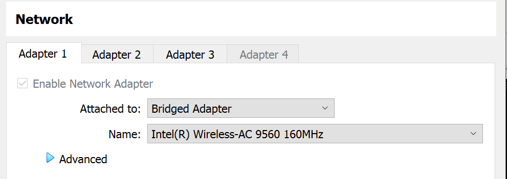
</p>

- The second interface will be connected to the DMZ network.

<p align="center">
  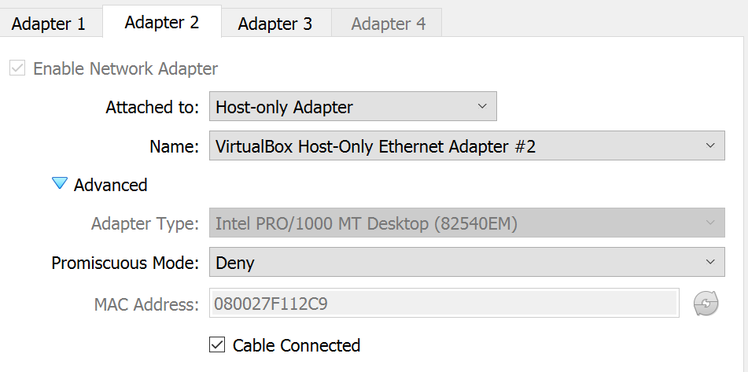
</p>

- The last interface will be connected to the internal network.
<p align="center">
  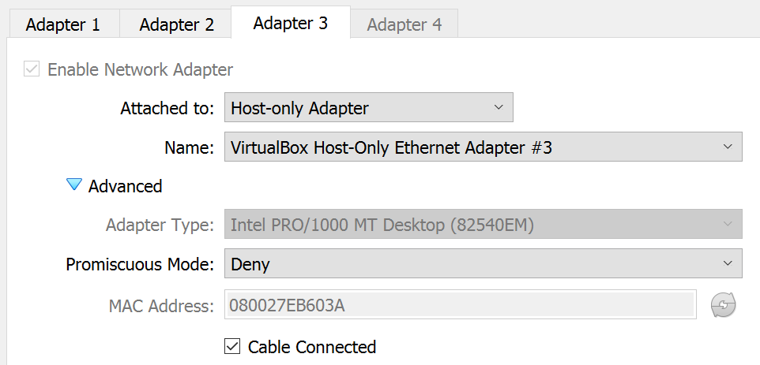
</p>

### Kali

The kali interface will simply be a "Bridged Adapter". This means that your host machine, firewall, and kali linux will be on the same Home network, and they will receive their IP addresses from your home router. This simplifies the setup procedure but note that your home router may keep assigning different IPs to the different computers. You can choose static IPs by configuring you home router and you network settings on each machine manually.

<p align="center">
  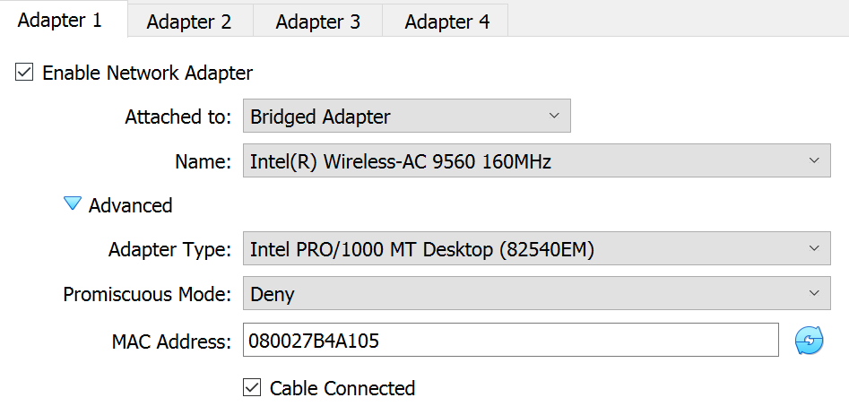
</p>

### DMZ
Lastly, you need to configure the dmz VM to connect to the DMZ interface as follows:

<p align="center">
  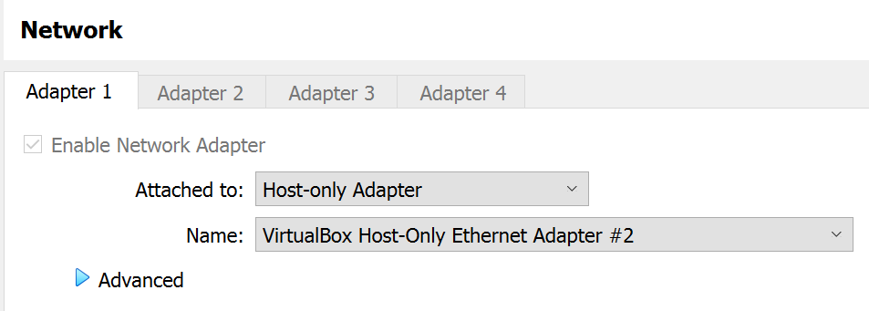
</p>

---
# Network Settings Configuration VM
Now, inside the VMs, we need to identify the correct interface name and to which network it belongs. Then, we configure those interface to with the correct settings, such as IP address, DNS name,

### Firewall
The fire wall will have the most complex setup procedure as it has 3 network interface that we need to configure. 

- First, we need to launch the VM and execute 

```
ip link
```

<p align="center">
  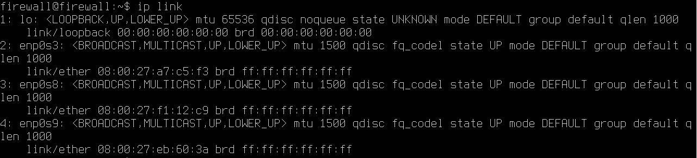
</p>

This command will reveal the name of the network interfaces as well as their MAC addresses. This information is important as it will allow us to identify which interface belongs to which network in VirtualBox. 

For example, interface ***enp0s8*** has a MAC address of **08:00:27:F1:12:C9**. Going back to the network interface screenshots,  we see that the interface that ends "12C9" is an interface connected to "VirtualBox Host-Only Ethernet Adapter #2, which is the DMZ network.

<p align="center">
  
</p>

Thus, the interface ***enp0s8*** must be configured with the IP address of the DMZ. 

- After identifying which interface belongs to which network, we can configure the network interface by editing the network configuration file at: **/etc/netplan/*.yaml**. It should be the only .yaml file under the netplan directory

```[yaml]
network:
  version: 2
  ethernets:
    enp0s3:
      dhcp4: true
    enp0s8:
      addresses: [192.168.10.1/24]
    enp0s9:
      addresses: [192.168.20.1/24]
```
The above configuration assigns each network interface its correct IP address, and subnet mask. 

For example, **enp0s8** is assigned:
- The IP address: 192.168.10.1, 
- and the subnet mask 255.255.255.0 **(/24)**

Essentially, this configures this interface to connect to the DMZ network, to which the DMZ VM will also be connected.

- Finally, you execute this command to apply the changes to the system:
```
sudo netplan apply
```

 **Note: If your firewall's IP address keeps changing, you need to configure a fixed IP value. You may also need to configure your home router to assign a fixed IP address to firewall VM (which requires access to your home router). This can be done as follows for example:**

```
network:
  version: 2
  ethernets:
    enp0s3:
      addresses: [192.168.33.6/24] 
      routes:
        - to: 0.0.0.0/0
          via: 192.168.33.1        # your WAN gateway
      nameservers:
        addresses: [8.8.8.8, 1.1.1.1]

    enp0s8:
      addresses: [192.168.10.1/24]

    enp0s9:
      addresses: [192.168.20.1/24]
```
### DMZ VM
The DMZ VM is much simpler to setup since we only have one interface that should be connected to the DMZ network.

- Here we also identify the name of the interface using ***ip link*** command.

<p align="center">
  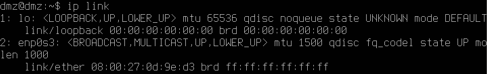
</p>

- The name of interface is **enp0s3** and we should now configure it from the same .yaml file:

```[yaml]
network:
  version: 2
  ethernets:
    enp0s3:
      addresses: [192.168.10.2/24]
      routes:
        - to: 0.0.0.0/0
          via: 192.168.10.1
      nameservers:
        addresses: [8.8.8.8, 1.1.1.1]
```
The configuration assigns:
- the IP address 192.168.10.2 to the VM,
- the subnet 255.255.255.0,
- the route 192.168.10.1 as the default ip for all traffic on this interface.
- an the domain name servers 8.8.8.8 and 1.1.1.1

After saving the changes, we apply with the following command:
```
sudo netplan apply
```
### Testing
Now, you should be able to ping the firewall VM from DMZ VM and vice versa.
<p align="center">
  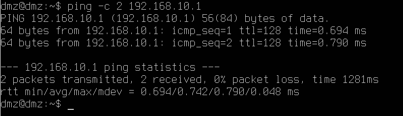
</p>

 **Note: However, you will still not be able to use the dmz for external traffic since the firewall routing is not configured yet.**

---
# Firewall Routing Setup

Currently, the firewall does not know how to route external ingress/egress traffic, and by default, routing is disabled on the VM.

### Routing Activation
First we need to activate routing, which can simply be achieved by:

- Editing */etc/sysctl.conf* file

```
sudo nano /etc/sysctl.conf
```
- Appending/Uncommenting the following config in the file:
```
net.ipv4.ip_forward=1
```
- and applying the changes:
```
sudo sysctl -p
```

### Internal Traffic Routing
By default, Ubuntu contains a firewall program called **Iptables**, which we can use to route traffic from in/out of the network.

First, we would like the firewall to route  any traffic from the DMZ to outside. To do this, we use the following command:

```
sudo iptables -t nat -A POSTROUTING -s 192.168.10.0/24 -o enp0s3 -j MASQUERADE
```
Basically, this rule tells the firewall that any traffic originating from the network 192.168.168.10.0/24 should have its IP address replaced with the firewall's IP. This helps my Home network route the traffic back to the firewall, and then back to the DMZ vm.

We do not need any additional rules for know since the default behavior of the firewall is to allow all the traffic (i.e., it does not filter any traffic yet).

### DMZ -> External Test
Now we should be able to connect to the internet using the DMZ machine through the firewall. We can test that by tracing the packet's route with the following command:

<p align="center">
  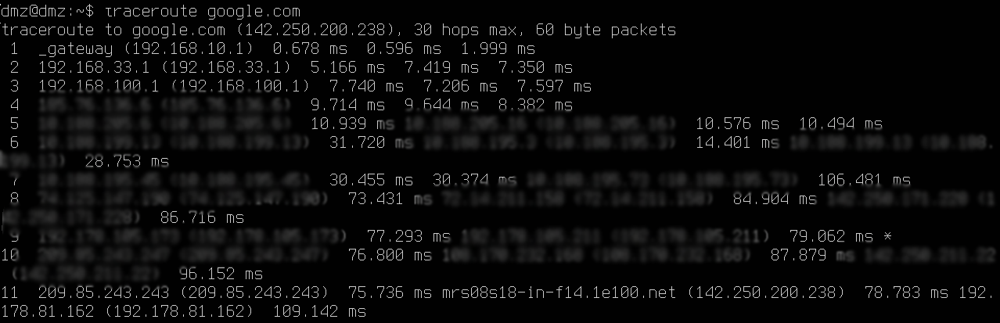
</p>

The trace shows that the packets to google.com are being directed through "192.168.10.1", which is the firewall and then externally.

### External Traffic Routing Plan

Now we are able to send traffic from the DMZ to outside, but not the other way around. That's, even though traffic going out of the firewall can be routed back, new external traffic cannot traverse the firewall. 

For that, we need to route external tell the firewall which traffic we want to go through to the DMZ. Since we will be hosting an SSH beacon and a reverse proxy, we need map ports: 22, 80 and 443 to the DMZ VM. 

### Nginx and SSH Server Downloading and Running 

To be able to test the rules that we add, we should run the services first. To Install an SSH-Server we use the following series of commands:
```
sudo apt install openssh-server -y
sudo systemctl status ssh
sudo systemctl enable ssh
```
This will download openssh server, enable it, and set it run even after reboots.

Similarly, to install Nginx:
```
sudo apt install nginx -y
sudo systemctl enable nginx
sudo systemctl start nginx
```

From the firewall, you should be able to ssh and curl to the DMZ VM.

<p align="center">
  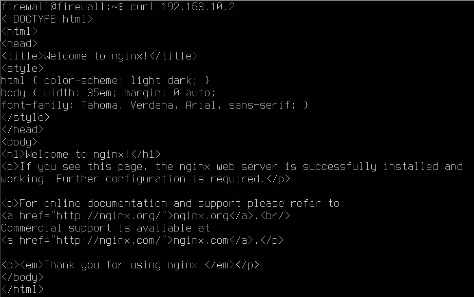
</p>

### External Traffic Routing Rules
To route external traffic to the DMZ VM, we need to execute the following commands on the firewall:
```
sudo iptables -t nat -A PREROUTING -i enp0s3 -p tcp --dport 22 -j DNAT --to-destination 192.168.10.2:22
sudo iptables -t nat -A PREROUTING -i enp0s3 -p tcp --dport 80 -j DNAT --to-destination 192.168.10.2:80
sudo iptables -t nat -A PREROUTING -i enp0s3 -p tcp --dport 443 -j DNAT --to-destination 192.168.10.2:443
```
This tells the firewall that any traffic coming from interface **enp0s3** headed to TCP ports 22,80, or 443 should be routed to the DMZ VM.


| External Port  | Destination Address | 
|-----------------|---------------------|
| 22 | 192.168.10.2:22  | 
| 80 | 192.168.10.2:80  | 
| 443 | 192.168.10.2:443| 
---
# Accessing The Services
Now that the routing rules are added, we can access the internal services within the DMZ.

### Reverse Proxy From Admin Computer
Visiting the website http://192.168.33.6 is now possible from the admin's computer.
<p align="center">
  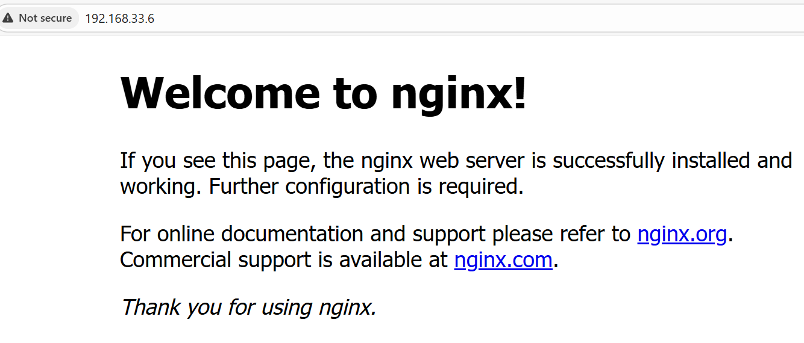
</p>

### SSH From Admin Computer
The admin can also now use SSH to connect to the DMZ VM.
<p align="center">
  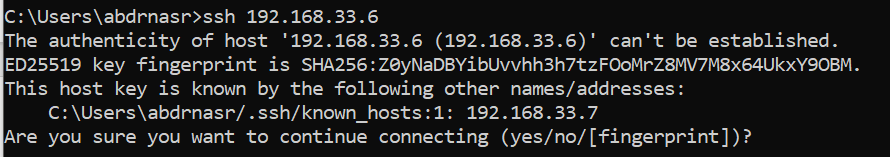
</p>

# Attacking

## Example Attacks
Now that we have setup the networks, the firewall, and DMZ VM. We can start attacking these services using the **kali** machine.

### SSH Brute Force
Now, we perform SSH brute force attack from the kali machine.
<p align="center">
  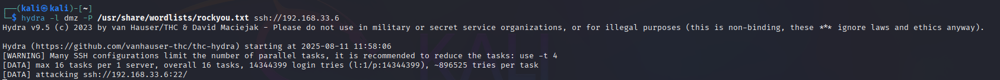
</p>

### Port Scanning
We can perform port scanning like so: 
<p align="center">
  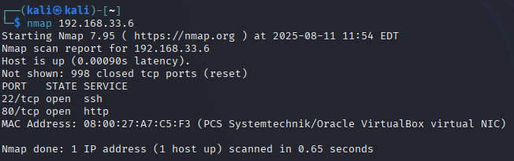
</p>

---
# Security Considerations
## Attack Detection
With our current setup, the only way to see the these attacks is by looking at the network traffic on the interface of the VMs. However, there various problems with this approach:

- Attack traffic is usually hard to detect especially if there is other traffic moving through the firewall.
- We do not have SSH access to the firewall, and so the only way to see the traffic is by physically opening the VM and watching the traffic (which is not practical).
- We do not have an easy way to store/filter/analyze the traffic.

Without a system to collect the traffic from the firewall and the other VMs, it will be hard to detect attacks.

## Points To Consider
- The firewall now is not restrictive. It allows packets to flow in and out without filtering, as the default action is to accept the traffic. The problem here is that the internal users of the network may be able to access any website externally and download malware on the system.

- External traffic can only reach the DMZ if the destination port is 22,80, or 443. Thus, these ports are part of the attack surface and need to be secured. 

- Currently, SSH uses password based-authentication which is generally weaker than public-key-based authentication. 

- There is no encryption for the web traffic, because we are not using TLS yet.

---

# Technical Summary

This lab demonstrates how to build a virtual enterprise-like network environment using `VirtualBox`, `Ubuntu Server`, and `Kali Linux`. The objective is to configure a firewall, set up a DMZ with services, and simulate attacks using `Kali` to test the configuration.

`VirtualBox` must be installed, followed by downloading `Ubuntu Server` (to be used for the firewall and DMZ) and `Kali Linux`(to act as the external attacker). Three virtual machines are created: the `firewall VM`, which will connect all network segments and enforce traffic rules; the `DMZ VM`, which will host an `SSH beacon` and a `reverse proxy (Nginx)`; and the Kali VM, which will be used to launch attacks. Inside `VirtualBox`, two host-only networks are created—`192.168.10.0/24` for the DMZ and `192.168.20.0/24` for the internal network. The firewall is assigned three interfaces (WAN via bridged mode, DMZ via host-only, and internal via host-only), the DMZ VM is connected to the DMZ network, and the `Kali VM` is set to bridged mode.

Within the VMs, network interfaces are identified using the `ip link` command. The firewall is configured with static IPs: WAN receives DHCP or a static address, the DMZ interface is given `192.168.10.1/24`, and the internal network is given `192.168.20.1/24`. The `DMZ VM` is configured with IP `192.168.10.2/24`, gateway `192.168.10.1`, and DNS servers `8.8.8.8` and `1.1.1.1`. These configurations are applied using `netplan`. Connectivity is tested by pinging between the firewall and the DMZ VM.

Routing is then enabled on the firewall by editing `/etc/sysctl.conf` to allow IP forwarding and applying it with `sysctl -p`. NAT is configured using `iptables` to masquerade outgoing traffic from the DMZ through the firewall’s WAN interface. This allows the DMZ VM to access the internet via the firewall, which can be verified using traceroute.

Services are then deployed on the `DMZ VM`. The `OpenSSH server` is installed and enabled, providing SSH access, while `Nginx` is installed and started to serve HTTP traffic. These services are tested from the firewall using SSH and curl commands. Next, firewall rules are configured to forward external traffic to the `DMZ VM`. Specifically, `iptables` PREROUTING rules are added to redirect TCP ports 22, 80, and 443 to the `DMZ VM` at `192.168.10.2`. This allows the admin computer to access the DMZ services directly via the firewall’s WAN IP address, enabling both HTTP access to the hosted `Nginx server` and SSH login to the `DMZ VM`.

Finally, with the environment operational, attacks are performed using the `Kali` machine. SSH brute force attacks are attempted against the `DMZ SSH` service, and `Nmap` is used for port scanning to discover exposed services. These simulated attacks demonstrate the purpose of the setup: creating a controlled virtual lab environment to understand network segmentation, firewall routing, DMZ configuration, and basic offensive security techniques.


