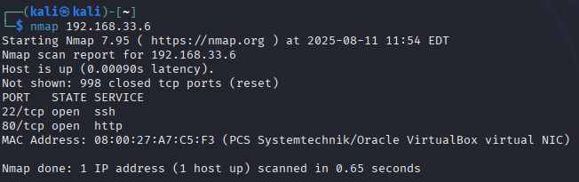

# Enterprise Cybersecurity & DevSecOps Environment Project – Phase 1: Core Network Infrastructure

## Overview
Phase 1 lays the foundation for our project with **three core virtual machines** that mimic a segmented enterprise network:
- **Firewall** – Acts as the gateway between networks.
- **DMZ Server** – Public-facing with limited services.
- **External Attacker** – Simulates real-world cyber threats.

---
## Virtual Machines Used

| VM Name        | Role                | Description                                                                 |
|-----------------|---------------------|-----------------------------------------------------------------------------|
| **Kali Attacker** | External Attacker   | Simulates real-world attacks from the internet. |
| **Firewall VM**   | Network Gateway     | Segments the external network from DMZ and internal systems. |
| **DMZ VM**        | Public-facing Server| Hosts SSH server and `Nginx` reverse proxy services. |

---
## Phase Goals
By the end of Phase 1:
- All 3 VMs are running, positioned, & networked correctly.
- Firewall routes appropriate traffic between the `DMZ VM` and the external network.
- Reverse proxy and SSH beacon are accessible for external users, including users, admins and attackers.
- Demonstrated risks of **no monitoring or detection**.

---

## Testing Scenarios

- Benign User:
  - Admins can connect to the environment and manage it via the DMZ server
  - External user of the environment can access the Web Server (`Nginx` Reverse Proxy)
- Attackers:
  - A simulated hacker scanning and attacking the network.
  - How lack of monitoring allows undetected access attempts.

---

## Demo & Results – Non-Technical Overview 

### Benign Users
#### Admin can connect to the DMZ server and control it.

  

 This image shows that, I as an **admin**, can now control the publicly exposed DMZ server, which allows me to deploy services, control this machine, and manage the entire environment.

### External users can connect to the web server (reverse proxy).

  

This means that we can now start providing services to external users. For example, it is possible now to deploy a website and allow users to interact with it.

---
### Attackers

#### Simulated Attacks
1. **Brute-force Attack**

  

- This image shows an attacker attempting to gain access to the DMZ server using brute-force.

2. **Port Scanning Attack**

  

- This image shows a successful port scan. This allows attackers to know which services are exposed and plan for attacks.

### No Logging
With our current setup, both of these attacks went undetected because there is no logging, alerting, or monitoring. This will be addressed in later stages, however.

---
## Known Limitations (Addressed in Later Phases)
- No monitoring/logging/alerting yet, so attacks go undetected.
- No brute-force detection, which can degrade the environment's efficiency by consuming network bandwidth, processing power, and compete with other legitimate users
- No real services being provided by the network yet.

---
## **For Technical Readers:**  
See **[Lab Steps – Phase 1](lab-steps-phase-1.md)** for detailed VM setup, network configuration, and service installation instructions.

---
## Next Step
Move to **[Phase 2 – Internal Web App + IAM Integration](../phase2_app_iam/readme.md)**, where we will install and configure an Identity and Access Management (IAM) system, and will deploy a `Next.js` app with `MySQL` as the database.