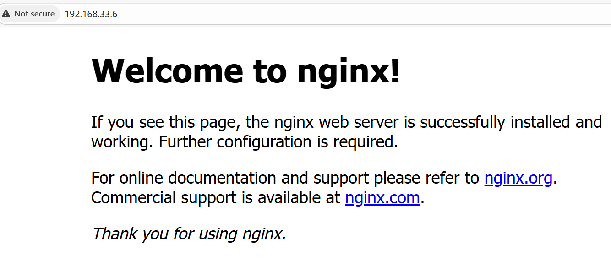

# 🔐 Enterprise Cybersecurity & DevSecOps Environment Project – Phase 1: Core Network Infrastructure

---

## 📌 Overview
Phase 1 lays the foundation for our lab with **three core virtual machines** that mimic a segmented enterprise network:
- **Firewall** – Acts as the gateway between networks.
- **DMZ Server** – Public-facing with limited services.
- **External Attacker** – Simulates real-world cyber threats.

---

## 🧱 Virtual Machines Used

| VM Name        | Role                | Description                                                                 |
|-----------------|---------------------|-----------------------------------------------------------------------------|
| **Kali Attacker** | External Attacker   | Simulates real-world attacks from the internet. |
| **Firewall VM**   | Network Gateway     | Segments the external network from DMZ and internal systems. |
| **DMZ VM**        | Public-facing Server| Hosts SSH and NGINX reverse proxy services. |

---

## 🎯 Phase Goals
By the end of Phase 1:
- All 3 VMs are running and networked correctly.
- Firewall routes appropriate traffic between the DMZ VM and the external network.
- Reverse proxy and SSH beacon are accessible for external users, including users, admins and attackers.
- Demonstrated risks of **no monitoring or detection**.

---

## 📽️ Demo & Results – Non-Technical Overview 

### Benign User
#### Admin can connect to the DMZ server and control it.

  

 This image shows that, I as an admin, can now control the publicly exposed server, which allows me to deploy services and control this machine.

### External users can connect to the web server (reverse proxy).

  

This means that we can now start providing services to external users.

### Attacker
- A simulated hacker scanning and attacking.
- How lack of monitoring allows undetected access attempts.

#### Brute-force Attack

  

- This image shows an attacker attempting to gain access to the DMZ server using brute-force.

#### Port Scanning Attack

  

- This image shows a successful port scan. This allows attackers to know which services are exposed and plan for attacks.

---

## ⚠️ Known Limitations
- No monitoring/logging yet, so attacks go undetected.
- No brute-force detection.
- No central alerting.
- No real services being provided by the network.

---

## 📄 **For Technical Readers:**  
See **[Lab Steps – Phase 1](lab-steps-phase-1.md)** for detailed VM setup, network configuration, and service installation instructions.

---

## ✅ Next Step
Move to **[Phase 2 – Monitoring & Detection](../phase2_app_iam/readme.md)**.