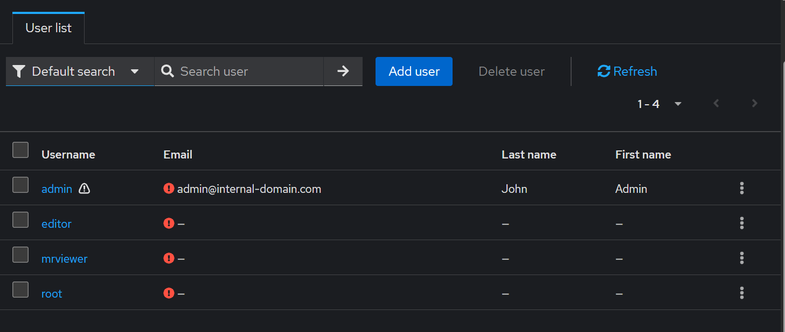
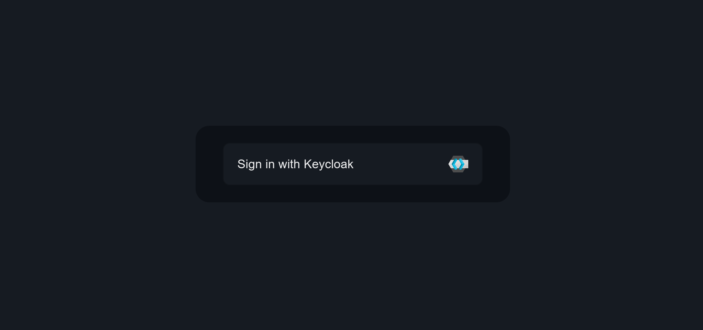
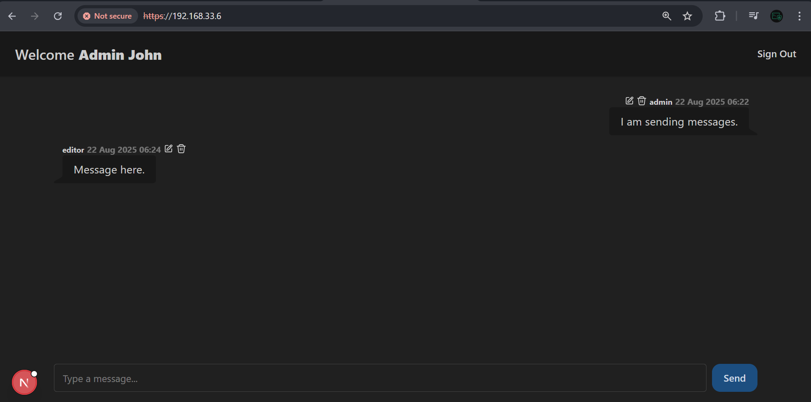
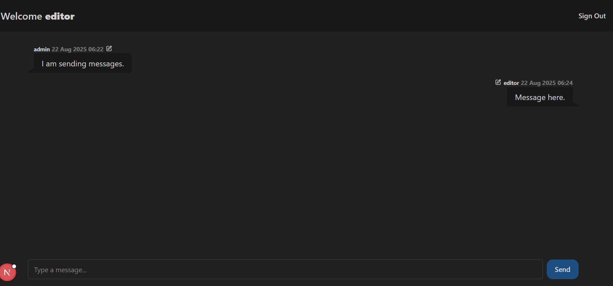
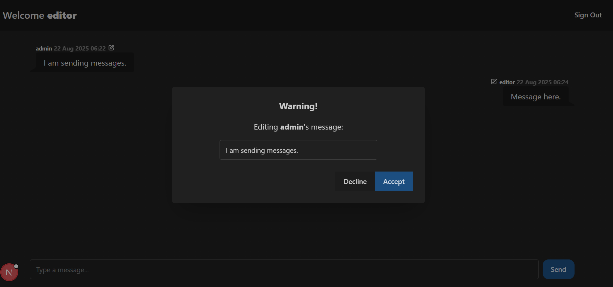

# Enterprise Cybersecurity & DevSecOps Environment Project – Phase 2: Internal Web App + IAM Integration

## Overview

In Phase 2, we expand the lab environment by introducing two new **internal virtual machines**. These VMs represent realistic internal services commonly found in enterprise infrastructures:

- A **web application** `(Next.js)` with a backend database `(MySQL)`
- An **Identity and Access Management (IAM)** server `(Keycloak)`

This setup gives our infrastructure something real to protect and monitor in the future phases. It also lays the groundwork for exploring secure authentication, authorization, and access control.

---

## Virtual Machines Used

| VM Name             | Role                        | Description                                                                 |
|---------------------|-----------------------------|-----------------------------------------------------------------------------|
| **Internal App VM** | Web App + Database          | Hosts a `Next.js`application and a `MySQL` database to simulate a modern full-stack app. |
| **IAM Server VM**   | Identity Management         | Hosts `Keycloak`, an enterprise-grade open-source IAM system. Provides authentication, role-based access, and token issuance. |

> These two VMs reside in the **internal network**, behind the firewall and DMZ, and are **not directly accessible** from the internet.

---

## Phase Goals

By the end of this phase, we will have:

- A deployed `Next.js` [chat-app](https://github.com/abdrnasr/Chat-App-with-Keycloak-IAM) that simulates a real service for the environment users
- A working `MySQL` database for storing app data
- An installed and configured `Keycloak IAM` server
- Functional **SSO login integration** between the app and `Keycloak`
- Reverse proxy routing properly configured via `Nginx` in the DMZ
- Clear separation of duties between app, auth, and data layers

---

## Services Setup

- **Internal App VM**
  - `Next.js` **chat-app** served via `Node.js`
  - `MySQL` database for storing application data
  - Will be accessed externally via the `Nginx reverse proxy` in the DMZ
  - Will integrate authentication via Keycloak `(OAuth2 / OpenID Connect)`

- **IAM Server VM**
  - `Keycloak` installed to manage:
    - User accounts
    - Login flows
    - Role-based access control
    - Token issuance and validation
  - Will also be routed externally via the reverse proxy
- **DMZ Reverse Proxy (from Phase 1)**
  - Forwards:
    - `/` → Internal App VM
    - `/sec` → IAM Server VM (Keycloak)
---
## Testing Scenarios
- Test reverse proxy routing from the `Kali VM`/External Admin Computer:
  - `https://192.168.33.6/` ~ `Next.js App`
  - `https://192.168.33.6/sec` ~ `Keycloak IAM`
- Simulate user login and token issuance via `Keycloak`
- Access protected app routes and execute protected actions

---

## Demo & Results – Non-Technical Overview 

### Accessing The IAM
A crucial component in any enterprise is an Identity and Access Management system (IAM). It essentially allows us to create & manage user accounts, and grant every user different permissions. For example, a CEO can be granted access to a service showing the profits of the organization, while others may not do so. This is one of the main functions of an IAM.

In this phase, this IAM service was completely configured and started. The IAM used is called `Keycloak`, which is popular enterprise-grade IAM.

One of its capabilities is defining users. For instance, this is a sample list of users that were created.

  

Now, these users will be able to use the chat-app that we created. In addition, each of these users have a specified role for the chat-app. This means that each of these users will only be able to perform different functions in the chat-app, based on their roles. 

### Chat App
We also deployed an actual chatting service that [I developed](https://github.com/abdrnasr/Chat-App-with-Keycloak-IAM) to simulate an actual service/target for users.

  

  

  

  
</p

Each user in the **"enterprise"** is assigned different roles, which leads to different access levels within the chatting app. 

---
## Security Design

- Internal services are **never directly exposed** to the public internet.
- External access is restricted to:
  - **HTTP/HTTPS** forwarded by `NGINX` (DMZ)
  - **SSH** via the DMZ jump host (admin use only)
- Single Source of Truth for Users and Access Control via `Keycloak`
- Least Privilege Principle When Possible (e.g., not all users have the same rights)

---

## 📄 **For Technical Readers:**  
See **[Lab Steps – Phase 2](lab-steps-phase-2.md)** for detailed VM setup, network configuration, and service installation instructions.

## Next Step

In **Phase 3**, we will deploy a centralized **Monitoring VM** running **Wazuh + ELK Stack**, which will:
- Monitor all agent-connected VMs (app, IAM, etc.)
- Detect port scans, brute-force SSH attacks, suspicious HTTP requests, and file tampering
- Visualize logs and alerts using `Wazuh`'s dashboards

