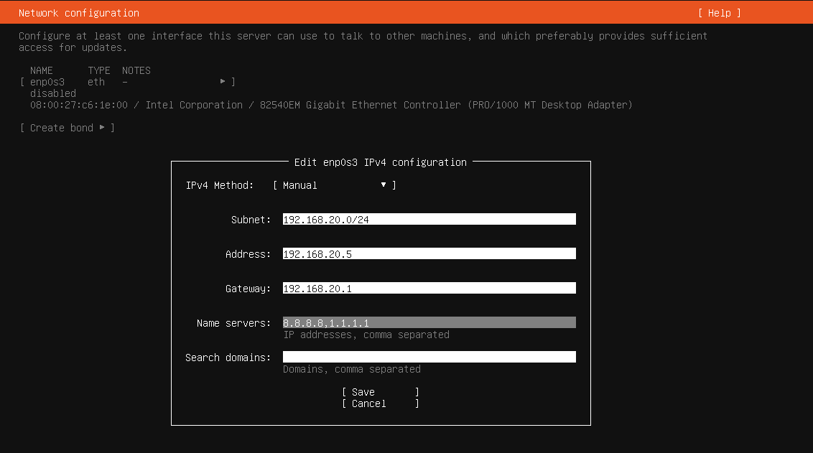
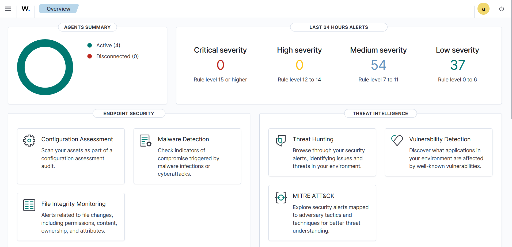
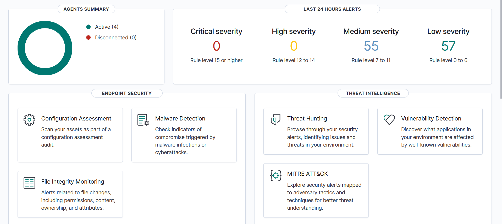
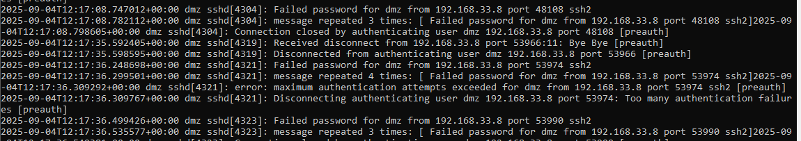

# NOTICE
In this phase, we will create two VMs. Only **one** will be used at the same time. One VM instance will be used to deploy Wazuh Manager, Indexer, and Dashboard. These services are quite heavy to download on a single VM especially if you have limited resources on your host machine. For this reason, the Wazuh machine will only be used for phases 3 & 4. In phase 3, we set up and configure Wazuh across the environment and experiment with its alerting capability. Then in phase 4, we test its responding capability, in addition to alerting.

In the second VM, we will install Elasticsearch, Logstash (optional), and Kibana. This VM will be used for further stages when we need to configure monitoring. This will allow us to experiment with both monitoring stacks, one for security monitoring, and the other for general monitoring needs.

While we could use our ELK stack with Wazuh, this will not be an optimal choice in terms of configuration. Wazuh Indexer & Dashboard come pre-configured for security detection. On the other hand, we have to manually configure our own dashboards, log forwarding, and data processing. In addition, Wazuh provides a lot of security detection features on its own stack, which may not be easily replicated on our own ELK setup. Thus, we resort to separate both stacks on TWO VMs.

---
# VMs Setup
Here, you should create two VMs as mentioned and connect them to the internal network. For the ELK stack VM, I chose the IP Address **192.168.20.5**, and the Wazuh Manager VM will have **192.168.20.6**.
## Image Downloading
Similar to the previous phases, we can use the same ISO image we downloaded to initialize both VMs.
## Setup 
The setup for these two new virtual machines is similar. Remember, you should connect these VMs to the internal network (in Virtualbox -> Network Settings -> Host-Only interface). 

 **Note: Those VMs will host heavy services on it, so be sure to provide it with sufficient resources. For example, 50 GB of disk space, 8 GB RAM, and 4 cores should be enough.**

## Network Configuration Setup
The configuration for the network interface for those VMs can look like:

```yaml
network:
  version: 2
  ethernets:
    enp0s3:
      addresses: [192.168.20.5/24]
      routes:
        - to: 0.0.0.0/0
          via: 192.168.20.1
      nameservers:
        addresses: [8.8.8.8, 1.1.1.1]
```
Or you could directly configure them as you are creating the new VMs (Quicker).

<p align="center">
  
</p>

 **If it looks like the VM is not able to connect to the other VMs, then it is probably an issue with ARP not being able to acquire the MAC address of the gateway. To fix it, try to ping the new VM from the Firewall.**

## VM Access
This VM is only intended to be used within the network. To access it, you should setup an SSH tunnel to the DMZ and start interacting with the services there.

---
# Elasticsearch VM
Now, you should have your first VM ready to download install ELK Stack. After installing both Elasticsearch, Logstash & Kibana, you should turn off the VM as we will not be using in this phase or the next one.

## Elasticsearch
Elasticsearch is a powerful search and analytics engine that enables us to store, search, and analyze large volumes of data in near real time. In a lab environment this is particularly useful because it allows us to simulate how production systems handle logs, metrics, and security events. By installing and configuring Elasticsearch on our VM we create a central hub where different components such as application logs, web server data, or security alerts from tools like Wazuh can be ingested and indexed. This setup helps us practice building ingestion pipelines and visualizations and also gives us hands-on experience with managing clusters, securing access, and tuning performance in a controlled environment.

## Install Elasticsearch Using APT
After initializing the VM, we can now install Elasticsearch. For your VMs, please follow the appropriate [guide](https://www.elastic.co/docs/deploy-manage/deploy/self-managed/installing-elasticsearch#installation-order) from their website. Here, we will use APT to install Elasticsearch directly.

### GPG Public Key Addition 
```bash
wget -qO - https://artifacts.elastic.co/GPG-KEY-elasticsearch | sudo gpg --dearmor -o /usr/share/keyrings/elasticsearch-keyring.gpg
```
### Elasticsearch and Dependencies Installation
```bash
# For additional details, visit their website.
sudo apt-get install apt-transport-https
echo "deb [signed-by=/usr/share/keyrings/elasticsearch-keyring.gpg] https://artifacts.elastic.co/packages/9.x/apt stable main" | sudo tee /etc/apt/sources.list.d/elastic-9.x.list
sudo apt-get update && sudo apt-get install elasticsearch
```

 **In a single node setup, we do not need to make any configuration for Elasticsearch elasticsearch.yml file. So, we can run it immediately**

### Configuration and Running
If you happen to miss the password used for Elasticsearch, you could generate a new one with the following command:

```bash
sudo /usr/share/elasticsearch/bin/elasticsearch-reset-password -u elastic
```

This password is required to test the connectivity with Elasticsearch. After acquiring the password, you can add it as temp environment variable:

```bash
export ELASTIC_PASSWORD="the_generated_password"
```

Now, we can test the connectivity to Elasticsearch:
```bash
sudo curl --cacert /etc/elasticsearch/certs/http_ca.crt -u elastic:$ELASTIC_PASSWORD https://localhost:9200
```
This should print:
```json
{
  "name" : "mon",
  "cluster_name" : "elasticsearch",
  "cluster_uuid" : "C_9rFA3VStiYfm5SMZtaEg",
  "version" : {
    "number" : "9.1.2",
    "build_flavor" : "default",
    "build_type" : "deb",
    "build_hash" : "ca1a70216fbdefbef3c65b1dff04903ea5964ef5",
    "build_date" : "2025-08-11T15:04:41.449624592Z",
    "build_snapshot" : false,
    "lucene_version" : "10.2.2",
    "minimum_wire_compatibility_version" : "8.19.0",
    "minimum_index_compatibility_version" : "8.0.0"
  },
  "tagline" : "You Know, for Search"
}
```

Later, we will create more users for each VM, so that we can enforce access control on what each VM can post/read from the database. In addition, we need to legitimize the Elasticsearch across the environment, which we can do by copying the public key certificate. This is because you can not normally interact with Elasticsearch with only HTTP (unless you allow this manually). To use HTTPs without problems, the certificate must be spread across the environment.

## Memory Limit Configuration
The amount of memory that Elasticsearch consumes can be too much especially that we still need to install other services in the VM. We can reduce the amount of memory used by Elasticsearch easily.

- Create a new text folder mem.options as follows:
```bash
sudo nano /etc/elasticsearch/jvm.options.d/mem.options
```
- And add the following two lines:
```bash
-Xms2g
-Xmx2g
```
This will limit the amount of heap memory used by Elasticsearch to 2GB of memory.

---
# Kibana

Kibana allows us to visualize the data that we stored in Elasticsearch and create our own custom dashboards. It simplifies data visualization greatly and allows us to tailor our dashboards as we wish.

## Kibana Installation with APT
Some of the steps for installation were already performed in the installation of Elasticsearch, and we will be using apt again for Kibana.

```bash
sudo apt-get update && sudo apt-get install kibana
```

 **The same version of Kibana must be used as Elasticsearch for this to work. For the case here, the version 9.1.2**

## Configuring Kibana
We need to make kibana accessible from any computer from within the network, as we do not want to expose it externally. To do this, we need to add(uncomment) the following setting in the **kibana.yml** file, located in /etc/kibana/kibana.yml:
```yml
# Allow access through localhost or 192.168.20.5 or any other interface
server.host: 0.0.0.0
```
This tells kibana to accept any request from any network interface. 
## Running Kibana
The following series of commands registers:
```bash
# Allow kibana to run on start-up
sudo /bin/systemctl daemon-reload
sudo /bin/systemctl enable kibana.service

# Start Kibana
sudo systemctl start kibana 
```
After executing those commands, your Kibana instance should be up and running. Now, you need to extract the setup code, which is found in the logs:
```bash
# Ensure it is running (Active)
sudo systemctl status kibana 
# This scans for "code" in the logs for quick access
journalctl -u kibana.service | grep code
# Output Example:
Aug 27 09:43:42 mon kibana[9291]: Go to http://0.0.0.0:5601/?code=XXXXXX to get started.
Aug 27 10:07:25 mon kibana[9291]: Your verification code is:  XXX XXX # This the 6 digit code
```
## Accessing Kibana
To access kibana, you need to setup an SSH proxy to the DMZ from the admin's computer.
- First you can initialize a CMD window, and run the following command:
```cmd
# Note IP Address, this is specific to my network.
ssh -D 1080 -C -N dmz@192.168.33.6
```
Then, on your browser (Firefox), configure the proxy settings to point to proxy. If it is on the same computer, then the following configuration is possible.

<p align="center">
  
</p>

Now, you should be able to access Kibana at http://192.168.20.5:5601?code=XXXXXX, where the setup **code=XXXXXX** is the code that we have found a few steps previously (If you do not put the code as a parameter, you will be asked later for it). 

<p align="center">
  
</p>

Now you need to generate an Enrollment code. This enrollment code is easily obtained by executing the following command on the monitoring VM.

```bash
sudo /usr/share/elasticsearch/bin/elasticsearch-create-enrollment-token -s kibana
```

This produce a long string that must be pasted in the text entry field. 
<p align="center">
  
</p>

If everything goes well, you will be introduced to the login screen where you can use your Elasticsearch credentials (that you used with the curl command).

<p align="center">
  
</p>

Now we have access to Elasticsearch, which we will use at later stages.

<p align="center">
  
</p>

# Log Stash

Currently, we do not need to install Logstash. We can install later if there was a need for extended data transformation.

---
# Wazuh VM

For this part, the other VM should be used. The first VM should be shutdown to preserve the system resources. This VM will only be used for phases 3 & 4, and will later not be used due to limited system resources on my computer. 

**Ensure that you provide sufficient disk space for this VM, as Wazuh is quite large. Not providing enough space could lead to failure due to limited disk space.**

## Wazuh

Wazuh is an open-source security platform designed for security monitoring, threat detection, and incident response across endpoints, servers, and cloud environments. It provides a unified solution with features like log collection and analysis, file integrity monitoring, vulnerability detection, intrusion detection, malware detection, and compliance reporting. Wazuh uses its own stack, including the Wazuh Manager, Indexer, and Dashboard, to collect, analyze, and visualize security data, giving organizations centralized visibility and control over their infrastructure. This makes it a powerful tool for detecting threats, enforcing security policies, and improving overall security posture.

## Wazuh Core Installation
The core parts of Wazuh are the Manager, Indexer, and Dashboard. These will all be installed on the monitoring machine. Theses components can be installed separately, but for simplicity, we will download the all-in-one version. This version installs all of these components directly onto the VM without the need download and configure each component.


The following command downloads a script and initializes all the components needed onto the system:
```bash
# A newer version could be available at:
# https://documentation.wazuh.com/current/quickstart.html#requirements
curl -sO https://packages.wazuh.com/4.12/wazuh-install.sh && sudo bash ./wazuh-install.sh -a
```

If everything went well, a message should appear in the CLI with the username/password printed to the terminal.
```bash
28/08/2025 18:35:37 INFO: You can access the web interface https://<wazuh-dashboard-ip>:443
    User: admin
    Password: "Generated_password"
```

## Accessing Wazuh
To access Wazuh, you should establish an SSH proxy through the DMZ, as we covered previously. Once established, visit https://192.168.20.6.

<p align="center">
  
</p>

You can use the same credentials that you have been presented with after the installation.

<p align="center">
  
</p>


## Wazuh Agents Deployment
Currently, Wazuh's manager is running without anything to monitor. However, to monitor the other computers, you need to install Wazuh Agents on every other VM. The process of deploying agents is quite straightforward. 

- First, navigate to the home page of Wazuh, and press **"Deploy new agent"**.
<p align="center">
  
</p>

- After clicking, you will need to choose the type of OS you are using (DEB amd64). 

<p align="center">
  
</p>

- Then, you type the Server IP address of Wazuh. It is located at 192.168.20.6. The agents will connect to this IP to register themselves as agents.

<p align="center">
  
</p>

- For each VM you have, use a unique name to identify the agent. Ideally, they should reflect their real usage to avoid confusion.

<p align="center">
  
</p>

- You will then be given a command to execute on the target VM. So, you will need to open each VM and execute this command on it.

<p align="center">
  
</p>

- For example, this is the command that I should run on the dmz.
```bash
wget https://packages.wazuh.com/4.x/apt/pool/main/w/wazuh-agent/wazuh-agent_4.12.0-1_amd64.deb && sudo WAZUH_MANAGER='192.168.20.6' WAZUH_AGENT_NAME='dmz' dpkg -i ./wazuh-agent_4.12.0-1_amd64.deb
```

- After initiating the agent, the following command will register the agent for startup, and run it now.
```bash
sudo systemctl daemon-reload
sudo systemctl enable wazuh-agent
sudo systemctl start wazuh-agent
```

- After registering all vms, you should have four machines being monitored.

<p align="center">
  
</p>

## Disallowing New Agents Enrollment
Now that all of the agents are registered, we can stop and disable [wazuh-authd](https://documentation.wazuh.com/current/user-manual/reference/daemons/wazuh-authd.html) service in the manager's VM. This service is responsible for handling enrolling of new agents.
```bash
systemctl stop wazuh-authd
systemctl disable wazuh-authd
```
Since enrollment is not password protected by default, this will disallow any new agents from joining (attackers may try to abuse this feature by trying to enroll agents). 

---
# Attack Detection Test

Now that we have deployed Wazuh across the environment, we can start to test its detection capability.

## Nmap Scan Detection

### Before the attack
Before we attack the environment, we will take a snapshot of the number of alerts and compare it after the attack.

<p align="center">
  
</p>

As we see here, the number of alerts is **54 mediums and 37 lows**. 

### Attacking
To attack, we open Kali VM and port scan the **external IP** of the firewall.

<p align="center">
  
</p>

### After the attack
Now we go back to check Wazuh for the generated alerts.
<p align="center">
  
</p>

As we can see, the number of alerts generated has noticeably increased **within the attacks duration**. This suggests that Wazuh maybe managed to capture that attack. We need to dig into the alerts deeper to find more.

### Medium Severity Alert Investigation
Viewing the medium severity alerts, we can see the following new alert:

<p align="center">
  
</p>

<details>
  <summary>JSON OF THE ALERT</summary>

```json
{
  "_index": "wazuh-alerts-4.x-2025.09.04",
  "_id": "s-ywE5kBSD0SqL96PlQW",
  "_version": 1,
  "_score": null,
  "_source": {
    "input": {
      "type": "log"
    },
    "agent": {
      "ip": "192.168.10.2",
      "name": "dmz",
      "id": "001"
    },
    "previous_output": "192.168.33.8 - - [04/Sep/2025:07:45:39 +0000] \"OPTIONS / HTTP/1.1\" 400 5 \"-\" \"Mozilla/5.0 (compatible; Nmap Scripting Engine; https://nmap.org/book/nse.html)\"\n192.168.33.8 - - [04/Sep/2025:07:45:39 +0000] \"GET /HNAP1 HTTP/1.1\" 404 8088 \"-\" \"Mozilla/5.0 (compatible; Nmap Scripting Engine; https://nmap.org/book/nse.html)\"\n192.168.33.8 - - [04/Sep/2025:07:45:39 +0000] \"OPTIONS / HTTP/1.1\" 400 5 \"-\" \"Mozilla/5.0 (compatible; Nmap Scripting Engine; https://nmap.org/book/nse.html)\"\n192.168.33.8 - - [04/Sep/2025:07:45:39 +0000] \"GET /evox/about HTTP/1.1\" 404 8097 \"-\" \"Mozilla/5.0 (compatible; Nmap Scripting Engine; https://nmap.org/book/nse.html)\"\n192.168.33.8 - - [04/Sep/2025:07:45:39 +0000] \"GET /.git/HEAD HTTP/1.1\" 404 8096 \"-\" \"Mozilla/5.0 (compatible; Nmap Scripting Engine; https://nmap.org/book/nse.html)\"\n192.168.33.8 - - [04/Sep/2025:07:45:39 +0000] \"POST /sdk HTTP/1.1\" 404 8086 \"-\" \"Mozilla/5.0 (compatible; Nmap Scripting Engine; https://nmap.org/book/nse.html)\"\n192.168.33.8 - - [04/Sep/2025:07:45:39 +0000] \"OPTIONS / HTTP/1.1\" 400 5 \"-\" \"Mozilla/5.0 (compatible; Nmap Scripting Engine; https://nmap.org/book/nse.html)\"\n192.168.33.8 - - [04/Sep/2025:07:45:39 +0000] \"GET /nmaplowercheck1756971937 HTTP/1.1\" 404 8107 \"-\" \"Mozilla/5.0 (compatible; Nmap Scripting Engine; https://nmap.org/book/nse.html)\"\n192.168.33.8 - - [04/Sep/2025:07:45:39 +0000] \"TJXG / HTTP/1.1\" 400 5 \"-\" \"Mozilla/5.0 (compatible; Nmap Scripting Engine; https://nmap.org/book/nse.html)\"\n192.168.33.8 - - [04/Sep/2025:07:45:39 +0000] \"OPTIONS / HTTP/1.1\" 400 5 \"-\" \"Mozilla/5.0 (compatible; Nmap Scripting Engine; https://nmap.org/book/nse.html)\"\n192.168.33.8 - - [04/Sep/2025:07:45:39 +0000] \"OPTIONS / HTTP/1.1\" 400 5 \"-\" \"Mozilla/5.0 (compatible; Nmap Scripting Engine; https://nmap.org/book/nse.html)\"",
    "manager": {
      "name": "mon"
    },
    "data": {
      "protocol": "OPTIONS",
      "srcip": "192.168.33.8",
      "id": "400",
      "url": "/"
    },
    "rule": {
      "firedtimes": 1,
      "mail": false,
      "level": 10,
      "pci_dss": [
        "6.5",
        "11.4"
      ],
      "tsc": [
        "CC6.6",
        "CC7.1",
        "CC8.1",
        "CC6.1",
        "CC6.8",
        "CC7.2",
        "CC7.3"
      ],
      "description": "Multiple web server 400 error codes from same source ip.",
      "groups": [
        "web",
        "accesslog",
        "web_scan",
        "recon"
      ],
      "mitre": {
        "technique": [
          "Vulnerability Scanning"
        ],
        "id": [
          "T1595.002"
        ],
        "tactic": [
          "Reconnaissance"
        ]
      },
      "id": "31151",
      "nist_800_53": [
        "SA.11",
        "SI.4"
      ],
      "frequency": 14,
      "gdpr": [
        "IV_35.7.d"
      ]
    },
    "location": "/var/log/nginx/access.log",
    "decoder": {
      "name": "web-accesslog"
    },
    "id": "1756971940.163466",
    "full_log": "192.168.33.8 - - [04/Sep/2025:07:45:39 +0000] \"OPTIONS / HTTP/1.1\" 400 5 \"-\" \"Mozilla/5.0 (compatible; Nmap Scripting Engine; https://nmap.org/book/nse.html)\"",
    "timestamp": "2025-09-04T07:45:40.129+0000"
  },
  "fields": {
    "timestamp": [
      "2025-09-04T07:45:40.129Z"
    ]
  },
  "highlight": {
    "manager.name": [
      "@opensearch-dashboards-highlighted-field@mon@/opensearch-dashboards-highlighted-field@"
    ]
  },
  "sort": [
    1756971940129
  ]
}
```
</details>

### Alert Interpretation
####  Where was the log generated?
- **Log Location:** `/var/log/nginx/access.log`
- **Agent:** `dmz` (IP: `192.168.10.2`)
- **Manager:** `mon`
- This shows the log originated from the **NGINX web server in the DMZ host**.

#### Time of the log
- **Timestamp:** `2025-09-04T07:45:40.129Z` (UTC)
- Events occurred around `04/Sep/2025 07:45:39 +0000`.

#### Why was it generated?
- Source IP: **192.168.33.8**
- User-Agent: `Mozilla/5.0 (compatible; Nmap Scripting Engine; https://nmap.org/book/nse.html)`

The requests included:
- `OPTIONS /`
- `GET /HNAP1`
- `GET /.git/HEAD`
- `GET /evox/about`
- `POST /sdk`
- `GET /nmaplowercheck...`

**Interpretation:**
- These are classic signs of **reconnaissance/vulnerability scanning**.
- The attacker was probing for:
  - Web app endpoints
  - Misconfigured `.git` repositories
  - Debug/SDK paths
- Wazuh Rule **31151** flagged this activity as:
  - **Group:** `web_scan`, `recon`
  - **MITRE:** T1595.002 (Vulnerability Scanning / Reconnaissance)

#### How Was This Attack Detected?
A normal user visiting our site has no interest in interacting with any of these endpoints:
- `OPTIONS /`
- `GET /HNAP1`
- `GET /.git/HEAD`
- `GET /evox/about`
- `POST /sdk`
- `GET /nmaplowercheck...`

Knowing this, Wazuh flagged the request for these paths as a plausible port scan by `nmap`.

#### The Other Low Severity Alerts
<p align="center">
  
</p>
There are 20 other generated low alerts, and they are all indicative of the same attack. The medium alert is essentially a correlation of all of these lower-grade alerts.

---
## SSH Brute-Force
Another attack vector in this environment is the publicly exposed SSH server in the DMZ. Hackers may try to use brute-force to gain access to the DMZ machine. For this, we need to be able to detect and possibly stop brute-force attempts. Here, we will only use 10 passwords for the brute-force to limit the amount of generated alerts.

### Before The Attack
As before, we take a snapshot of the number alerts.
<p align="center">
  
</p>


### Unthrottled SSH Brute-force
The following SSH attack attempts to brute-force using 10 passwords from the password list file. This attack executes without any form of throttling.
```zsh
hydra -l dmz -P <(head -n 10 /usr/share/wordlists/rockyou.txt) ssh://192.168.33.6
```

<p align="center">
  
</p>

### Throttled SSH Bruteforce
Some SSH servers drop quick consecutive login attempts from the same IP to deter brute force attacks. Thus, instead of testing the password, the SSH connection is terminated before it checks the password with the stored one (i.e., no password check is made, and the connection terminates). For this, we can slow down the SSH and force hydra to use one thread only for the attack. This prevents opening multiple simultaneous connections with the SSH server, which could lead to dropping connections.

```zsh
hydra -l dmz -P <(head -n 10 /usr/share/wordlists/rockyou.txt) ssh://192.168.33.6 -t 1
```

<p align="center">
  
</p>

The reason we try both of these attack tactics is that they manifest themselves differently in the logs.

### After the Attack
Here again, we see a noticeable increase in the number of alerts.

<p align="center">
  
</p>

However, looking at all of these alerts one by one can be ineffective especially when the number of alerts increase (which is the case in real environments). We can use filtering to filter for ssh traffic.

### Low Severity SSH
By adding **rule.groups: sshd**, we can list all rule detections related to SSH. Here, we see 9 new alerts
<p align="center">
  
</p>

Looking at the details of these alerts, we see they are all of the type "Failed password for dmz from 192.168.33.8 port 40132 ssh2". This means that the password was accepted and tested against the stored one.

<details>
  <summary>JSON OF THE ALERT</summary>
```json
{
  "_index": "wazuh-alerts-4.x-2025.09.04",
  "_id": "TuxWFJkBSD0SqL968lX8",
  "_version": 1,
  "_score": null,
  "_source": {
    "predecoder": {
      "hostname": "dmz",
      "program_name": "sshd",
      "timestamp": "Sep 04 10:47:41"
    },
    "input": {
      "type": "log"
    },
    "agent": {
      "ip": "192.168.10.2",
      "name": "dmz",
      "id": "001"
    },
    "manager": {
      "name": "mon"
    },
    "data": {
      "srcip": "192.168.33.8",
      "dstuser": "dmz",
      "srcport": "40132"
    },
    "rule": {
      "mail": false,
      "level": 5,
      "hipaa": [
        "164.312.b"
      ],
      "pci_dss": [
        "10.2.4",
        "10.2.5"
      ],
      "tsc": [
        "CC6.1",
        "CC6.8",
        "CC7.2",
        "CC7.3"
      ],
      "description": "sshd: authentication failed.",
      "groups": [
        "syslog",
        "sshd",
        "authentication_failed"
      ],
      "nist_800_53": [
        "AU.14",
        "AC.7"
      ],
      "gdpr": [
        "IV_35.7.d",
        "IV_32.2"
      ],
      "firedtimes": 8,
      "mitre": {
        "technique": [
          "Password Guessing",
          "SSH"
        ],
        "id": [
          "T1110.001",
          "T1021.004"
        ],
        "tactic": [
          "Credential Access",
          "Lateral Movement"
        ]
      },
      "id": "5760",
      "gpg13": [
        "7.1"
      ]
    },
    "location": "journald",
    "decoder": {
      "parent": "sshd",
      "name": "sshd"
    },
    "id": "1756982863.197535",
    "full_log": "Sep 04 10:47:41 dmz sshd[3876]: Failed password for dmz from 192.168.33.8 port 40132 ssh2",
    "timestamp": "2025-09-04T10:47:43.143+0000"
  },
  "fields": {
    "timestamp": [
      "2025-09-04T10:47:43.143Z"
    ]
  },
  "highlight": {
    "manager.name": [
      "@opensearch-dashboards-highlighted-field@mon@/opensearch-dashboards-highlighted-field@"
    ],
    "rule.groups": [
      "@opensearch-dashboards-highlighted-field@sshd@/opensearch-dashboards-highlighted-field@"
    ]
  },
  "sort": [
    1756982863143
  ]
}
```
</details>

These alerts correspond to the throttled attack, because the passwords were accepted and tested.

### Medium Severity SSH
Next, we investigate the new medium alerts.

<p align="center">
  
</p>

<details>
  <summary>JSON OF THE ALERTS</summary>

```json
{
  "_index": "wazuh-alerts-4.x-2025.09.04",
  "_id": "TexWFJkBSD0SqL968lX8",
  "_version": 1,
  "_score": null,
  "_source": {
    "predecoder": {
      "hostname": "dmz",
      "program_name": "sshd",
      "timestamp": "Sep 04 10:47:41"
    },
    "input": {
      "type": "log"
    },
    "agent": {
      "ip": "192.168.10.2",
      "name": "dmz",
      "id": "001"
    },
    "previous_output": "Sep 04 10:47:41 dmz sshd[3876]: Failed password for dmz from 192.168.33.8 port 40132 ssh2\nSep 04 10:47:41 dmz sshd[3876]: Failed password for dmz from 192.168.33.8 port 40132 ssh2\nSep 04 10:47:40 dmz sshd[3874]: Failed password for dmz from 192.168.33.8 port 40130 ssh2\nSep 04 10:47:40 dmz sshd[3874]: Failed password for dmz from 192.168.33.8 port 40130 ssh2\nSep 04 10:47:38 dmz sshd[3874]: Failed password for dmz from 192.168.33.8 port 40130 ssh2\nSep 04 10:47:38 dmz sshd[3874]: Failed password for dmz from 192.168.33.8 port 40130 ssh2\nSep 04 10:47:38 dmz sshd[3874]: Failed password for dmz from 192.168.33.8 port 40130 ssh2",
    "data": {
      "srcip": "192.168.33.8",
      "dstuser": "dmz",
      "srcport": "40132"
    },
    "manager": {
      "name": "mon"
    },
    "rule": {
      "mail": false,
      "level": 10,
      "hipaa": [
        "164.312.b"
      ],
      "pci_dss": [
        "11.4",
        "10.2.4",
        "10.2.5"
      ],
      "tsc": [
        "CC6.1",
        "CC6.8",
        "CC7.2",
        "CC7.3"
      ],
      "description": "sshd: brute force trying to get access to the system. Authentication failed.",
      "groups": [
        "syslog",
        "sshd",
        "authentication_failures"
      ],
      "nist_800_53": [
        "SI.4",
        "AU.14",
        "AC.7"
      ],
      "frequency": 8,
      "gdpr": [
        "IV_35.7.d",
        "IV_32.2"
      ],
      "firedtimes": 1,
      "mitre": {
        "technique": [
          "Brute Force"
        ],
        "id": [
          "T1110"
        ],
        "tactic": [
          "Credential Access"
        ]
      },
      "id": "5763"
    },
    "location": "journald",
    "decoder": {
      "parent": "sshd",
      "name": "sshd"
    },
    "id": "1756982861.196376",
    "full_log": "Sep 04 10:47:41 dmz sshd[3876]: Failed password for dmz from 192.168.33.8 port 40132 ssh2",
    "timestamp": "2025-09-04T10:47:41.151+0000"
  },
  "fields": {
    "timestamp": [
      "2025-09-04T10:47:41.151Z"
    ]
  },
  "highlight": {
    "manager.name": [
      "@opensearch-dashboards-highlighted-field@mon@/opensearch-dashboards-highlighted-field@"
    ]
  },
  "sort": [
    1756982861151
  ]
}
```

```json
{
  "_index": "wazuh-alerts-4.x-2025.09.04",
  "_id": "SexWFJkBSD0SqL968lX8",
  "_version": 1,
  "_score": null,
  "_source": {
    "predecoder": {
      "hostname": "dmz",
      "program_name": "sshd",
      "timestamp": "Sep 04 10:47:40"
    },
    "input": {
      "type": "log"
    },
    "agent": {
      "ip": "192.168.10.2",
      "name": "dmz",
      "id": "001"
    },
    "manager": {
      "name": "mon"
    },
    "data": {
      "srcip": "192.168.33.8",
      "dstuser": "dmz",
      "srcport": "40130"
    },
    "rule": {
      "firedtimes": 1,
      "mail": false,
      "level": 8,
      "description": "Maximum authentication attempts exceeded.",
      "groups": [
        "syslog",
        "sshd",
        "authentication_failed"
      ],
      "mitre": {
        "technique": [
          "Brute Force"
        ],
        "id": [
          "T1110"
        ],
        "tactic": [
          "Credential Access"
        ]
      },
      "id": "5758",
      "gpg13": [
        "7.1"
      ]
    },
    "location": "journald",
    "decoder": {
      "parent": "sshd",
      "name": "sshd"
    },
    "id": "1756982861.194619",
    "full_log": "Sep 04 10:47:40 dmz sshd[3874]: error: maximum authentication attempts exceeded for dmz from 192.168.33.8 port 40130 ssh2 [preauth]",
    "timestamp": "2025-09-04T10:47:41.140+0000"
  },
  "fields": {
    "timestamp": [
      "2025-09-04T10:47:41.140Z"
    ]
  },
  "highlight": {
    "manager.name": [
      "@opensearch-dashboards-highlighted-field@mon@/opensearch-dashboards-highlighted-field@"
    ]
  },
  "sort": [
    1756982861140
  ]
}
```
</details>

Here, we see two new alerts generated, one is about exceeding the maximum authentication attempts, and the other is about the **multiple failed password attempts**. Both of these correspond to the same throttled attack. So, where are the alerts of the other attacks?

### SSHD Dropping connection
Investigating the actual logs that sshd produces on the DMZ machine, we see two different log patterns.

| <p  align="center">Throttled</p>   |
|----------|
| |
| <p  align="center">Unthrottled</p> |
| |

- The throttled SSH traffic is accepted without issues by sshd and we know this by "Failed Password" attempts. That's, hydra provided passwords and the ssh checked the stored one. Those "Failed Password" logs are parsed by the agent and are logged as alerts to Wazuh's Dashboard.

- For unthrottled traffic, there are no passwords being tested, and the conncetions established do not actually provide a password. This is signified by the "Connection closed by..." and the fact that there are no password attempts with each connection. Wazuh is not configured by default to alert on "Connection closed by..." logs, and so we see no alerts about these in the dashboard.

---
## Critical File Tampering

Linux has many critical files in the filesystem that are of attackers interest. For instace, linux users' passwords are stored in the **/etc/shadow** file. Detecting changes to these file is critical because they could indicate the presence of an attacker and the use of persistance techniques.

### Alerts Snapshot

<p align="center">
  
</p>

### Speeding Up The File Integrity Check
By default, wazuh agents check the files' integrity every 12 hours. This could be long for our testing, so we need to speed it up. To speed it up, change the configurations of the agent on **DMZ VM**. The configurations are stored in **/var/ossec/etc/ossec.conf**. This change is not needed for all the agents in the network, and we will only do it for the DMZ VM.

```bash
sudo nano /var/ossec/etc/ossec.conf
```

Now, under this file, change the **frequency** attribute under **syscheck**.

```xml
  <!-- File integrity monitoring -->
  <syscheck>
    <disabled>no</disabled>

    <!-- CHANAGE THIS VALUE - The frequency that syscheck is executed default every 12 hours -->
    <frequency>60</frequency> <!-- The value here was 43200, but now its 60  -->
    ...
```

<p align="center">
  
</p>


This will let the file intergrity check be done every one minute instead of 12 hours. Now, we restart the agent.

```bash
sudo systemctl restart wazuh-agent.service
```
### Making The Change
Instead of directly tampering with the file, we could just use one of the built-in tools to make the change. The **/etc/shadow** file stores the hashes of the passwords. Thus if we change the password of an account, the file's content will change. To change the password of one of the accounts, we can use the `passwd` tool.
```bash
sudo passwd dmz
```
You will be prompted to enter a new password. After saving this change, you should wait for at most a minute (the time we configured the agent to perform the check). An alert should appear on the dashboard.

## Alert Investigation
After this change, a new **Medium Severity** alert has appeared.

<p align="center">
  
</p>

And on the file integrity alert's window, we see that a new file was modified.

<p align="center">
  
</p>

### 
<p align="center">
  
</p>

<details>
  <summary>JSON OF THE ALERT</summary>

```json
{
  "_index": "wazuh-alerts-4.x-2025.09.04",
  "_id": "7uzrFJkBSD0SqL96AVXx",
  "_version": 1,
  "_score": null,
  "_source": {
    "syscheck": {
      "size_before": "985",
      "uname_after": "root",
      "mtime_after": "2025-09-04T13:28:36",
      "inode_before": 304845,
      "size_after": "952",
      "gid_after": "42",
      "md5_before": "0b38ab27816ff5c6182f385fc408e3ca",
      "sha256_before": "12c3b34201acb8e623127df111c78905a00c0574685f004c3763243b7a40ac93",
      "mtime_before": "2025-08-28T20:40:03",
      "mode": "scheduled",
      "path": "/etc/shadow",
      "sha1_after": "f12776cea369d91da8606d1c831716d11a996f9d",
      "changed_attributes": [
        "size",
        "inode",
        "mtime",
        "md5",
        "sha1",
        "sha256"
      ],
      "gname_after": "shadow",
      "uid_after": "0",
      "perm_after": "rw-r-----",
      "event": "modified",
      "md5_after": "d929937ef1abac59654e3b24f857fc93",
      "sha1_before": "5e9abfcb746c6de11255e79c1c7fbb9bf814a96f",
      "sha256_after": "4731be0a7e8b3de7d98b4bc77183d8dfbb9500480f5b378d9500267ec0567176",
      "inode_after": 264138
    },
    "input": {
      "type": "log"
    },
    "agent": {
      "ip": "192.168.10.2",
      "name": "dmz",
      "id": "001"
    },
    "manager": {
      "name": "mon"
    },
    "rule": {
      "mail": false,
      "level": 7,
      "pci_dss": [
        "11.5"
      ],
      "hipaa": [
        "164.312.c.1",
        "164.312.c.2"
      ],
      "tsc": [
        "PI1.4",
        "PI1.5",
        "CC6.1",
        "CC6.8",
        "CC7.2",
        "CC7.3"
      ],
      "description": "Integrity checksum changed.",
      "groups": [
        "ossec",
        "syscheck",
        "syscheck_entry_modified",
        "syscheck_file"
      ],
      "nist_800_53": [
        "SI.7"
      ],
      "gdpr": [
        "II_5.1.f"
      ],
      "firedtimes": 1,
      "mitre": {
        "technique": [
          "Stored Data Manipulation"
        ],
        "id": [
          "T1565.001"
        ],
        "tactic": [
          "Impact"
        ]
      },
      "id": "550",
      "gpg13": [
        "4.11"
      ]
    },
    "location": "syscheck",
    "decoder": {
      "name": "syscheck_integrity_changed"
    },
    "id": "1756992558.238238",
    "full_log": "File '/etc/shadow' modified\nMode: scheduled\nChanged attributes: size,inode,mtime,md5,sha1,sha256\nSize changed from '985' to '952'\nOld modification time was: '1756413603', now it is '1756992516'\nOld inode was: '304845', now it is '264138'\nOld md5sum was: '0b38ab27816ff5c6182f385fc408e3ca'\nNew md5sum is : 'd929937ef1abac59654e3b24f857fc93'\nOld sha1sum was: '5e9abfcb746c6de11255e79c1c7fbb9bf814a96f'\nNew sha1sum is : 'f12776cea369d91da8606d1c831716d11a996f9d'\nOld sha256sum was: '12c3b34201acb8e623127df111c78905a00c0574685f004c3763243b7a40ac93'\nNew sha256sum is : '4731be0a7e8b3de7d98b4bc77183d8dfbb9500480f5b378d9500267ec0567176'\n",
    "timestamp": "2025-09-04T13:29:18.950+0000"
  },
  "fields": {
    "syscheck.mtime_after": [
      "2025-09-04T13:28:36.000Z"
    ],
    "syscheck.mtime_before": [
      "2025-08-28T20:40:03.000Z"
    ],
    "timestamp": [
      "2025-09-04T13:29:18.950Z"
    ]
  },
  "highlight": {
    "manager.name": [
      "@opensearch-dashboards-highlighted-field@mon@/opensearch-dashboards-highlighted-field@"
    ]
  },
  "sort": [
    1756992558950
  ]
}
```
</details>

The alert basically tells us that the MD5, SHA1, & SHA256 of the **/etc/shadow** have changed, indicating that the file was changed. If this change was not done by an authorized person, then there might be an attacker tampering with this machine.

---

# Blind Spots & Limitations
## Limited Nmap Scan Visibility
While we have managed to detect the nmap scan, that was only successful because we had a running Nginx server AND because we used aggressive port scan (-A). That is, even though we scanned the **entire port range (-p- option)**, we were only able to detect the port scan across Nginx (ports 80/443). So, which other ports did we scan? We simply do not know (from the alerts), and that's a blind spot. The reason for this behavior is that the firewall is not configured to **log anything**. Thus, port scans are not entirely detected.

To resolve this, we could simply configure the firewall to log ALL traffic, instead of only rejecting/dropping the packets. We will then need to configure Wazuh agent too to forward these logs to the Wazuh Manager. This way, we will be able to identify all the ports that were scanned and even correlate it with the other port scans. This, however, can introduce a lot of alerts, and so we might only keep logs for a set of ports that are critical for the enterprise.

Even if we introduce an Network-Based Intrusion Detection System (NIDS) in the network, like Snort or Suricata, it will still fail to see the port scan because the traffic is not forwarded internally to any port other than (22/80/443).

Many enterprise-level firewalls come fit with the ability to easily log and produce clean logs this kind of traffic, but Iptables alone is not meant for this.

## Lack of Network Monitoring
The current security monitoring system we have only monitors hosts and does NOT monitor any raw network traffic. That's the alerts are generated by the logs issued by the programs on the host, rather than raw network traffic. Network traffic monitoring is important because it can allow us to detect lateral movement, connections with suspecious IP and DNS names, and to scan for attack signatures within the network traffic.
 
## Default Configurations
As we saw with ssh attack, some of the logs — "Connection closed by..." — were not detected because Wazuh is not configured to alert upon these. You may, however, want to capture these logs, which you can do by creating your own custom rules with Wazuh. 

### Is it actually a risk?
However, the passwords were not tested against system, so why should we even bother? If passwords are not being tested, then were is the risk? The problem with this reasoning is that this SSH traffic does not come free. Each brute-force connection may clog the network with a large amounts of uneccessary traffic. Thus, instead of sitting idle, we can instruct the firewall to block or throttle this IP. This should reduce the amount of network traffic heading to the DMZ, which is  

## Falsely Low Rated Attacks
To demonstrate this point, we should successfully open **TWO SUCCESSFUL SSH** connections from the `Attacker VM` and `Admin VM` to `the DMZ VM`. Then, we navigate to the alerts.

<p align="center">
  
</p>

We should see the two successful attempts as alerts. Looking at the first login, it was from 192.168.33.3 `(Admin VM)`, and the second one was from 192.168.33.8 `(Attacker VM)`. This might be okay, as in this case, where we deliberately logged in from multiple places. However, in an enterprise setting, this could indicate a compromised account. For this reason, each login attempt should be taken seriously. This alert was shown to be low severity. Nevertheless, it could have been a detrimental problem (i.e., not low severity), because this account is an admin account, and it can control the entire public side of the environment. For instance, if the attacker could get hold of an admin account on this machine, the attacker can alter the Nginx config file to serve his own content.

```nginx
server {
    listen 80;
    server_name 192.168.33.6;

    location / {
        proxy_pass http://www.hacker.com;
        proxy_set_header Host www.hacker.com;
        proxy_set_header X-Real-IP $remote_addr;
        proxy_set_header X-Forwarded-For $proxy_add_x_forwarded_for;
        proxy_set_header X-Forwarded-Proto $scheme;
    }
}
```
The above Nginx config could be used by the attacker to redirect our users to his own website. This kind of sophisticated attack is a critical to the business and the users.

## Integrity Check Long Time Window
The integrity check is execute by default every 12 hours. This could be enough time for an attacker to make changes to the critical files, make harm to the internal system, and recover the file to its original state. Thus, the shorter the time the better. This indeed comes with the cost of increased processing.

## Responding to The Alerts
While we have detected these attacks that we attempted, we have not really responded to any of them. Wazuh provide a module called active-response which allows us to respond automatically and manually, depending on our configuration. We will look into this in the next phase.

---
# Technical Summary

In this phase, the lab environment is expanded with two dedicated virtual machines: one for an `Elasticsearch`, `Logstash`, and `Kibana` stack, and another for the `Wazuh stack` consisting of the `Manager, Indexer, and Dashboard`. To conserve host resources, only one of these monitoring VMs is active at a time, with `Wazuh` being reserved for the phases focused on security monitoring and response, while the `ELK VM` is used later for general observability and dashboard customization. Keeping the stacks separate avoids the complexity of forcing generic `ELK` components to replicate `Wazuh’s` prebuilt security features and ensures that each platform is used for its strengths.

Both VMs are attached to the internal `host-only network`, with typical addressing such as `192.168.20.5` for `Elasticsearch` and `192.168.20.6` for `Wazuh`. They are provisioned with sufficient CPU, memory, and disk resources, since the services they run are heavy. Connectivity is verified to ensure internal nodes can reach the firewall and DMZ as needed, and administrators interact with the services through the `DMZ proxy` rather than exposing them directly. This maintains the segmentation model established earlier in the lab.

The `Elasticsearch VM` is configured as a single-node cluster capable of ingesting logs and metrics and providing a central data store. It is secured using built-in authentication and certificates, with memory tuning applied to prevent excessive resource usage. Once confirmed functional, it is typically shut down until later stages. `Kibana` is installed alongside `Elasticsearch` to provide dashboards and visualizations. It is configured to accept requests from internal interfaces only, and administrators reach its UI through SSH proxying. This provides an opportunity to practice enrollment, setup, and secure access patterns while keeping the service isolated from external networks.

The `Wazuh VM`, installed with its all-in-one package, provides a full security monitoring stack with built-in capabilities for log collection, intrusion detection, malware monitoring, vulnerability assessment, and compliance reporting. After installation, the dashboard is accessed securely via the DMZ proxy, and the automatically generated administrative credentials confirm that the deployment is active. Agents are then deployed across `all other VMs`, each one pointing back to the `Wazuh Manager` at `192.168.20.6` and named after the host function to make correlation easier. Once registered, the dashboard reflects full visibility of the environment.

To test detection, controlled attacks are launched from the attacker node. A reconnaissance scan against the firewall’s external address produces a noticeable spike in `Wazuh` alerts. The system flags the unusual web requests, including probes to uncommon endpoints, as medium-severity findings tied to reconnaissance techniques. This demonstrates that `Wazuh` can recognize automated scanning activity and classify it with `MITRE ATT&CK` context. `SSH` brute-force attempts are then simulated, both throttled and unthrottled. Throttled attempts generate numerous failed password entries that `Wazuh` correlates into brute-force alerts, while unthrottled attempts show different logging behavior because the SSH service drops rapid connection attempts before checking credentials. This difference highlights how attack style influences detection patterns and why layered rules are required for complete coverage.

Finally, file integrity monitoring (`FIM`) is validated by making a controlled change to a critical system file. The lab accelerates the default check frequency so that modifications are detected quickly. After changing a password, `Wazuh` reports a medium-severity alert indicating that the system’s shadow file has been modified, with details about size, inode, timestamps, and cryptographic hashes. This demonstrates that the agent is capable of detecting tampering with sensitive files, a key signal of potential persistence or privilege escalation.

By the end of this stage, the environment includes two complementary monitoring stacks: `Elasticsearch and Kiban` a for flexible analytics, and `Wazuh` for dedicated security monitoring and response. Both remain internally scoped and are accessed through controlled paths, preserving segmentation while enabling comprehensive visibility. The exercises confirm that reconnaissance, brute-force attempts, and file tampering are all surfaced with actionable context, providing a realistic foundation for security monitoring and incident response in later phases.
