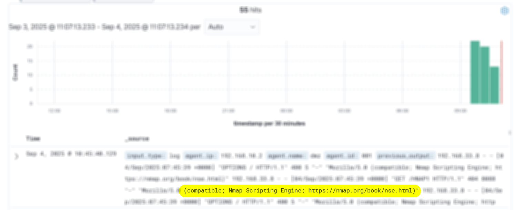
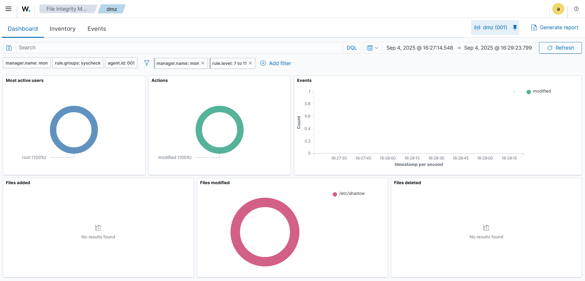

# 🔐 Enterprise Cybersecurity & DevSecOps Environment Project – Phase 3: Monitoring and Visibility

## 🧩 Overview

In Phase 3, we introduce centralized **monitoring, alerting, and visibility** to our infrastructure by deploying a dedicated **Monitoring VM**. This phase is essential for detecting attacks, system anomalies, and suspicious behaviors that went unnoticed in previous stages.

This monitoring stack simulates what real Monitoring Engineers and Security Operations Centers (SOCs) use in production environments.

---

## 🧱 New Virtual Machines Used

| VM Name           | Role                     | Description                                                             |
|-------------------|--------------------------|-------------------------------------------------------------------------|
| **ELK Monitoring VM** |   Log Management    | Hosts the core monitoring tools: the **ELK Stack**.       |
| **Wazuh Monitoring VM** | SIEM & XDR    | Hosts the core security monitoring tools: **Wazuh** and the **ELK Stack**.       |

> Those VMs reside in the **internal network** and have access to all internal systems (App VM, IAM VM, DMZ), but are **not externally accessible**. The reason we have two VMs here is because we will only use `Wazuh`'s VM for phases **3 & 4**. The other one will be used in later stages too for infrastructure monitoring. 

---

## 🧱 Agent Configuration

| VM                  | Agent Installed | Logs Collected                                    |
|---------------------|-----------------|--------------------------------------------------|
| **Internal App VM** | Wazuh agent     | System logs, process monitoring, application logs |
| **IAM VM (Keycloak)** | Wazuh agent   | Auth events, login attempts, config changes       |
| **DMZ VM**          | Wazuh agent     | SSH login attempts, `NGINX` access logs            |
| **Firewall VM**       | Wazuh agent     | `iptables/nftable`s events, system/auth logs, Active Response for auto-blocking |

All agents forward logs to the `Wazuh Manager`, which stores and process the logs.

---

## 🎯 Phase Goals

By the end of this phase, we will have:
- A fully functioning **SIEM/XDR solution** `(Wazuh)` for attack detection  
- All VMs reporting logs to `Wazuh` Manager
- Detect attacks such as:  
  - SSH brute-force attempts  
  - Web scans and failed logins  
  - Unauthorized file modifications  
- The `ELK` stack fully setup and running on the other VM.

---

## 🛠️ Services Setup

### ✅ Core Tools

- **Wazuh (XDR / SIEM)**
  - Collects and analyzes logs from all connected agents
  - Detects brute-force, port scanning, privilege escalation, file changes, and more
  - Allows for taking response actions when an alert is raised
  - Used for phases 3 & 4

- **ELK Stack (Log Management, Aggregation, Processing, and Visualization)**
  - **Elasticsearch**: stores structured logs and alerts
  - **Logstash**: data processing pipeline that ingests data from a multitude of sources, transforms it, and then sends it
  - **Kibana**: provides dashboards and visualizations
  - Used for phases 5 onward 
---

## 🧪 Testing Scenarios

- Use the `Kali VM` to:
  - Run `nmap` scans against `firewall VM`
  - Simulate **brute-force SSH** logins using `hydra`
  - Login to the DMZ computer and Tamper with critical files (e.g., `/etc/shadow`) on monitored hosts
- Observe real-time alerts in the `Wazuh` dashboard

---

## 📽️ Demo & Results – Non-Technical Overview 
The premise of this lab phase is to build a comprehensive security monitoring solution across the environment to detect the attacks that we were unable to identify in earlier phases. 

### Wazuh XDR & SIEM 
In this phase, we have utilized `Wazuh`, which is **Security Information and Event Management (SIEM)** & an **Extended Detection and Response (XDR)**. It monitors all the machines in the environment for malicious behavior and provides immediate alerts for administrators to investigate.

  

### Realtime Alert Monitoring

To keep the discussion as non-technical as possible, we will only use the dashboards. However, the actual detection methodology is much more technical.

With the current setup, we have `Wazuh` monitoring the entire environment in realtime. It has agents on each VM monitoring for suspicious activity. Admins and SOC teams can now open `Wazuh` Dashboard and monitor for security alerts. 

  

### Detecting Port Scans
A port scan is a kind of attack that hackers use to detect what services a network has available. They scan for possible targets that they could attack on further stages. For instance, in this infrastructure, we have `Nginx`, `Keycloak`, `Next.js chat-app`, and an SSH server. These services are exposed to the public, meaning they can be vulnerable to external attackers. One of the popular tools that is used for port scanning is called `Nmap`.

#### Before the Attack
Before we attack the environment, we took a snapshot of the number of alerts.

  

This allows us to compare the number of alerts before/after attack.

#### After the attack
After executing the attack, we see an increase in the number of alerts. Digging into these new alerts, we find that they indeed correspond to a port scan attempt (the highlighted note shows `Nmap` as a possible culprit).

  

For reference, this is the details of the alert and it clearly states `Nmap` as possible instigator.

  

### Detecting SSH Brute Force 
Another important public service is the `ssh server` in the `DMZ VM`. This service is meant only for admins to control the internal environment from outside of the network, but hackers are also interested in attacking it to gain access to it.

A brute-force attack attempts repeatedly to login with different usernames/passwords, essentially trying to guess a possible combination to login. 

#### Attack Detection
Here, again we can use the alerts generated to detect the attack.

  

Looking at these alerts, notice the **Password Guessing** message in the logs. These alerts tell us that we can successfully detect password guessing attempts.

## Detecting Critical File Tampering

Most operating systems have critical files that needs to be protected. One such file is the `/etc/shadow` file, which stores the [hashed passwords](https://auth0.com/blog/hashing-passwords-one-way-road-to-security/) for the systems' users. These files are **usually** static, so any change to these file could indicate an intrusion.

### Wazuh File Integrity Monitoring
`Wazuh` comes with the ability to monitor these critical files and report any change. Thus, any minor change to the file is reported for investigation.

### Making The Change
To detect the tampering of these critical files, we can make a change to the file and wait for `Wazuh` to flag the issue. For this case, we change the password of one of the user's on the system, which will lead to changing the content of `/etc/shadow` file.

### Detecting The Attack
After making this change, we got an alert at the dashboard that some critical file was tampered with.

  

The file that was changed is the `/etc/shadow`, as we have discussed. If this was not an authorized change, immediate action should be taken to prevent further damage.

## Responding To These Alerts

- These alerts may not necessarily indicate an intrusion, but a SOC team can rule out which of these alerts is a **false-positive** and which are **true-positive**. 
- The way to respond to an incident depends on the kind of threat detected. For example, in the above cases, a simple precautionary action would be to:
  - block attackers computers or
  - isolate the machine, take a forensic copy of the disk and memory and start investigating. 

These actions, however, can lead to business disruption, so the environment must be carefully investigated before deeming an alert as an intrusion.

## ELK Stack

In addition to `Wazuh`, we installed `Elasticsearch` and `Kibana` on another VM, as these will be used in the later stages for monitoring. The difference between `Wazuh` and `ELK` is that `Wazuh` is specifically designed for security monitoring, while the `ELK stack` is used for any kind of monitoring.

  

---

## ⚠️ Known Limitations (Addressed Later)
- We are able to detect the attacks, but our not respond. We should prepare automatic response playbooks to respond automatically, timely, predictably, and correctly.
- The default Wazuh configuration does not alert on some logs, and so attacks may go undetected (blind spots). Thus, the default configuration should be altered for each environment to match its threat landscape.
- Application Layer Attacks, such as SQLi and XSS, were not tested (and are not the focus of the project).
---

## 🔒 Security Design

- Wazuh Manager accepts logs only from authenticated agents  
- All of the monitoring services (ELK Stack & Wazuh) are **local-only** (not exposed to external IPs) and only accessible from the DMZ.
- SOC teams and system admins can monitor the security across all the machines in the environment.

---

## 📄 **For Technical Readers:**  
See **[Lab Steps – Phase 3](lab-steps-phase-3.md)** for detailed VM setup, network configuration, and service installation instructions.

---

## ✅ Next Step

In phase 4, we will focus on **one real-world attack: port scanning**. Building on the blind spot identified earlier, we will first implement defensive measures in Wazuh. We will then execute the port scan to **document its traces across the monitoring tools**. Based on the observed behavior, we will develop **custom detection rules** and **configure response actions** to ensure that similar attacks are properly detected, alerted, and mitigated in the future.
