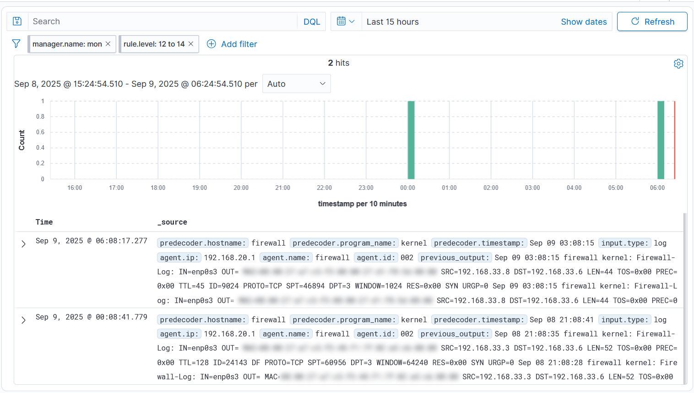

# Attacking and Defending (Threat modelling)

At this point, we have a decently realistic environment that we can attack and protect. To defend this environment correctly, we need to think about the entire attack surface, and the possible ways threat actors may exploit the weaknesses in the environment.

## Assets Enumeration

The first step in any such activity is asset enumeration, where we mention **all** the critical assets that need to be protected in this environment. The way I will go about this activity is per VM, since we can conveniently list all the critical assets. In addition, some assets are widely important like `Wazuh Agents`, which we will mention in their own table.

### Widely Important Assets
| Asset | Justification |
|-------|------|
| Wazuh Agents | `Wazuh` alerting relies on the presence of the agent on the monitored machine. If it is not functioning properly or was shut down intentionally, then the alerting capability would not work and we would lose monitoring to that machine.|
| Wazuh Agents Config| The configuration controls the behavior of the agent and must be protected (such as the reporting time, log sources, and communication settings). Unauthorized modification could disable monitoring, reduce visibility, or allow evasion of detection. |
| Critical System Files| Many files such as `/etc/passwd`, `/etc/shadow`, kernel modules, and application binaries are essential to the integrity of the operating system. If they are tampered with, attackers can escalate privileges, create backdoors, or destabilize the system. Monitoring these ensures integrity and quick detection of compromise.
| SSH Server Configs/keys| SSH configurations (e.g., `/etc/ssh/sshd_config`) and private keys control access to servers. If altered or stolen, they can weaken security policies (like disabling root login restrictions) or allow unauthorized access. Protecting and monitoring them helps ensure secure remote access and prevents credential-based attacks. |

### Firewall VM

| Asset | Justification |
|-------|------|
| Firewall Rules | Firewall rules regulate and control access to the infrastructure. If tampered with, they could be misconfigured or disabled, potentially leading to denial-of-service attacks, unauthorized access, or exposure of sensitive information. |


### DMZ VM
| Asset | Justification |
|-------|------|
| Nginx Server | The `Nginx` server routes external traffic into our `Keycloak IAM` and other internal services. A compromise could allow attackers to bypass authentication, disrupt routing, or perform man-in-the-middle attacks.|
| SSH Beacon | The SSH server on this machine is publicly exposed for administrators to connect and reach internal services. If abused, it could provide attackers with a direct entry point into the infrastructure, enabling privilege escalation or lateral movement.|

### App VM
| Asset | Justification |
|-------|------|
| Next.js Chatting App | This is the simulated service that users interact with. If compromised, attackers could manipulate user interactions, inject malicious code, or exfiltrate sensitive chat data. |
| MySQL | Stores the data required for the Next.js app, including user information and chat history. Unauthorized access or tampering could result in data loss, corruption, or exposure of sensitive information. |

### IAM VM
| Asset | Justification |
|-------|------|
| Keycloak IAM | Provides identity and access management (IAM) for the chat application and other services. It stores authentication data, user identities, and access policies. If compromised, attackers could gain unauthorized access, escalate privileges, or disable authentication entirely. |


### Monitoring VM
| Asset | Justification |
|-------|------|
| Wazuh Manager, Dashboard & Indexer| These components provide centralized security monitoring, log collection, and threat detection across the infrastructure. If compromised, attackers could disable monitoring, hide malicious activity, or manipulate alerts, severely reducing visibility and response capabilities. |

## Prioritization
Next, after identifying the assets, we can prioritize them based on their criticality and role within the system. In this simulated environment, we may skip this step since there is no real risk involved. However, in a real-world environment, prioritization is essential. Typically, assets are ranked according to:

- Business Impact – How crucial the asset is to operations (e.g., customer databases vs. test servers).
- Confidentiality, Integrity, and Availability (CIA) – The security principles most relevant to the asset.
- Threat Exposure – How likely the asset is to be targeted or exploited.
- Recovery Difficulty – How challenging and costly it would be to restore the asset if compromised.

This prioritization helps allocate resources effectively, ensuring the most critical systems are protected first.

## Asset Prioritization
Example prioritization could look like this (from most important to least):


| Priority | Asset | Justification |
|----------|-------|---------------|
| 1 | Wazuh Manager, Dashboard & Indexer | Centralized monitoring and detection. If lost or tampered with, the entire defense visibility collapses. |
| 2 | Keycloak IAM | Controls authentication and access policies. A compromise enables impersonation and privilege escalation. |
| 3 | SSH Beacon | Provides direct administrative access to internal services. Critical to protect against lateral movement. |
| 4 | Nginx (DMZ) | Main entry point for external traffic. Compromise could bypass authentication, redirect traffic, or disrupt routing. |
| 5 | Firewall Rules | Enforce segmentation between external, DMZ, and internal networks. Misconfiguration could expose sensitive services. |
| 6 | MySQL Database | Stores sensitive user and chat data. High confidentiality and integrity requirements. |
| 7 | Next.js Chatting App | Public-facing application. Potential target for code injection or data exfiltration. |
| 8 | Wazuh Agents | Provide log forwarding and visibility, but individually less critical compared to the Wazuh Manager. |
| 9 | System Configs & Critical Files | Local persistence and privilege escalation, but limited to single host impact. |


## Mitigations/Protections
Next, for each asset, we should list what protections are in place, and whether we need anything additional to enforce more protection. To keep this section brief, we instead describe most of the protections present and what we may need to include further.

### TLS protection
The `Nginx` server only allows HTTPs traffic to flow through it, and terminate the TLS traffic when it arrives. This protects secret information such Session Tokens & Passwords from getting exposed while the external users are interacting with our services.

However, at `Nginx` all of the traffic is decrypted and all internal communication is done in plain text (TLS terminated Traffic). For security and compliance reasons, you might consider re-encrypting the traffic before forwarding it internally.

### Firewall Filtering & Subnetting 
The external, DMZ, and internal networks are logically separated to enforce barriers and to let only a specific set of traffic to pass through.

External traffic can only be routed directly from the firewall to the DMZ. If the traffic is for a specific internal service, then `Nginx` forwards that traffic internally. Those exposed ports are 80 & 443 for `Nginx`, and 22 for SSH.

All kinds of traffic between the internal & DMZ is allowed. If we want to be more restrictive, we can enforce stronger policy, by only letting in traffic for certain service, mainly:
- SSH (to control internal services)
- `Wazuh Agents` (as they need to report to the manager and the manager must be able to respond to alerts) 
- `Wazuh Dashboard`
- `Next.js` App
- `Keycloak IAM`. 

This also allows us to enforce the principle of least privilege. Any other traffic between the two machines is not needed, and we could potentially interpret that as potential anomaly.

### Strict Password Policy

Password Authentication to the SSH beacon is allowed, and the passwords are relatively strong and hard to guess.

### Least Privilege Across the Environment

If some admin's job is to interact with an internal service like `Wazuh` or `Keycloak`, then this admin does not need to have **root** rights. This principle can be applied in many places across the environment.

### Continuous Monitoring and Response
In addition to protective measures, we need to have reactive measures to help handle incidents and provide visibility. This is achieved with the help of `Wazuh`.

## What We Could Implement

In addition to the existing protections/mitigations, we might benefit of implementing more into the infrastructure. 

### Network-Based Intrusion Detection
Network traffic currently is not checked and attack signatures at the network level may not be detected. Tools like `Snort` or `Suricata` can help with this.

### Log Integrity

Logs are only useful if they can be trusted. An attacker who compromises a system may attempt to delete or modify logs in order to cover their tracks. To reduce this risk, log integrity mechanisms should be enforced. This can be achieved by forwarding logs from each VM to a centralized system like the Wazuh Manager, applying cryptographic checksums to detect tampering, and storing logs in immutable or `write-once-read-many` storage. Together, these measures protect the reliability of logs and ensure that detection and response processes are based on trustworthy information.

### Web Application Firewall

Web Application Level attacks like SQLi and XSS are not filtered before the get to the web application. Despite that we have checked all the fields and endpoints in the chatting app, it is good to layer defenses on top of one another. This ensures that even if there is an unchecked or vulnerable field, the WAF will stop it before it gets processed.

### Load Balancing

Currently, the only entry point to the infrastructure and the internal services is DMZ VM, which if went down, then access is lost to the entire infrastructure. Here, we could introduce another DMZ beacon and instruct the firewall to spread traffic to both. In case one goes down, the other could take handle the traffic without losing access entirely.

### Automate Effort
Many configurations and maintains task need to be done manually. Instead, we can introduce automation, which could reduce manual work and increase the predictability, correctness & speed of those tasks.

### Patch Management

Patch Management is another area where automation can provide significant security benefits. Components such as `Nginx`, `MySQL`, and `Next.js` regularly release updates that often include fixes for newly discovered vulnerabilities. If these patches are not applied in a timely manner, the environment may remain exposed to known exploits, increasing the risk of compromise. Consistent and automated patch management ensures that critical services remain up to date, reduces the attack surface, and strengthens overall resilience against evolving threats.

## Multi-factor authentication (MFA)

Multi-factor authentication (MFA) is a critical layer of defense that significantly strengthens identity security within the environment. By requiring users to present two or more independent factors, such as a password (something they know) and a one-time code or push notification (something they have), MFA reduces the risk of unauthorized access even if one factor, like a password, is compromised. This approach directly protects high-value assets such as the `Keycloak` IAM service, which manages identities and access policies across the infrastructure.

An additional benefit of delegating authentication to `Keycloak` IAM is that we can change the methods used for sign-in without touching the `Next.js` chat-application. Thus, we can implement stronger authentication means with minimal effort on `Keycloak`. 

---

# Implementing Mitigations

Since implementing security controls and proper detection mechanisms is a time-consuming activity, we will focus now on implementing detection for a single real-world attack. In doing so, we will break down the logic behind every step in the process, discuss the consequences of implementing the mitigation, highlight the weaknesses of the mitigation itself, and explore how it can be improved and fine-tuned.

This approach will help readers understand not just what to deploy, but why it is deployed, and how it should be configured to achieve meaningful results. The goal is to provide a structured methodology: identify the threat, select the control, implement it carefully, evaluate its impact, and refine it iteratively.

By following this method, readers gain the ability to reason about security design decisions, rather than blindly deploying multiple controls without a thorough explanation of their purpose or configuration. This depth of understanding leads to more resilient defenses, fewer false positives, and better long-term security posture.

---

# Addressing Port Scanning Blind Spot

The selected vulnerability that we will tackle is our inability to detect surface-level port scans.

## The Problem

We have identified a blind spot in the last phase, which is that port scanning is not detected at the firewall because of the lack of **logging of dropped packets**. As a result, port scans can be carried out across the entire port range without generating any alerts. This provides an attacker with the opportunity to perform reconnaissance and gather information about available services without being noticed.

## Configuring the Firewall to log

The first step to resolve this blind spot is to configure the firewall to start logging network traffic. We do not need to log the entire content of the traffic, only the (TCP/IP), such as:

- Source & destination IP addresses
- Protocol (TCP, UDP, ICMP, etc.)
- Ports (source & destination)
- Packet flags (SYN, ACK, FIN, etc. for TCP)
- Interface (incoming/outgoing)

To minimize the amount of generated logs, we will use this strategy: log any **inbound** traffic whose destination is to any of the ports in the range 1-1024. This port range encompasses ports of many well-known services, so it is naturally a target for attackers to scan.

However, for ports 22,80 & 443, no log should be generated. This is because these ports are meant to be accessed externally and interacting with them from external sources does not necessarily indicate and attempt to scan for open ports. 

On the other hand, we do not offer any service on the other ports (say 20 or 21), so any interaction with these ports could indicate a port scan attempt. Determining whether a port scan is being performed could reduce to to how many ports an IP has interacted with. For example, there is no reason for the IP `192.168.33.2` to interact with ports **1,2,3,4,5....10**, unless it is a port scan.

The rule we will add to `iptables` in the `firewall VM` is following:
```bash
sudo iptables -A INPUT -i enp0s3 -p tcp --dport 1:1024 -m multiport ! --dports 22,80,443 -m hashlimit --hashlimit-upto 1/min --hashlimit-burst 1 --hashlimit-mode srcip,dstport --hashlimit-name uniqPortHitTCP -j LOG --log-prefix "Firewall-Log: " --log-level 4
```
Let's break down this rule:

| Option | Description |
|-------|------|
| `-A INPUT` | Append this rule to the INPUT chain |
| `-i enp0s3` | Match only packets arriving on interface `enp0s3`, which is the external interface of the firewall.|
| `-p tcp`| Match only TCP traffic (We are not interested in UDP).|
| `--dport 1:1024` | Match destination ports 1 through 1024 (inclusive).|
| `-m multiport ! --dports 22,80,443`| Load the multiport matcher and exclude TCP ports 22, 80, 443. Combined with `--dport 1:1024`, the effective match is: **ports 1–1024 except 22/80/443.**|
| `-m hashlimit` | Activates the `hashlimit` module|
| `--hashlimit-mode srcip,dstport` |  Build a rate bucket per (source IP, destination port) tuple.|
| `--hashlimit-upto 1/min` |  Allow 1 log per minute for each unique (src IP, dst port).|
| `--hashlimit-burst 1` | The first matching packet per tuple is logged immediately; further packets for the same tuple are suppressed until the rate window allows another.|
| `--hashlimit-name uniqPortHitTCP` | A label for this limiter (must be unique per rule).|
| `-j LOG`| Log the packet (does not accept/drop it). Control continues to the next rule.|
| `--log-prefix "Firewall-Log: "`| Adds a recognizable prefix to the syslog line so you can filter in rsyslog/Wazuh.|
| `--log-level 4` | Syslog level 4 (info) for the message.|

This rule tells the firewall to log TCP traffic coming in through interface `enp0s3` on ports 1 to 1024, except for the service ports 22 (SSH), 80 (HTTP), and 443 (HTTPS). To avoid log flooding, it uses a rate limit that records **only one log entry per minute** for each unique combination of source IP and destination port. The log entries are tagged with the prefix `"Firewall-Log: "` so they can be easily identified later in system logs or by Wazuh. The rule only logs the traffic; it does not block it, so if blocking is required, a separate `DROP` rule should be added. By default,  these packets are dropped because their routing is not configured for every port on the firewall.

We can then verify that the logs are being logged by visiting the `192.168.33.6:2` & `192.168.33.6:3` on your browser (The firewall IP address in your environment maybe different). Then on the firewall's syslog file `/var/log/syslog` you should see two new logs:

```syslog
2025-09-07T21:39:40.274179+00:00 firewall kernel: Firewall-Log: IN=enp0s3 OUT= MAC=XX:XX:XX:XX:XX:XX:XX:XX:XX:XX:XX:XX:XX:XX SRC=192.168.33.3 DST=192.168.33.6 LEN=52 TOS=0x00 PREC=0x00 TTL=128 ID=1134 DF PROTO=TCP SPT=49291 DPT=2 WINDOW=64240 RES=0x00 SYN URGP=0
2025-09-07T21:40:04.189002+00:00 firewall kernel: Firewall-Log: IN=enp0s3 OUT= MAC=XX:XX:XX:XX:XX:XX:XX:XX:XX:XX:XX:XX:XX:XX SRC=192.168.33.3 DST=192.168.33.6 LEN=52 TOS=0x00 PREC=0x00 TTL=128 ID=1719 DF PROTO=TCP SPT=49598 DPT=3 WINDOW=64240 RES=0x00 SYN URGP=0
```
<p align="center">
  
</p>

## Log Delivery
The next part after producing the logs is to actually deliver them to the `Wazuh Manager` for processing. Fortunately, these firewall logs are automatically appended to the [`journald`](https://documentation.wazuh.com/current/user-manual/capabilities/log-data-collection/journald.html) system service. The `Wazuh Agent` automatically picks up any new logs it sees in the `journald` and forwards it to the manager. Thus, we do not need to configure log forwarding.

To verify that the logs are actually present in the `journald`, we can use the following command:

```bash
# Command
sudo journalctl -k | grep Firewall-Log
# Example output
2025-09-07T21:39:40.274179+00:00 firewall kernel: Firewall-Log: IN=enp0s3 OUT= MAC=XX:XX:XX:XX:XX:XX:XX:XX:XX:XX:XX:XX:XX:XX SRC=192.168.33.3 DST=192.168.33.6 LEN=52 TOS=0x00 PREC=0x00 TTL=128 ID=1134 DF PROTO=TCP SPT=49291 DPT=2 WINDOW=64240 RES=0x00 SYN URGP=0
2025-09-07T21:40:04.189002+00:00 firewall kernel: Firewall-Log: IN=enp0s3 OUT= MAC=XX:XX:XX:XX:XX:XX:XX:XX:XX:XX:XX:XX:XX:XX SRC=192.168.33.3 DST=192.168.33.6 LEN=52 TOS=0x00 PREC=0x00 TTL=128 ID=1719 DF PROTO=TCP SPT=49598 DPT=3 WINDOW=64240 RES=0x00 SYN URGP=0
```

## Log Processing
Next, we need to capture the log at the manager, decode it, and check it against the list of rules that we have. For this we need to write a [**decoder**](https://documentation.wazuh.com/current/user-manual/ruleset/ruleset-xml-syntax/decoders.html), which instructs `Wazuh` how to parse a log and extract useful information & fields from them. Then, we need to write alerts that detects the malicious behavior and produce an alert on `Wazuh`'s dashboard.

First, before writing our own Decoder/Rules, we need to see how `Wazuh` interprets our logs. There is a designated tool in `Wazuh` that could help us do this, and it can be found under `Server Management -> Ruleset Test`.

<p align="center">
  
</p>

You will be presented with a large textbox wherein your log can be pasted. 

<p align="center">
  
</p>

Now, you can either copy one of the firewall logs generated by your firewall or use the following:

```bash
2025-09-07T21:39:40.274179+00:00 firewall kernel: Firewall-Log: IN=enp0s3 OUT= MAC=XX:XX:XX:XX:XX:XX:XX:XX:XX:XX:XX:XX:XX:XX SRC=192.168.33.3 DST=192.168.33.6 LEN=52 TOS=0x00 PREC=0x00 TTL=128 ID=1134 DF PROTO=TCP SPT=49291 DPT=2 WINDOW=64240 RES=0x00 SYN URGP=0
```

After pasting the log into the field, press on `Test`.

<p align="center">
  
</p>

<details>
  <Summary>Rule Test Full Output</Summary>

```bash  
  **Messages:
	WARNING: (7003): '92d1229d' token expires
	INFO: (7202): Session initialized with token '59d65897'

**Phase 1: Completed pre-decoding.
	full event: '2025-09-07T21:39:40.274179+00:00 firewall kernel: Firewall-Log: IN=enp0s3 OUT= MAC=XX:XX:XX:XX:XX:XX:XX:XX:XX:XX:XX:XX:XX:XX SRC=192.168.33.3 DST=192.168.33.6 LEN=52 TOS=0x00 PREC=0x00 TTL=128 ID=1134 DF PROTO=TCP SPT=49291 DPT=2 WINDOW=64240 RES=0x00 SYN URGP=0'
	timestamp: '2025-09-07T21:39:40.274179+00:00'
	program_name: 'kernel'

**Phase 2: Completed decoding.
	name: 'kernel'
	parent: 'kernel'
	action: 'Firewall-Log:'
	dstip: '192.168.33.6'
	dstport: '2'
	protocol: 'TCP'
	srcip: '192.168.33.3'
	srcport: '49291'

**Phase 3: Completed filtering (rules).
	id: '4100'
	level: '0'
	description: 'Firewall rules grouped.'
	groups: '["firewall"]'
	firedtimes: '1'
	mail: 'false'

```
</details>

## Decoder & Rules

Here, we see a few important details. First, `Wazuh` was able to sufficiently decode the fields we need using a built-in **Decoder**. As the output shows, it managed to capture the `source IP(srcip)`,`destination IP(dstip)`,`source port(srcport)` & `destination port(dstport)`. That is, from the log we provided it with, it managed to capture all of these fields automatically. So, we do not need to write our own `decoder`.

However, the alert that was generated is generic and does not really help us in our detection. For this reason, we will write our own rules. One thing to notice here is the the alert id `id: 4100`. This is a built-in rule that is automatically triggered after this specific decoder. That is, because the decoder used is related to firewall logs, rule `id: 4100` is configured to immediately capture any log processed by that decoder.

By default, this rule does not generate an alert on the dashboard, because the level of this alert is `level:0`. In addition, this rule does not stop the propagation of the alert itself. In other words, we can chain additional rules that can further process the log.

Because the alert `id: 4100` was triggered, our rules can benefit from this information. When we write our rule, we will tell `Wazuh` that our rule will **only** trigger if the log has already matched the rule with `id: 4100`. By doing this, we will have access to fields like `source IP` & `destination Port`, because the **decoder** used for `rule: 4100` will provide these values for us. In other words, if rule `id: 4100` does not match, there is no guarantee that we will get these important fields. 

Now, we create our own custom rule. To do this navigate to the homepage, then `Server management -> Rules`.

<p align="center">
  
</p>

Then, press `Add new rule` on the top of the page.

<p align="center">
  
</p>

Paste the following rule inside, and name the file **"firewall_port_scan_detection"**:

```xml
<group name="local,custom,firewall,">

  <!-- Base match for firewall logs (no alert) -->
  <rule id="100100" level="1">
    <if_sid>4100</if_sid>
    <match>Firewall-Log</match>
    <description>Custom firewall log captured (base)</description>
    <options>no_log</options>
  </rule>

  <!-- Same SRC IP hitting >=5 different destination ports in 60s -->
  <rule id="100110" level="12" frequency="5" timeframe="60">
    <if_matched_sid>100100</if_matched_sid>
    <same_srcip />
    <different_dstport />
    <description>Port scan suspected: $(srcip) contacted ≥5 different destination ports in 60s.</description>
    <group>portscan,</group>
  </rule>

</group>
```

<p align="center">
  
</p>

Save the file. Then you will be asked to restart Wazuh Manager, which you should for the rule to take effect.

<p align="center">
  
</p>

## Rule Explanation

**Rule 100100 - base tagger for firewall logs**

- It only runs on events that already matched rule 4100 (<if_sid>4100</if_sid>), and it further requires the log line to contain the text "Firewall-Log" (<match>Firewall-Log</match>).
- It raises a very low-severity alert (level="1") with the description "Custom firewall log captured (base)".
- The idea is to tag/collect these firewall events under SID 100100 so a later rule can count them.
- We set <options>no_log</options>, which means the alert won't include the original log body. It does not suppress the alert itself.

**Rule 100110 — correlation for suspected port scan**

- It looks only at events that matched 100100 (`<if_matched_sid>`100100`</if_matched_sid>`).
- If the same source IP (`<same_srcip />`) hits ≥ 5 different destination ports (`<different_dstport />`) within 60 seconds (frequency="5" timeframe="60"), it raises a high-severity alert (level="12").
- The alert is grouped under portscan and its message includes the source IP ($(srcip)).

**Or Simply**
- A firewall log triggers 4100 (built-in).
- If that log line also contains "Firewall-Log", 100100 tags it (and, as written, emits a level-1 alert and we suppress this alert).
- If within 60s the same src IP hits 5 different dst ports, 100110 fires a level-12 "port scan suspected" alert.


## Testing the Rule
We first check if the rule `id: 100100` triggers. To do this, we go back to the same rule-test window. Then, paste a firewall log from your environment, or use:

```bash
2025-09-07T21:39:40.274179+00:00 firewall kernel: Firewall-Log: IN=enp0s3 OUT= MAC=XX:XX:XX:XX:XX:XX:XX:XX:XX:XX:XX:XX:XX:XX SRC=192.168.33.3 DST=192.168.33.6 LEN=52 TOS=0x00 PREC=0x00 TTL=128 ID=1134 DF PROTO=TCP SPT=49291 DPT=2 WINDOW=64240 RES=0x00 SYN URGP=0
```

Before `Test`ing the rule, ensure you also press on `Clear Session`.
<p align="center">
  
</p>
<details>
  <Summary>New Rule Test Full Output</Summary>

```bash  
**Messages:
	INFO: (7202): Session initialized with token '74ce94e0'

**Phase 1: Completed pre-decoding.
	full event: '2025-09-07T21:39:40.274179+00:00 firewall kernel: Firewall-Log: IN=enp0s3 OUT= MAC=XX:XX:XX:XX:XX:XX:XX:XX:XX:XX:XX:XX:XX:XX SRC=192.168.33.3 DST=192.168.33.6 LEN=52 TOS=0x00 PREC=0x00 TTL=128 ID=1134 DF PROTO=TCP SPT=49291 DPT=2 WINDOW=64240 RES=0x00 SYN URGP=0'
	timestamp: '2025-09-07T21:39:40.274179+00:00'
	program_name: 'kernel'

**Phase 2: Completed decoding.
	name: 'kernel'
	parent: 'kernel'
	action: 'Firewall-Log:'
	dstip: '192.168.33.6'
	dstport: '2'
	protocol: 'TCP'
	srcip: '192.168.33.3'
	srcport: '49291'

**Phase 3: Completed filtering (rules).
	id: '100100'
	level: '1'
	description: 'Custom firewall log captured (base)'
	groups: '["local","custom","firewall"]'
	firedtimes: '1'
	mail: 'false'

```
</details>

You should see that the new rule with `id: 100100` should have captured the log and raised an alert. However, to trigger the second rule, you need 5 logs from the same `source IP` and to a different `destination IP` **within a minute**. 

We can easily do this by creating 5 different logs with the same `source IP (SRC)` and different `destination ports (DPT)` 
```bash
2025-09-07T21:39:40.274179+00:00 firewall kernel: Firewall-Log: IN=enp0s3 OUT= MAC=XX:XX:XX:XX:XX:XX:XX:XX:XX:XX:XX:XX:XX:XX SRC=192.168.33.3 DST=192.168.33.6 LEN=52 TOS=0x00 PREC=0x00 TTL=128 ID=1134 DF PROTO=TCP SPT=49291 DPT=2 WINDOW=64240 RES=0x00 SYN URGP=0
2025-09-07T21:39:40.274179+00:00 firewall kernel: Firewall-Log: IN=enp0s3 OUT= MAC=XX:XX:XX:XX:XX:XX:XX:XX:XX:XX:XX:XX:XX:XX SRC=192.168.33.3 DST=192.168.33.6 LEN=52 TOS=0x00 PREC=0x00 TTL=128 ID=1134 DF PROTO=TCP SPT=49291 DPT=3 WINDOW=64240 RES=0x00 SYN URGP=0
2025-09-07T21:39:40.274179+00:00 firewall kernel: Firewall-Log: IN=enp0s3 OUT= MAC=XX:XX:XX:XX:XX:XX:XX:XX:XX:XX:XX:XX:XX:XX SRC=192.168.33.3 DST=192.168.33.6 LEN=52 TOS=0x00 PREC=0x00 TTL=128 ID=1134 DF PROTO=TCP SPT=49291 DPT=4 WINDOW=64240 RES=0x00 SYN URGP=0
2025-09-07T21:39:40.274179+00:00 firewall kernel: Firewall-Log: IN=enp0s3 OUT= MAC=XX:XX:XX:XX:XX:XX:XX:XX:XX:XX:XX:XX:XX:XX SRC=192.168.33.3 DST=192.168.33.6 LEN=52 TOS=0x00 PREC=0x00 TTL=128 ID=1134 DF PROTO=TCP SPT=49291 DPT=5 WINDOW=64240 RES=0x00 SYN URGP=0
2025-09-07T21:39:40.274179+00:00 firewall kernel: Firewall-Log: IN=enp0s3 OUT= MAC=XX:XX:XX:XX:XX:XX:XX:XX:XX:XX:XX:XX:XX:XX SRC=192.168.33.3 DST=192.168.33.6 LEN=52 TOS=0x00 PREC=0x00 TTL=128 ID=1134 DF PROTO=TCP SPT=49291 DPT=6 WINDOW=64240 RES=0x00 SYN URGP=0
```

Note: DPT (Destination Port) has 5 different values in each log, namely `2,3,4,5,6`. It must be distinct or the alert wouldn't be generated.

Then, copy these 5 logs and paste them in the field. Do not forget to press `Clear Session` button before `Test`, or you may get different results to mine.

<p align="center">
  
</p>

The expected output is that each log is processed and each log should be handled by rule `id: 100100`, **besides the last one** which should be handled by `id: 100110`. This shows that we can now detect port scans that scans 5 ports or more.

## Port Scan with Nmap or Manually

To test our ability to detect port scans, position yourself outside the network by using the `Kali VM`. Then, scan the `external IP address` of the firewall. We show two ways to simulate a port scan.

### With a Browser
To simulate a port scan, you could visit from a browser:
- `192.168.33.6:2`
- `192.168.33.6:3`
- `192.168.33.6:4`
- `192.168.33.6:5`
- `192.168.33.6:6`

This should be done within a minute to hit the alert threshold.

### Using Nmap

Using `Nmap`, we can use the following command:
```bash
# The target is the EXTERNAL_IP of the firewall
nmap -p 2-6 192.168.33.6
```
<p align="center">
  
</p>

This will scan ports `2,3,4,5,6` on the machine `192.168.33.6`, which is the firewall.

## Checking Wazuh
Executing either of these methods should produce a **high-severity** alert on the dashboard.

<p align="center">
  
</p>

<p align="center">
  
</p>

Investigating the new alert, you should see that it has an alert message of `"Port scan suspected: <Kali_attacker_IP> contacted ≥5 different destination ports in 60s."`. In addition to the message, you should see the log that caused alert to arise, and the history of logs before it.

<p align="center">
  
</p>

<p align="center">
  
</p>

## What Happened
`Nmap` scanned ports `2,3,4,5,6`, and as a result, the firewall logged 5 different logs. These 5 logs were then sent to the `Wazuh Manager`, where it triggered the **"Port Scan"** Alert.

## What We Have Now

Before we added this port scan detection capability, we were not able to see surface level port scans (that only checks for open ports). The reason for that was the the firewall was not logging any connection attempts, and so port scans go undetected. Now, if someone interacts with 5 different ports within a minute, we hypothesize that this indicates a port scan attempt, and an alert is raised. The is all done without our intervention. That is, the alert is raised automatically to notify us.

## Limitations

This detection rule only fires an alert after **5 port interactions within a minute**, which means slow port scans can go undetected. This can be resolved by increasing the `timeframe` to a larger value. Additionally, the `"no_log"` option suppresses the low-severity alert. Thus, scanning 4 ports only is not actually detected. If you need a more verbose alerting in `Wazuh`, you could remove the`"no_log"` option from the rule `id: 100100`, but we will not do this here (bear in mind that this produce a low-alert for every interaction, which can cause log flood). Finally, this rule only works if the attacker uses a single machine to attack. This works perfectly here, but in other situations, where an attacker may have multiple computers to perform scanning, this rule may be unable to detect these scans from multiple attackers' computers if done thoughtfully.

## Alert Flood
As we have discussed, the `"no_log"` option is useful in lowering the number of alerts generated, but it comes at the cost of less visibility. In addition to that, the low `"threshold"` value could lead to a high number of false-positives, because a client could legitimately interact with 5 different service (FTP, MAIL, HTTP, HTTPS and so on...). Thus, these values need to be tailored depending on the environment where this rule will be deployed.

## Detection Evasion
Cumulatively, if the attacker knew about our threshold, then the attacker could theoretically schedule `nmap` to scan 4 ports every 1 minute; `65,536 (ports) / 4 (ports per min) = 16384 minutes`. In other words, the attacker can scan the entire port range in `16384 minutes` OR `273.06 hours` OR `11.37 days`.

The less the `threshold`, the slower the attacker must be. The higher the `timeframe`, the slower the attacker should. The information about threshold or `timeframe` must definitely be kept secret, so that attackers can not plan accordingly. 
 

## MITRE ATT&CK Mapping

We can further change the rule so that it maps to `MITRE ATT&CK Framework`. The new rule could look as follows:

```xml
<group name="local,custom,firewall,">

  <!-- Base match for firewall logs (no alert) -->
  <rule id="100100" level="1">
    <if_sid>4100</if_sid>
    <match>Firewall-Log</match>
    <description>Custom firewall log captured (base)</description>
    <options>no_log</options>
  </rule>

  <!-- Same SRC IP hitting >=5 different destination ports in 60s -->
  <rule id="100110" level="12" frequency="5" timeframe="60">
    <if_matched_sid>100100</if_matched_sid>
    <same_srcip />
    <different_dstport />
    <description>Port scan suspected: $(srcip) contacted ≥5 different destination ports in 60s.</description>
    <group>portscan,</group>
    <!-- This element was added here -->
    <mitre>
      <id>T1046</id>
    </mitre>
  </rule>
</group>

```

With this addition, alerts show the `MITRE ATT&CK` categorization of the tactic used in the dashboard as a part of the alert.

<p align="center">
  
</p>

---

## Alert Clarity

The alert clearly produces the following message:

"Port scan suspected: `192.168.33.3` contacted ≥5 different destination ports in 60s. This alert is clear, and an analyst can immediately understand that `192.168.33.3` is probably trying to plan an attack on the network by scanning for open services.

# Responding To The Attack

With our current setup, we can detect the port scan fairly easily. However, there is nothing stopping the attacker from scanning the entire port range, since there is no response being done against the attack. In addition, not stopping the attack would mean that every 5 request a new alert arises, which would overwhelm the person monitoring the environment.

For this, we need to react when the alert is raised. Conveniently, `Wazuh` comes with built-in module called [`active-response`](https://documentation.wazuh.com/current/user-manual/capabilities/active-response/index.html). This module allows us to take various actions on the agents across the environment either manually or automatically.

## Manual Response

While we would like to respond timely to the attack, sometimes automatic response is just not possible. There various reasons for this, one being that false-positives can cause alerts that lead to disruptive automatic responses. 

One action that might be of our interest is the [`firewall-drop`](https://documentation.wazuh.com/current/user-manual/capabilities/active-response/default-active-response-scripts.html#linux-macos-and-unix-based-endpoints). This action allows us to drop any packet originating from a certain origin (source IP). In other words, it allows us to block an IP address.

### Manual Response using Agent_Control Tool
We can execute this action by executing the following [command](https://documentation.wazuh.com/current/user-manual/reference/tools/agent-control.html) on the manager:

```bash
/var/ossec/bin/agent_control -a <agent_id> -f firewall-drop -b <attacker_IP>
```
This will block `attacker_IP` on the agent with `id:agent_id`.

### Manual Response with SSH

Another way to respond is using SSH to connect to the target computer and then executing commands inside that VM. For instance, we could SSH to the firewall, and execute the following command:

```bash
sudo iptables -A INPUT -s <ATTACKER_IP> -j DROP
```
However, this is much slower, requires authentication, requires root access, and ad hoc. Thus, we could benefit from the automatic response module.

## Automatic Response

As we mentioned, `Wazuh` comes with various out-of-the-box actions that we can utilize automatically. One such action is the `firewall-drop` action. Those actions are already configured in the `/var/ossec/etc/ossec.conf` file in the `manager`. For instance, this is how the `firewall-drop` command is defined in my manager's config file:

```xml
<ossec_config>
  <!-- .... -->
  <command>
    <name>firewall-drop</name>
    <executable>firewall-drop</executable>
    <timeout_allowed>yes</timeout_allowed>
  </command>
  <!-- .... -->
</ossec_config>
```

The action is already defined using the [`command`](https://documentation.wazuh.com/current/user-manual/reference/ossec-conf/commands.html) tag, but the action is **never** triggered by any alert. We need to tell `Wazuh` to execute this action when our alert is fired. To do this, we use the [`active-response`](https://documentation.wazuh.com/current/user-manual/reference/ossec-conf/active-response.html) element and add it to the config file in the `manager`.

```xml
<ossec_config>
  <!-- .... -->
  <command>
    <name>firewall-drop</name>
    <executable>firewall-drop</executable>
    <timeout_allowed>yes</timeout_allowed>
  </command>
  
  <!-- We add this element to the file -->
  <active-response>
    <command>firewall-drop</command>
    <location>local</location>
    <timeout>30</timeout>             <!-- seconds; after this execd sends "delete", which undoes the action -->
    <rules_id>100110</rules_id>       <!-- the rule IDs that will trigger the response -->
  </active-response>
  <!-- .... -->
</ossec_config>
```

This `active-response` element can be interpreted as follows: We execute the `firewall-drop` command on the agent that caused the alert to raise (`local`), when the rule with `id: 100110` is fired. After `30` seconds, the firewall should unblock the violator. Or simply, when the our alert is raised, the firewall agent blocks the origin that cause the alert to arise. The reason we choose a low `timeout` value is for testing purpose.


## How Does The Action Get Executed?

When the alert is raised, `Wazuh Manager` contacts `Wazuh Agent` in the firewall directly, which execute a small **binary** that blocks the attacker's IP.

Still, one question you might have is how this `active-response` action knows which `source IP` to block. The simple answer to this question is in the alert itself.

<p align="center">
  
</p>

Before executing the response, `Wazuh` passes the `JSON` data of the alert as a parameter to the `firewall-drop` action. This JSON data contains the `source IP (data.srcip)` of the instigator of the alert. Thus, the `firewall-drop` action extracts the `source IP` from the JSON of the alert, and then executes an `iptables` command to block this IP. You can review the code for the [`firewall-drop action`](https://github.com/wazuh/wazuh/blob/v4.12.0/src/active-response/firewalls/default-firewall-drop.c) on the GitHub repo of Wazuh.

If the alert did not contain the `(data.srcip)` field, then it wouldn't be possible to block any IP address. So, it is important to use `firewall-drop` action only on alerts where `(data.srcip)` field is present.

## Testing The Response

After implementing and configuring the response, we should be able to detect *and* respond the port scan automatically. That is, when the attacker scans 5 ports, and alert is raised, and an automatic response is taken. This action will block the IP Address of the attacker for 30 seconds, as we configured above. To test this, we go back to the `Kali VM`.

### Kali Machine

On the kali machine, we will execute the same attack command. However, we will use two different attack strategies to compare and contrast the results.

1. **Scanning 4 Ports and Stopping**

First, we scan 4 ports on the firewall to **not** trigger the alert, then attempt to `ping` the firewall VM or `curl` it. What we should see is that we are able to scan 4 ports, `curl` & `ping` the firewall after it without problems. This is because the alert is not triggered, and so we do not get blocked.

2. **Scanning 5 Ports and Connecting**

For the second attack, we will scan 5 ports and attempt to `curl` or `ping`. Here, as the attacker, after scanning 5 ports, we should **not** be able to connect. This is because 5 ports is the `firewall-block` `threshold` value, and after 5 port interactions we should get blocked for 30 seconds.


### Attack Preparation

Before attacking the firewall, on the `Kali VM`, I used the following command to display the time including seconds on the `Zsh Window`.

```bash
export PROMPT=$'┌──[%D{%H:%M:%S}](${debian_chroot:+($debian_chroot)}%n㉿%m)-[%~]\n└─$ '
```
<p align="center">
  
</p>

In addition, the `ping` commands we will use is the following.

```bash
ping 192.168.33.6 | awk '{ print strftime("[%H:%M:%S]"), $0; fflush(); }'
```
Basically, this command allows the `ping` tool to print the timestamp with each `ping` message.

#### Scanning 4 Ports and Stopping

The attack sequence is as follows:

```bash
# Test if firewall is reachable
curl 192.168.33.6
# Port scan 4 ports only
nmap -p 2-5 192.168.33.6
# Test if the firewall is STILL reachable
curl 192.168.33.6
```
<p align="center">
  
</p>

As the image shows, we were able to connect to the `Nginx` server through the firewall without issues. Then, we performed the attack, scanning only 4 ports (2,3,4,5) within less than a minute. Then, we connected back to `Nginx` without issues. This is the expected behavior here, since the attacker only gets blocked after 5 port accesses. 

**Remember, ports 22,80, and 443 do not count towards the 5 port accesses. This is because we intentionally configured the firewall to not log anything for accesses to these ports.**

#### Scanning 5 Ports and Connecting
The attack sequence here is similar, with a few differences.

```bash
# Test if firewall is reachable
curl 192.168.33.6
# Port scan 5 ports only
nmap -p 2-6 192.168.33.6
# Test if the firewall is STILL reachable
curl 192.168.33.6 # We cancel this because we would not get a response timely
# Continuously test Ping To see when we get unblocked
ping 192.168.33.6 | awk '{ print strftime("[%H:%M:%S]"), $0; fflush(); }'
```
<p align="center">
  
</p>

Here, we start with the `curl` to test reachability. Then, we perform the port scan, targeting **5 ports (2,3,4,5,6)**, which raises an alert and causes our machine to get blocked. This is proven by the next command. Attempting to `curl` the firewall again does not succeed timely, so we cancel it, and instead perform a `ping` command. The `ping` command starts initially, but we do not get any immediate replies because we are blocked. Only after a few seconds that we get a `ping` response from the server. This proves that we are indeed getting blocked by `Wazuh`, since we have scanned 5 ports on the firewall, which must not be allowed.

### Active Response Logs

Once an active response action is taken, a log should be added to the `/var/ossec/logs/active-responses.log` file on the `firewall VM`. 

<p align="center">
  
</p>

<details>
  <Summary>Full Active Response Output Log</Summary>

```bash
# Output Log
2025/09/11 14:31:53 active-response/bin/firewall-drop: Starting
2025/09/11 14:31:53 active-response/bin/firewall-drop: {"version":1,"origin":{"name":"node01","module":"wazuh-execd"},"command":"delete","parameters":{"extra_args":[],"alert":{"timestamp":"2025-09-11T14:31:22.306+0000","rule":{"level":12,"description":"Port scan suspected: 192.168.33.8 contacted ≥5 different destination ports in 60s.","id":"100110","mitre":{"id":["T1046"],"tactic":["Discovery"],"technique":["Network Service Discovery"]},"frequency":5,"firedtimes":4,"mail":true,"groups":["local","custom","firewall","portscan"]},"agent":{"id":"002","name":"firewall","ip":"192.168.20.1"},"manager":{"name":"mon"},"id":"1757601082.55622","previous_output":"Sep 11 14:31:21 firewall kernel: Firewall-Log: IN=enp0s3 OUT= MAC=XX:XX:XX:XX:XX:XX:XX:XX:XX:XX:XX:XX:XX:XX SRC=192.168.33.8 DST=192.168.33.6 LEN=44 TOS=0x00 PREC=0x00 TTL=43 ID=22529 PROTO=TCP SPT=42977 DPT=4 WINDOW=1024 RES=0x00 SYN URGP=0 \nSep 11 14:31:21 firewall kernel: Firewall-Log: IN=enp0s3 OUT= MAC=XX:XX:XX:XX:XX:XX:XX:XX:XX:XX:XX:XX:XX:XX SRC=192.168.33.8 DST=192.168.33.6 LEN=44 TOS=0x00 PREC=0x00 TTL=52 ID=62520 PROTO=TCP SPT=42977 DPT=5 WINDOW=1024 RES=0x00 SYN URGP=0 \nSep 11 14:31:21 firewall kernel: Firewall-Log: IN=enp0s3 OUT= MAC=XX:XX:XX:XX:XX:XX:XX:XX:XX:XX:XX:XX:XX:XX SRC=192.168.33.8 DST=192.168.33.6 LEN=44 TOS=0x00 PREC=0x00 TTL=47 ID=21703 PROTO=TCP SPT=42977 DPT=2 WINDOW=1024 RES=0x00 SYN URGP=0 \nSep 11 14:31:21 firewall kernel: Firewall-Log: IN=enp0s3 OUT= MAC=XX:XX:XX:XX:XX:XX:XX:XX:XX:XX:XX:XX:XX:XX SRC=192.168.33.8 DST=192.168.33.6 LEN=44 TOS=0x00 PREC=0x00 TTL=40 ID=51922 PROTO=TCP SPT=42977 DPT=3 WINDOW=1024 RES=0x00 SYN URGP=0 ","full_log":"Sep 11 14:31:21 firewall kernel: Firewall-Log: IN=enp0s3 OUT= MAC=XX:XX:XX:XX:XX:XX:XX:XX:XX:XX:XX:XX:XX:XX SRC=192.168.33.8 DST=192.168.33.6 LEN=44 TOS=0x00 PREC=0x00 TTL=55 ID=16031 PROTO=TCP SPT=42977 DPT=6 WINDOW=1024 RES=0x00 SYN URGP=0 ","predecoder":{"program_name":"kernel","timestamp":"Sep 11 14:31:21","hostname":"firewall"},"decoder":{"parent":"kernel","name":"kernel"},"data":{"protocol":"TCP","action":"Firewall-Log:","srcip":"192.168.33.8","srcport":"42977","dstip":"192.168.33.6","dstport":"6"},"location":"journald"},"program":"active-response/bin/firewall-drop"}}

2025/09/11 14:31:53 active-response/bin/firewall-drop: Ended
```
This is the second full log file:
- Full JSON NMAP ALERT: [mid-nmap-scan-alert.json](result/mid-nmap-scan-alert.json)

</details>

A couple of key details are available here.
-  The active response JSON data contains the program to execute AND the source IP. This allows the `firewall-drop` program to use the `srcip` as an argument to the active-response binary, effectively allowing us to block the attackers IP.
- The log shows the application and the removal of the firewall block, which is expected because we set the timeout to be 30 seconds.


## Response Speed Test

Another issue that we must tackle is the speed of the response. Ideally, when the attacker scans 5 ports, the 6th port interaction must not be allowed. However, this is unrealistic for multiple reasons. The key reason for this issue is the induced processing and transfer delay. Specifically, this is how an attacker's IP gets blocked:

1. The attacker sends scan packets using a port scanner tool like `Nmap`
2. The Firewall analyzes packets and puts the logs directly into the file.
3. The agent continuously forwards these logs to the manager, which does correlation, alerting and active-response.
4. If a violating sequence of logs is observed, then an alert is raised and an Active-Response script command is sent to the agent. 
5. The agent interprets the Active Response Commands and blocks the attacker's IP.

All of these activities requires processing & communication, and thus, blocking the attacker is not instantaneous action. But how many ports can the attacker scan before getting blocked? The less the number the better it is. 

### Testing Response Speed

The response speed in seconds or milliseconds may not be an effective figure on its own. Rather, we must see how many ports can the attacker scan in total before getting blocked. Our baseline is 5, and every port beyond this figure weakens our response effectiveness.

To perform the attack, we could use the following command:

```bash
# Ensure you use the correct firewall Address
nmap -p- -T4 192.168.33.6 
# -p- Makes the scan span the entire port range.
# the -T4 speeds up the scan more than normal scan speed. This is to harvest as much ports as possible before getting blocked.
```
**Note: You need to stop the attack manually, because `Nmap` cannot tell that it was blocked. This is because the `firewall-drop` action cause the firewall to silently drop packets coming from the attacker. A safe way to stop the attack is by monitoring Wazuh and waiting for the moment the alerts stop increasing. Stop here, because the attacker may get unblocked (due to short block) and continue scanning for more ports.**

### Judging the Response Speed 
Before the attack, we had **4 High-Severity alerts**. 

<p align="center">
  
</p>

After the attack, this figure increased to **24**.

<p align="center">
  
</p>

This indicates that the attacker managed to scan at least **(24 - 4) = 20 alerts, 20 * 5 = 100 ports**, and at most **104 port**s. This is **95 ports** more than the baseline.

### Estimating Response Speed
Next, we try to quantify the response speed in seconds. We need to collect different items to do this. For this we need multiple to collect multiple timestamp readings across different logs.

FIRST ALERT JSON: [low-nmap-scan-alert.json](result\low-nmap-scan-alert.json)

1. First, we need the timestamp of the **5th log in the first alert**, because this log is the timestamp at which the block must have occurred. The log of the 5th alert is as follows, which can be found in the first alert itself in `Wazuh`:

```bash
Sep 11 20:32:16 firewall kernel: Firewall-Log: IN=enp0s3 OUT= MAC=XX:XX:XX:XX:XX:XX:XX:XX:XX:XX:XX:XX:XX:XX SRC=192.168.33.8 DST=192.168.33.6 LEN=44 TOS=0x00 PREC=0x00 TTL=42 ID=64462 PROTO=TCP SPT=56411 DPT=199 WINDOW=1024 RES=0x00 SYN URGP=0 
```
2. Next, we need to see when was the alert raised. This also can be extracted from the alert JSON or from the dashboard.

<p align="center">
  
</p>

```json
// The timestamp shown on the dashboard is UTC+03:00, so the hours is a bit shifted
{
    "timestamp": [
      "2025-09-11T20:32:18.796Z"
    ]
}
// 11 September 2025, 20:32:18.796Z UTC
```
This means that the time it took `Wazuh` to raise an alert **20:32:18.796 (Wazuh Alert Timestamp) - 20:32:16 (Firewall Log Timestamp) = 00:00:2.796 = 2.796 seconds**.

3. Finally, we need to the active response log, which we can acquire from the `/var/ossec/logs/active-responses.log` file on the `firewall VM`.

<p align="center">
  
</p>

```bash
2025/09/11 20:32:19 active-response/bin/firewall-drop: Starting
# Timestamp 20:32:19
```
Then, the amount of time it took for the response to take is **20:32:19 (Action Timestamp) - 20:32:16 (Firewall Log Timestamp) = 3 seconds**. Thus, after violation, it took `Wazuh` `3 seconds` to analyze the last alert and issue a command to the agent to block the attacker.

### How Good Is This Speed?

The answer to this questions depends on multiple factors. For instance,
- How many ports are actually open and servicing requests?
- How many total ports did the attacker harvest in total?
- How fast was the detection and response latency (in seconds)?
- Did the attacker find high-value ports or services?
- Can the defense adapt if the attacker switches IPs or uses distributed scans?
- What type of scan did the attacker use (SYN, FIN, Xmas, UDP, etc.)?
- Was the firewall drop permanent or temporary?

For example, in this attack, the number of alerts tell us that at least 100 ports were interacted with. But, what about the output from `Nmap`?

<p align="center">
  
</p>

Despite telling `Nmap` that it should store the scan results in a file, the file contained no useful output. In addition, we had to manually terminate the attack, and the port scan results were lost from memory. So, from the attacker perspective, we were **not able to see which ports** that were successfully scanned, so our attack failed.

For this reason, a simple naive `Nmap` scan does not work here and the results will be lost. The attacker has to use a smarter strategy, so that `Nmap` produces a better result. One such way is scanning in blocks, instead of scanning the entire port range. 

**For example:**

```bash
# Scan the first 50 ports
nmap -p 1-50 192.168.33.6
nmap -p 51-100 192.168.33.6
# ....
```
This has several advantages and disadvantages.
- **Advantages:**
  - Can be scripted using `Python` or `Bash` to automate the scan.
  - More chance of success than a blind brute-force `Nmap` scan.
- **Disadvantages:**
  - Sharding port-scans into blocks is slower than executing a full `Nmap` scan
  - A slower scan leads to a lower number of ports scanned
  - Requires scripting knowledge for sophisticated attacks

### Dealing with the High Number of Alerts

The way the alerting system works is, for each 5 logs, a new alert is raised. This leads to a high number of alerts, which can overwhelm the administrators. We have a few methods to deal with this problem.

#### Threshold Increase
By increasing the frequency value in the rule configuration, alerts will only trigger after more events occur in the defined timeframe. For example, raising the threshold from 5 to 20 events within 60 seconds will reduce noise while still catching significant patterns.

#### Duplicate Suppression

Using directives like `<same_source_ip />` or `<same_field />` ensures that repeated alerts from the same origin (e.g., same IP or username) are merged, instead of raising a new alert for each occurrence.

#### Rule Grouping and Correlation

You can group related rules under a parent rule. Instead of multiple alerts for each sub-rule (e.g., similar to how we grouped alerts for rule 100100 to generate 100110 alerts), Wazuh can generate a single higher-level alert that reflects the overall attack attempt, reducing noise and improving clarity.

# Summary

We built a realistic monitoring stack, then enumerated and prioritized assets by *mock business impact*, CIA, exposure, and recovery difficulty. Highest-critical items included the `Wazuh Manager/Indexer/Dashboard (visibility backbone)`, `Keycloak IAM`, the SSH beacon and `Nginx` in the DMZ, core firewall policy, and app/database components. Baseline security controls covered TLS termination at `Nginx`, subnetting and port exposure minimization, least-privilege administration, strong passwords, and centralized monitoring via `Wazuh`. We also outlined future hardening: NIDS (`Suricata`/`Snort`), log integrity/immutability, WAF, HA/load balancing, automation, patch management, and MFA through `Keycloak` to strengthen identity without touching the app.

We then targeted a concrete detection gap: **undetected reconnaissance** from basic port scans. To close it, the firewall was configured to log inbound TCP hits on privileged ports **(1–1024) except 22/80/443**, tagging with a clear **prefix** and rate-limiting logs to prevent floods. Those kernel logs flow to `journald` and are shipped by the `Wazuh Agent` without extra forwarding config. On the `Wazuh` side, we kept the built-in kernel decoder and added two lightweight custom rules: **a low-level "base" tag (100100) and a high-severity correlation (100110)** that fires when the same source IP touches ≥5 different destination ports in 60 seconds, mapped to `MITRE ATT&CK T1046 (Network Service Discovery)`.

Detection was paired with response. Using `Wazuh Active Response`, the environment automatically executes `firewall-drop` on the affected agent when rule 100110 triggers, temporarily blocking the scanning **source IP** and logging the action. Blocking an attacker flows as follows:
- Attacker scans the firewall using `nmap` from the `Kali VM`   
- The firewall emits rate-limited logs 
- `Wazuh` correlates and alerts 
- Active response pushes a block command to the affected agent, which blocks the attackers IP
- Subsequent `curl`/`ping` attempts fail until the block expires.

Finally, we assessed limitations and possible improvements for the detection mechanism that we implemented. This includes the following points:
- Slow/distributed scans can evade a short 60-second window; 
- Raising the timeframe or threshold trades noise for coverage. 
- Excluding 22/80/443 avoids false positives but means those ports don't contribute to triggers. 
- Response is not instantaneous due to logging, shipping, correlation, and command execution latency; measuring "ports scanned before block" is a practical effectiveness metric.
- Alert volume can be controlled via higher frequencies, duplicate suppression, and rule grouping. 

Overall, the lab demonstrates a clear, defensible workflow: enumerate and prioritize assets, configure the perimeter to produce high-signal logs, correlate reconnaissance patterns in `Wazuh`, and enforce timely, targeted blocks, while acknowledging and tuning around operational trade-offs.