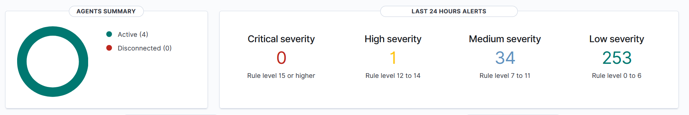
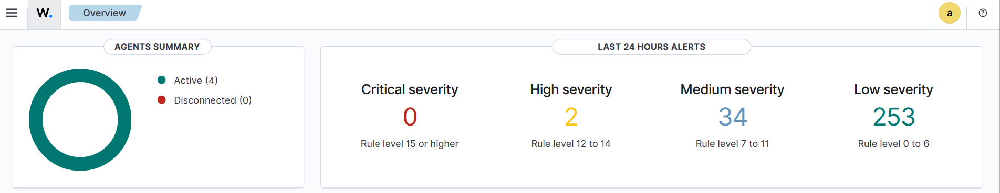
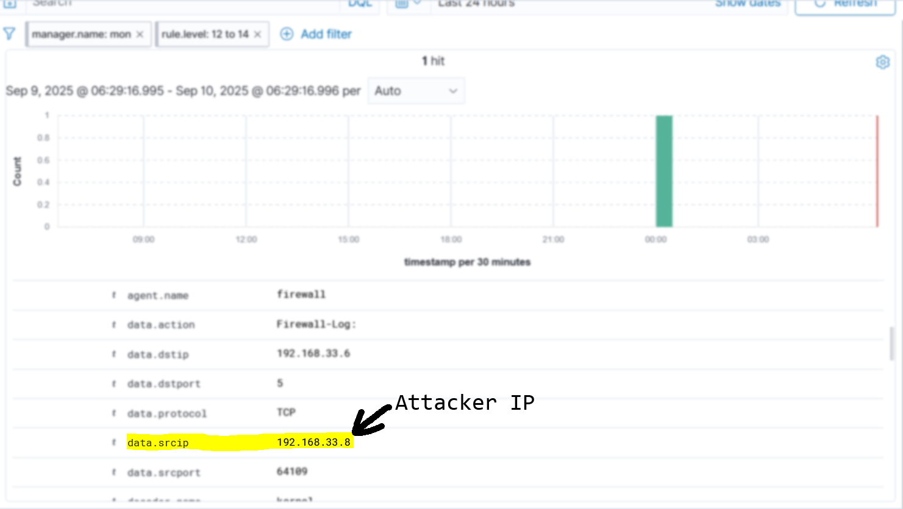

# 🔐 Enterprise Cybersecurity & DevSecOps Environment Project – Phase 4: Attack Simulation & Detection & Response

## 🧩 Overview

In Phase 4, we move into **active attack simulation, detection, and response** to validate the resilience of our environment and the effectiveness of our monitoring stack. We will launch **port scan attacks** from the `Kali` attacker VM against various components of the project and evaluate:

- How well the environment reacts to each attack
- How quickly and easily the attacks can be detected
- How good is the environments response to the attack

This phase represents the **"red team vs. blue team"** part of the project, testing the security controls we’ve built across earlier phases.

---

## 🧱 Virtual Machines Involved

| VM Name              | Role                        |
|----------------------|-----------------------------|
| **Kali Attacker**    | Launches simulated attacks  |
| **Firewall VM**      | Filters & routes   |
| **DMZ VM**           | SSH jump host & reverse proxy target |
| **Monitoring VM**    | Wazuh Manager, Indexer & Dashboard |

---

## 🎯 Phase Goals

By the end of this phase:
- We will have performed **threat modelling**, identified the important assets in the network, and prioritized assets.
- We will discuss the **current** protection mechanisms that are implemented.
- We will have documented **improvement areas** for future security hardening
- We will carefully consider a single attack (port scan):
    - simulate it
    - look at it from different angles
    - implement detections for it
    - configure `Wazuh` to respond to the attack with minimal amount of disruption to the environment
    - analyze the detection & response
---

## 🔍 Attack Detection & Response Goals

For this part of the lab, we will avoid scattershot, superficial attack simulations. Instead, we focus on a single representative technique - port scanning - and treat it end-to-end. Therefore, for the **port scanning attack** we will:

- explain the blind spot that we have discovered in the previous part of the lab
- configure the environment to properly produce logs
- implement detections rule
- map it to `MITRE ATT&CK`
- implement a response an appropriate response to the attack
- validate the effectiveness of this effort.

In addition to the above, we will
- Assess **alert clarity**; was the event easy to identify and interpret?
- Check **time-to-detection**; how long did it take for the alert to appear?
- Document the log sources and the specific rule ID that was triggered.

---

## 📽️ Demo & Results – Non-Technical Overview 

In this phase, we analyzed the environment, its assets, and protections, and then focused on detecting and responding to **port scans**. [Port scanning](https://attack.mitre.org/techniques/T1046/) is usually one of the first steps that attackers do in the early stages of an attack to identify the services that they could attack. For example, in this project, we have Nginx & SSH Servers accessible to the public. Thus, a port scan attack aims to identify all such services.

In the beginning of this phase, attackers were able to perform port scanning without getting detected by `Wazuh`, because our environment required extra configuration to detect such an attack. We began by configuring the computers in the environment, where we activated logging for certain network traffic. This allows us then to use `Wazuh`, which can read and interpret these logs. After configuring the environment, we wrote a few `Wazuh` rules, which are intended to directly address port scanning. These rules, along with the environment configuration, allowed us to correctly identify port scans attacks in real-time. For instance, within almost 3 seconds of executing a port scan attack, and alert gets raised for us to take action.

### Alerts Count Comparison

  

Before we perform the attack, there was **single high-severity** alert. 

  

After executing the attack, this was immediately reflected on the dashboard by an increase in the number of **high-severity** alerts. The alert contains sufficient information to allow the administrator to identify:
- Which ports were scanned.
- What is the IP address of the attacker
- To which `MITRE ATT&CK` attack-stage this attack belong

These pieces of information are essential for the administrator, because they help in the response process. 

  

The image shows the IP address of the machine that performed the attack against the environment. This information is useful since it now we can prevent further attacks from this address by blocking it entirely if needed.

### Automatic Response

At this point, the attack can be detected and an alert is raised within a few seconds of detection. However, human response to such attacks can be slow. For this reason, we should consider using automatic response, when such an attack is detected. This helps stop the attack from continuing quickly, and limit the number of identified services.

The implemented automatic response is simple yet, proved to be effective at stopping the attack. `Wazuh` provides a specific module called `Active Response`, which allows us to take action when an alert is raised. To simply describe the action, the attacker first starts by performing the port scan attack. `Wazuh` keeps monitoring for specific signature in the logs, and raises an alert if 5 of these signature is detected. `Wazuh` then sends a message to the computer that raised the alert, informing it to block the attacker's origin. 

The time it takes for a response to be triggered after an attack is detected is 3 seconds. This means the attacker has only a 3-second window to act before being blocked. Once the response is in place, the attacker can no longer communicate with our environment for a period of time. Within such a short window, it is extremely difficult for the attacker to gather any useful information. In effect, our response significantly reduces the likelihood of a successful attack, deterring adversaries and preventing compromise. With this improvement, we have gone from being unable to detect a port scan attack to being able to detect, respond to, and prevent it.

---
## ⚠️ Known Limitations 

We have identified that the port-scan detection we implemented has some gaps. These gaps mainly come from the trade-offs between detection accuracy, storage requirements, performance, and false positive reduction. 

The key point is that these trade-offs are not fixed—they can be tuned for each environment. In a high-security setup, thresholds and timeframes can be stricter with longer blocking times, while in production environments with heavy user traffic, looser thresholds and suppression techniques may be better to reduce noise. This flexibility means each organization can configure the detection to minimize the gap most relevant to its risk profile and operational needs.

That said, the environment may still have other blind spots. However, the goal of this phase is to demonstrate a methodology for implementing a security control, assessing it, and confirming it functions as intended; not to eliminate every single weakness in the environment, which would require significantly more time, effort, and tooling.
---

## 📄 **For Technical Readers:**  
See **[Lab Steps – Phase 4](lab-steps-phase-4.md)** for detailed VM setup, network configuration, and service installation instructions.

---

## ✅ Next Step

In **Phase 5**, we will start working with DevOps & DevSecOps portion of the project.