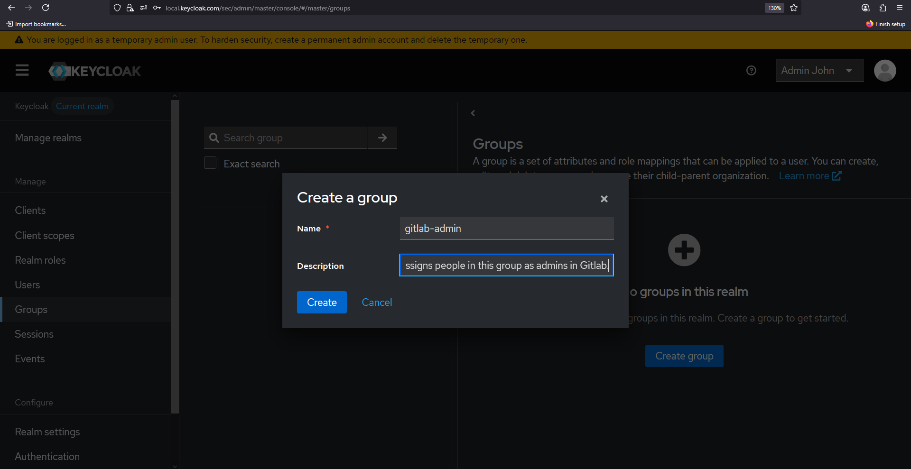
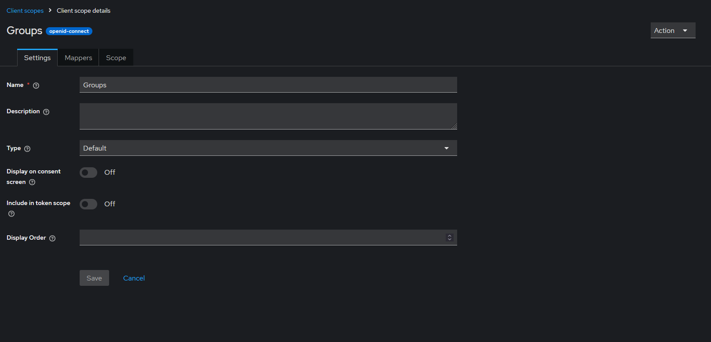
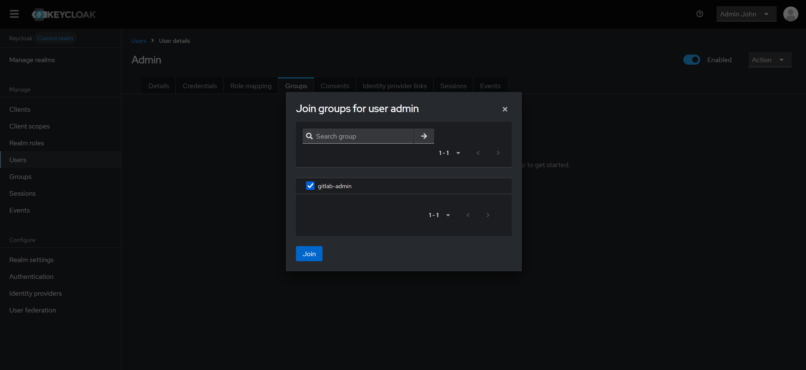
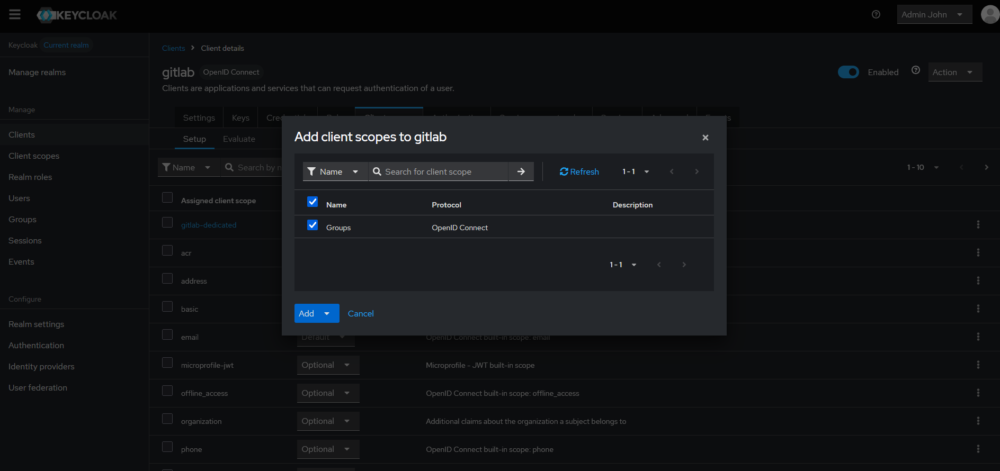
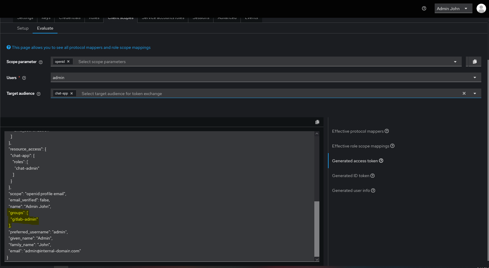

# Mapping "admin-gitlab" Keycloak group to GitLab admin user.

The setup for this is described briefly [here](https://docs.gitlab.com/administration/auth/oidc/#administrator-groups). For more elaborate steps, follow along here.

1. First you need to add few details to the `gitlab.rb` config. 

```ruby
gitlab_rails['omniauth_enabled'] = true 
gitlab_rails['omniauth_allow_single_sign_on'] = ['openid_connect']
gitlab_rails['omniauth_block_auto_created_users'] = false   # auto-create your account
gitlab_rails['omniauth_providers'] = [
  {
    name: "openid_connect",
    label: "Keycloak",
    args: {
      scope: ["openid","profile","email"],
      response_type: "code",
      issuer: "https://local.keycloak.com/sec/realms/master",
      discovery: true,
      uid_field: "preferred_username",
      pkce: true,
      client_options: {
        identifier: "gitlab",
        secret: "ivNg4D5Cyq40RQPNqCa5Y7Sd2xXWToSl",
        redirect_uri: "http://192.168.20.4/users/auth/openid_connect/callback",
        ## We added this block
        gitlab: {
          groups_attribute: "groups",
          admin_groups: ["gitlab-admin"]
        }
      }
    }
  }
]
```

2. Then you reconfigure `gitlab`.

```bash
## Use your container id
docker exec -it 60 bash
# Inside the container, this command should run
gitlab-ctl reconfigure
```

3. Now, go to your `Keycloak` server and create a new group. The group name must match that used is the `gitlab.rb` config file. 

<p align="center">
    
</p>

In our case, the group name is `"gitlab-admin"`.

4. Then create a client scope:

<p align="center">
    
</p>

And create group mapper with the following options:

<p align="center">
    
</p>

This mapper basically tells `Keycloak` how to place the groups info in the token.

5. Then, assign the users to this group.

<p align="center">
    
</p>

6. Next, under the `client settings -> Client scopes`, `add client scope` that we just created and set it to default, so you don't have to add it to the list of claims.

<p align="center">
    
</p>

7. We can now test whether the groups are being added correctly to the token.
<p align="center">
    
</p>

At this point, the setup for this is ready. That is, when a user is assigned to group `gitlab-admin` in `Keycloak`, `GitLab` will grant this user with admin rights on `GitLab`. However, because this requires the premium version, it will not work on my environment.