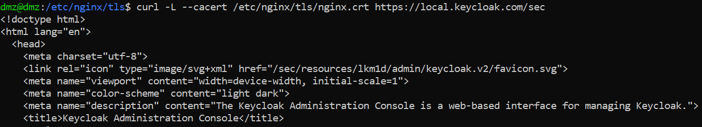

# VM Setup
In this phase of the lab, we set up our final VM needed. This VM will be used to host `GitLab CI/CD`. For simplicity, we will install `GitLab` via `Docker`.

## Setup Details

We will use the same `Ubuntu Server` image as the previous VMs. For network connectivity, this VM should be connected to the internal host-only network.

## Network Connectivity

```yaml
network:
  version: 2
  ethernets:
    enp0s3:
      addresses: [192.168.20.4/24] # IP chosen for this VM
      routes:
        - to: 0.0.0.0/0
          via: 192.168.20.1
      nameservers:
        addresses: [8.8.8.8, 1.1.1.1]
```

## Docker Installation

Following the instructions on their [website](https://docs.docker.com/engine/install/ubuntu/#install-using-the-repository), we use the following commands:

```bash
# Add Docker's official GPG key:
sudo apt-get update
sudo apt-get install ca-certificates curl
sudo install -m 0755 -d /etc/apt/keyrings
sudo curl -fsSL https://download.docker.com/linux/ubuntu/gpg -o /etc/apt/keyrings/docker.asc
sudo chmod a+r /etc/apt/keyrings/docker.asc

# Add the repository to Apt sources:
echo \
  "deb [arch=$(dpkg --print-architecture) signed-by=/etc/apt/keyrings/docker.asc] https://download.docker.com/linux/ubuntu \
  $(. /etc/os-release && echo "${UBUNTU_CODENAME:-$VERSION_CODENAME}") stable" | \
  sudo tee /etc/apt/sources.list.d/docker.list > /dev/null

sudo apt-get update
```

Then, we install `docker` packages.

```bash
sudo apt-get install docker-ce docker-ce-cli containerd.io docker-buildx-plugin docker-compose-plugin
```

### Using Docker Without Sudo

By default, you need to prefix all commands issued to `docker` with `sudo`. We can avoid this by adding the current user to `docker` group.

```bash
# Create docker group
sudo groupadd docker
# Add the current user to the docker group
sudo usermod -aG docker $USER
# Activate Group changes
newgrp docker
# You will most probably need to reboot for this to work 
reboot
```

After the machine reboots, you should be able to run the `hello-world` container without using `sudo`.
```bash
docker run hello-world
```

<p align="center">
  
</p>


## Docker Compose File

A docker-compose file allows us to group multiple images together and run them. Currently, the following file configuration should suffice as a starting point, but we may need to make a few changes later to the `docker-compose` file.

```yaml
services:
  gitlab:
    image: gitlab/gitlab-ce:18.3.2-ce.0
    container_name: gitlab
    restart: always
    hostname: '192.168.20.4'
    environment:
      GITLAB_OMNIBUS_CONFIG: |
        external_url 'http://192.168.20.4'
    ports:
      - '80:80'
      - '443:443'
      - '2222:22'
    volumes:
      - '/srv/gitlab/config:/etc/gitlab'
      - '/srv/gitlab/logs:/var/log/gitlab'
      - '/srv/gitlab/data:/var/opt/gitlab'
    shm_size: '256m'
```

A couple of points about the above config:
- We will not worry about encrypting the traffic from the `DMZ VM` to `GitLab`, since it is only accessible internally. The traffic from the client to the ssh proxy is completely encrypted by default, and we need not worry about encrypting internal traffic.
- I have chosen port 2222 for SSH in `GitLab`, because there is an SSH server already running on port 22 on the `CI/CD VM`. This will affect how you interact with `GitLab`, so bear this in mind.

## Running the Container

With everything ready, we can now run the image.

```bash
docker compose up -d
```

This should take a few minutes to complete. 

<p align="center">
  
</p>

<p align="center">
  
</p>

After it finishes, your `Docker` image should be in a healthy state. Now, we can start working with `GitLab`.

## Accessing GitLab

To access `GitLab`, we will use the SSH proxy (SOCKS 5 proxy). This will allow us to access the web app.

```bat
ssh -D 1080 -C -N dmz@192.168.33.6 :: On windows this command will work
```
Then on the browser, make sure you configure the proxy.

<p align="center">
  
</p>

Now visit http://192.168.20.4.

<p align="center">
  
</p>

The initial `root` password is stored in the `GitLab` container at `/etc/gitlab/initial_root_password`. This password can be found using the following command on the `CI/CD VM`:

```bash
sudo docker exec -it gitlab grep 'Password:' /etc/gitlab/initial_root_password
# Password: XXXXXXXXXXXXXX
```

Now you can use this to login into `GitLab` with the username `root`.

<p align="center">
  
</p>

---

# Integrating Keycloak IAM

One of the reasons we set up `Keycloak` as an **IAM** was to use it as a source of truth for user identities and accounts. This allows us to login using accounts stored on `Keycloak`, rather than accounts that we create directly in `GitLab`. This centralizes the management of identities, permissions, and roles to a single place.

## Reissuing a TLS Certificate

Since we are running `Keycloak` in a specific configuration behind `Nginx`, we must use the IP address `192.168.33.6` to connect to it. However, as we covered in phase 2, this can pose a lot of major problems, such as **Nat hairpinning**. Furthermore, `Keycloak` must be using HTTPS, since this is required by `GitLab`.

Reference for HTTPs requirement: https://docs.gitlab.com/administration/auth/oidc/#configure-keycloak

Previously, we managed to resolve this problem previously using `iptables`, but this will not be simple to do here. This is because `Docker` uses `iptables` behind the scenes, and we do not want to break anything by making our changes. 

<p align="center">
  
</p>

Since this is the public IP address of the firewall routing at the firewall may break. A simple solution to alleviate this problem is by reissuing the TLS certificate, but this time, we allow and sign both SANs:
- 192.168.33.6
- local.keycloak.com

The IP is required for external access to the `Nginx` server. On the other hand, the `local.keycloak.com` name will be used locally.

As a hint, these are the commands that you can use to reissue a certificate.

```bash
# We do not create a new private key, rather we use the old private key
# nginx.key is located at /etc/nginx/tls
# san2.conf is provided shortly
# The command should produce server2.csr
sudo openssl req -new -key nginx.key -out server2.csr -config san2.conf

# We use nginx.key to sign server2.csr
# This will produce the self-signed certificate server.crt
sudo openssl x509 -req -in server2.csr -signkey nginx.key -sha256 -days 825 -out server.crt -extensions req_ext -extfile san2.conf
```

Here is the `san2.conf` file that I used:
```ini
[ req ]
default_bits       = 2048
prompt             = no
default_md         = sha256
req_extensions     = req_ext
distinguished_name = dn

[ dn ]
C  = SA
ST = DMM
L  = DMM
O  = Lab
OU = DMZ
CN = 192.168.33.6

[ req_ext ]
subjectAltName = @alt_names
basicConstraints = CA:FALSE
keyUsage = digitalSignature, keyEncipherment
extendedKeyUsage = serverAuth

# I have added another DNS name local.gitlab.com, as we might need that in future
[ alt_names ]
IP.1  = 192.168.33.6
DNS.1 = local.gitlab.com
DNS.2 = local.keycloak.com
```
You should rename the `.crt` file to `nginx.crt`, so that `Nginx` can recognize it.
Finally, you must reconfigure `Nginx` to accept the new DNS names.

```nginx
server {
    listen 443 ssl http2;
    # Only line that has changed, where we added the DNS names.
    server_name local.gitlab.com local.keycloak.com 192.168.33.6 192.168.10.2;
    # ...
}
```

Now, you can restart `Nginx`.
```bash
sudo systemctl restart nginx.service
```

If everything goes well, you should be able to retrieve the newly created certificate when accessing `Nginx`.

<p align="center">
  
</p>

## Adding the Host Name

On both the `DMZ VM` & `CI/CD VM`, we must ensure that accessing `local.keycloak.com` is resolved to `192.168.10.2`. We can do this by configuring the `/etc/hosts` file on both VMs.

**Note: A more realistic approach is to host a DNS server, but for this project, we are trying to make everything as simple as possible**

```bash
# Open the file
sudo nano /etc/hosts
```

```bash
#/etc/hosts
# Add this line
192.168.10.2 local.keycloak.com
```

You should be able to `ping` using the **DNS name** on **both VMs**:

<p align="center">
  
</p>

## Rerunning Keycloak

The initial command that we used to run `Keycloak` with is:
```bash
sudo bin/kc.sh start-dev --hostname 192.168.33.6 --http-relative-path /sec --proxy-headers xforwarded
```
However, this poses a problem in terms of accessing it. By specifying the `hostname: 192.168.33.6`, we are telling `Keycloak` to issue redirects with this IP address. In other words, every time you try to access `keycloak` using `local.keycloak.com`, you will see that the hostname in URL change to `192.168.33.6`. This wouldn't work for our case, because of the NAT hairpinning problem. The solution is to ask `Keycloak` to derive the hostname based on our requests, rather than using a strict hostname. This can be done by running `Keycloak` with the following command:

```bash
sudo bin/kc.sh start-dev --hostname-strict=false --http-relative-path /sec --prox
y-headers xforwarded
```

The `--hostname-strict=false` tells `Keycloak` to derive the hostname from the requests themselves, and to process all the requests on the machine regardless of the hostname.

## Testing Access to Keycloak

Now, you should be able to access `Keycloak` from the DMZ via the SSH proxy.

<p align="center">
  
</p>


In addition, from the `DMZ VM`, you should test that you are able to access `Keycloak` without certificate errors. With the following command, you should not get any errors:

```bash
curl -L --cacert /etc/nginx/tls/nginx.crt https://local.keycloak.com/sec
```
This command tells `curl` to verify the certificate **specified** against the accessed website.

<p align="center">
  
</p>


## Creating Keycloak Client

Next, we create a `Keycloak Client` for `GitLab`. For reference, here are the values used for my setup.

<p align="center">
  
</p>

<p align="center">
  
</p>

<p align="center">
  
</p>

## Configuring GitLab

On the `CI/CD VM`, open the `/srv/gitlab/config/gitlab.rb` file and add the following:

```ruby
gitlab_rails['omniauth_enabled'] = true
gitlab_rails['omniauth_allow_single_sign_on'] = ['openid_connect']
gitlab_rails['omniauth_block_auto_created_users'] = false   # auto-create your account
gitlab_rails['omniauth_providers'] = [
  {
    name: "openid_connect",
    label: "Keycloak",
    args: {
      scope: ["openid","profile","email"],
      response_type: "code",
      issuer: "https://local.keycloak.com/sec/realms/master", # Keycloak address behind Nginx
      discovery: true,
      uid_field: "preferred_username", 
      pkce: true,
      client_options: {
        identifier: "gitlab", # The name of the client
        secret: "<generated-by-keycloak>", # The secret generated by Keycloak
        redirect_uri: "http://192.168.20.4/users/auth/openid_connect/callback"
      }
    }
  }
]
```
**Be sure that you correctly put the name of the client and secret. Otherwise this will not work.**

After doing this you need to reconfigure `GitLab` to reflect these changes.

1. First you need to identify your **container ID**.
```bash
docker ps
# Example output on my machine
CONTAINER ID   IMAGE                          COMMAND                  CREATED        STATUS                  PORTS                                                                                                                   NAMES
60f50a8b11bb   gitlab/gitlab-ce:18.3.2-ce.0   "/assets/init-contai…"   11 hours ago   Up 11 hours (healthy)   0.0.0.0:80->80/tcp, [::]:80->80/tcp, 0.0.0.0:443->443/tcp, [::]:443->443/tcp, 0.0.0.0:2222->22/tcp, [::]:2222->22/tcp   gitlab
```
<p align="center">
  
</p>

The ID here is `60f50a8b11bb`.

2. Then, open a **shell inside the container**:
```bash
## For the id, you can use the first few letters of the ID if there are not other containers with the same prefix
docker exec -it 60 bash
```

3. Run the reconfigure command:
```bash
# Running this should take a minute or so, so wait for it.
gitlab-ctl reconfigure
```

## GitLab Container to Keycloak

Before you exit the container, you should test whether your container can reach the `Keycloak`. This can be done with the `curl` command.

```bash
curl -k https://local.keycloak.com/sec/realms/master
```
<p align="center">
  
</p>


<details>
  <summary> Sample JSON Response</summary>

  ```json
  {
    "realm": "master",
    "public_key": "MIIBIjANBgkqhkiG9w0BAQEFAAOCAQ8AMIIBCgKCAQEAs/izZ9oYD62DIB7HkaILjlOe9cj5nxFFp99YLxwz5XhDw/7X4We2qMO89mklSla8k1Dh5I8eXH3rMLSIXEkdBqzCGFzpcUHwdI5SQrxyemDQMeWk8mXaatHjQhyoEI7AGrI93UrK9sEePTZCmRAw/nkKaNiVyOfXerWF6xetcfp6e//ZQ5Ght6laf3qb0hgUiIdfj3HIQ9BBT7e5dLFop9RN4pqkDVDxRRKmvwpzQeV2dmbM55QJfW41bLmPpsPCLpRht543p9M/CbtiPPc7NO/ABI+H7XbKZHqiiq4Jczw/ktZxSnAm66SRS0FRuM3xXkzNw1sIM/aNNkjnwsaTBwIDAQAB",
    "token-service": "https://local.keycloak.com/sec/realms/master/protocol/openid-connect",
    "account-service": "https://local.keycloak.com/sec/realms/master/account",
    "tokens-not-before": 0
  }
```
</details>

You must get a JSON response for this request, otherwise `GitLab` itself would not be able to connect. If this does not work, you might have a problem with your `/etc/hosts` file configuration.

## Keycloak SSL Certificate

Currently, if you try to login with `Keycloak` in `GitLab`, you won’t be able to sign in. The reason being that the certificate is self-signed, and you need to pass your TLS certificate to `GitLab`.

<p align="center">
  
</p>

Add a trusted TLS certificate by placing the certificate in the `/srv/gitlab/config/trusted-certs` folder.

<p align="center">
  
</p>

This is the same certificate that we issued a few steps before. Then, we reconfigure `GitLab`.

```bash
## Use your container id
docker exec -it 60 bash
# Inside the container, this command should run
gitlab-ctl reconfigure
```

## Testing Keycloak Login

Now we are ready to login with `Keycloak`. On your browser where the SSH proxy is active, visit http://192.168.20.4, and click on `Keycloak`.

<p align="center">
  
</p>

You will be redirected to `Keycloak` to sign in.

<p align="center">
  
</p>

Enter your username and password, then submit. You will be redirected back to the homepage of `GitLab`, signed in with your account.

## Using Keycloak for RBAC

To keep this simple, we used the `Open ID Connect` protocol for authentication. However, the shortcoming of using it is that you do not get a lot of control in terms group/role assignment. That is, you cannot have a fine-grained control over mapping `keycloak` users to `GitLab` groups. You would have to use SAML, SCIM, or LDAP to do this. Unfortunately, these other options are either too complex for the lab, or you will need to have the **premium** version of `GitLab` to use them.

<p align="center">
  
</p>

More about this here:

- https://docs.gitlab.com/integration/omniauth

In any case, if you would like to practice the process of configuring `Keycloak` **admin-group** to map to `GitLab` admins, you can find the steps here: [**Mapping Keycloak Admins to GitLab**](lab-optional.md). However, this is a paid feature, so you will not be able to test your work.

If you do not want this, you can just use the default **admin account**, or assign new `Keycloak` users to groups manually inside `GitLab`.

---

# Accessing GitLab with SSH via The SSH Proxy

`GitLab` allows us to interact with the `git` repositories on `GitLab` using SSH. Therefore, we need to configure our Admin computer to be able to interact with the SSH component of `GitLab`. The way we will go about this is by configuring an SSH-based TCP proxying via a jump host. 

1. First, on your Admin computer, generate a private/public key-pair. 

```bash
ssh-keygen -t ed25519 -C "gitlab_key" -f "$env:USERPROFILE\.ssh\id_ed25519"
```

2. Next, we create the following config file at `C:/Users/<YourUsername>/.ssh/config`.

```bash
Host bastion
  HostName 192.168.33.6 # The IP of the firewall
  User dmz              # The user on the firewall

Host gitlab
  HostName 192.168.20.4 # The IP of gitlab
  Port 2222             # The port we chose for gitlab SSH
  User git              # Keep this as git
  ProxyJump bastion     # This tells SSH to use "bastion" as the relay     
  IdentityFile C:/Users/<YourUsername>/.ssh/id_ed25519  # The private key we just created
```

3. On `GitLab`, you need to add the public key portion of the key to your user account.

<p align="center">
  
</p>

- Be sure to copy the full public key definition as shown.

<p align="center">
  
</p>

- After submitting, you will be able to use the private key to interact with `GitLab` SSH.

<p align="center">
  
</p>


4. Finally, test connectivity with:

```bash
ssh gitlab
```
You will be prompted to enter the passwords for the `DMZ VM` (if you've used a password), and the passphrase for the private key itself.
<p align="center">
  
</p>

If you see `"Welcome to GitLab, @root!"`, the setup is complete.

## Explanation of The Connection Establishment Process

When you type `ssh gitlab`, the ssh client sees that there is a configuration for `GitLab` already in the config file, so it uses. First, it sees that a `ProxyJump` is defined, whose address is `192.168.33.6:22` (port 22 is the default if not defined). Thus, before it attempts to connect to the server directly (`192.168.20.4:2222`), it will first connect to the bastion. After the connection is established to the bastion, it proceeds to connect to `192.168.20.4:2222`. Without the bastion in the middle, we wouldn't have been able to connect to `GitLab` without exposing it through the firewall. 

## Security Considerations for SSH Bridge

In a real environment, users should not use the same SSH account for the beacon. This because it limits accountability, because we would not know which user is performing which action. In addition, an SSH user can make changes to the same machine that the SSH server is running. Thus, the user accounts' privileges must be correctly configured on the `DMZ VM`. Thus, the `DMZ VM` must be correctly hardened and we will discuss how this is done towards the end of this phase.

---

# GitLab Runners

On its own, `GitLab` can not execute any of the CI/CD pipelines or automation that we configure. It relies on another component called `GitLab` runners, which actually take the job and execute it. So, we will be [installing and running](https://docs.gitlab.com/runner/install/) it on the same CI/CD machine. More complex runner topologies exist, but this is sufficient for the lab.

## Installing GitLab Runner with APT

1. We begin adding the [apt package](https://docs.gitlab.com/runner/install/linux-repository/) that allow us to download `gitlab-runner`.
```bash
curl -L "https://packages.gitlab.com/install/repositories/runner/gitlab-runner/script.deb.sh" | sudo bash
```
2. Then, we install the runner itself.

```bash
sudo apt install gitlab-runner
```

3. Next, on `GitLab` itself, create a runner. You can find the list of runners under `Admin Area -> CI/CD -> Runners`.
<p align="center">
  
</p>

4. This will give you instructions on how to install this runner on a machine.

<p align="center">
  
</p>

5. The command should be run on the same `CI/CD VM`:

```bash
gitlab-runner register --url http://192.168.20.4 --token <token generated-by-gitlab>
```

6. It will ask you for some other options like the following:

```bash
Enter the GitLab instance URL (for example, https://gitlab.com/):
[http://192.168.20.4]: # Here, you can press enter because the IP is correct
Verifying runner... is valid correlation_id=<correlation> runner=al0kTeg5e
Enter a name for the runner. This is stored only in the local config.toml file:
[cid]: default # Here, I used default as the name
Enter an executor: custom, parallels, docker-windows, docker+machine, kubernetes, docker-autoscaler, shell, ssh, virtualbox, docker, instance:
shell # Finally, use shell here.
```
<p align="center">
  
</p>

## Shell Executor Explanation

The shell executor allows us to execute commands on the `CI/CD VM` as if we are **running the commands ourselves in the terminal**. The benefit of this is that we can install the tools we need on the VM, and use them directly as commands in the CI/CD pipelines. For example, just for the sake of argument, we can use the command `curl` to interact with an external webhook. 

---

# Building a Test Pipeline

Next, we will build a simple, yet practical CI/CD pipeline for the database seeding. In phase 2, we have introduced a [chat-app](https://github.com/abdrnasr/Chat-App-with-Keycloak-IAM), which requires a **MySQL** database. The tables in the database are **seeded** via an API endpoint exposed by the [`Next.js API Route`](https://nextjs.org/docs/pages/building-your-application/routing/api-routes). 

The description of the route is as follows:

| Route       | Method | Headers / Query Params                                     | Description |
|-------------|--------|-------------------------------------------------------------|-------------|
| `/api/seeding` | `GET`  | - Query Param: `?secret=YOUR_SECRET` <br> - OR Header: `x-seeding-secret: YOUR_SECRET` | Initializes the database by creating the required tables. <br><br> **Seeding Process:** <ul><li>Validates secret against `SEEDING_SECRET` in environment.</li><li>If invalid or missing → returns `401 Unauthorized`.</li><li>Checks if `users` table already exists in `DATABASE_NAME`.</li><li>If it exists → responds with `200 OK` and message `"Database already seeded."` (no re-seeding needed).</li><li>If it does not exist → creates the **users** and **messages** tables, then responds with `200 OK` and message `"Tables created!"`.</li><li>If any error occurs during validation or table creation → responds with `500` and error details.</li></ul> |

One thing to notice here is that we require a `SEEDING_SECRET`, which must be passed to the pipeline for seeding. Here, we will use [`key masking`](https://docs.gitlab.com/ci/variables/#mask-a-cicd-variable). This secret is used for seeding the database, and must be passed as a part of the request. Thus, we can create a CI/CD pipeline that performs the request including this secret.

## Creating a Project

In order to make any CI/CD pipeline, we need to create a `GitLab` project.

<p align="center">
  
</p>

<p align="center">
  
</p>

## Utilizing Environment Variables

In the CI/CD pipeline, we would like to have access to some environment variables. The environment variables that we need will be:

```ini
APP_BASE_ADDRESS="https://local.keycloak.com" # This is base address of the hosted chat-app
SEEDING_SECRET="LONG_SEC" # This is the secret that is required for the seeding
```

An explanation of these variables is found in the [original repo](https://github.com/abdrnasr/Chat-App-with-Keycloak-IAM?tab=readme-ov-file#app-setup). The important thing here is that by extracting these values and putting them as environment variables, we reap many benefits:

- At any time, we can change these variables without having to change the content of the repository. This is because any change to the `.gitlab-ci.yml` will require making a new commit in the project.
- We can protect secrets such as `SEEDING_SECRET` from getting exposed, by marking it as [masked](https://docs.gitlab.com/ci/variables/#mask-a-cicd-variable).
- We get to choose which variables should appear in the logs and which variables to not log. For example, it is important to reveal the `APP_BASE_ADDRESS` variable, because it allows us to see whether the endpoint URL is correctly configured (i.e., no spelling mistakes). However, the `SEEDING_SECRET` must not be visible because it is meant to be kept secret from unauthorized access.
- We can entirely avoid logging these variables if we use the automatic inheritance of environment variables. That is, if we define a CI/CD variable, we do not need to pass it explicitly as follows:

```bash
# Doing this could expose these variables when using ps command in Linux
python seeder.py $SEEDING_SECRET $APP_BASE_ADDRESS
```

Alternatively, we could do the following: 

```bash
python seeder.py $APP_BASE_ADDRESS
```

And inside the `Python` script, we can load the variable. For example, inside the script, we can load the `SEEDING_SECRET` as follows:

```python
import os
secret = os.environ.get("SEEDING_SECRET")
```

Here, `GitLab` automatically exposes these variables to the programs we call as a part of the pipeline. 

## Testing the Python Seeding Script

The chat-app provides a [python seeding script file](https://github.com/abdrnasr/Chat-App-with-Keycloak-IAM?tab=readme-ov-file#database-seeding). We will modify it to load environment variables rather than passing them as arguments.

```python
#!/usr/bin/env python3
import sys
import os
import ssl
import http.client
from urllib.parse import urlparse

def run_seeding(base: str, secret: str):
    # Ensure scheme is included
    if "://" not in base:
        base = "http://" + base
    url = base.rstrip("/") + "/api/seeding"

    # Print endpoint being hit
    print(f"Hitting endpoint: {url}")

    parsed = urlparse(url)
    host, port = parsed.hostname, parsed.port
    scheme, path = parsed.scheme, parsed.path

    if not port:
        port = 443 if scheme == "https" else 80

    # Build SSL context (for self-signed certs)
    context = None
    if scheme == "https":
        context = ssl._create_unverified_context()

    try:
        if scheme == "https":
            conn = http.client.HTTPSConnection(host, port, context=context, timeout=5)
        else:
            conn = http.client.HTTPConnection(host, port, timeout=5)

        headers = {"x-seeding-secret": secret}
        conn.request("GET", path, headers=headers)
        response = conn.getresponse()

        body = response.read().decode(errors="ignore")

        if response.status == 200:
            print("Seeding successful!")
            print("Response:", body)
            sys.exit(0)
        else:
            print(f"Seeding failed with status {response.status}")
            print("Response:", body)
            sys.exit(response.status)
    except Exception as e:
        print("Seeding failed:", e)
        sys.exit(1)

if __name__ == "__main__":
    if len(sys.argv) != 2:
        print("Usage: seeding.py <host:port | full_url>")
        print("Examples:")
        print("  seeding.py 192.168.33.6:3000")
        print("  seeding.py http://192.168.33.6:8443")
        sys.exit(1)

    base_arg = sys.argv[1]
    secret = os.getenv("SEEDING_SECRET")

    if not secret:
        print("No SEEDING_SECRET passed")
        sys.exit(2)

    run_seeding(base_arg, secret)
```
Before we use this script in the pipeline, we should test it manually outside of the pipeline. To do this, create a `seeder.py` script file containing the code and make it executable. Then, execute the following commands:

```bash
# Creates the environment variable for the secret
export SEEDING_SECRET=<YourSecret>
# Test the seeding script
# Here, we use the DNS name to directly connect to the VM and avoid the NAT Hairpinning problem 
python3 seeder.py https://local.keycloak.com
```

Expected output:

```bash
Hitting endpoint: https://local.keycloak.com/api/seeding
Seeding successful!
Response: {"ok":true,"message":"Database already seeded."}
```

<p align="center">
  
</p>


As you can see, we have not even passed the `SEEDING_SECRET`, but since we have defined the variable using `export` command, the variable is available in the shell itself. So, whenever we execute a new script from the **same shell**, the shell exports these variables to child processes, so the `Python` script can read them from the environment.

## Adding The Environment Variables

To create these variables and make them accessible to the pipelines, we open the project page. Then, we navigate `Settings -> CI/CD`.

<p align="center">
  
</p>

Navigate down under the `Variables` settings group, you will find the section that allows us to define these variables.

| <p align="center">`APP_BASE_ADDRESS`</p> | <p align="center">`SEEDING_SECRET`</p> |
|-------------|--------|
|  |    | 

 **Note: Ensure that the spelling of the variables is the same in the Python script file, or it will not work.**

## Configuring The Repository

The way we will go about executing the pipeline will be through `GitLab's UI`. We will disallow automatic seeding by configuring the `.gitlab-ci.yml`. However, we need a way for the pipeline to access the `Python` script. By default, when executing a CI/CD pipeline with `GitLab`, it clones the entire project (associated with the CI/CD pipeline), performs the pipeline stages, and cleanup the files after finishing. A simple way for the pipeline to always have access to the `Python` script is to push the script along in the root directory of the  project. This way, in each clone, the `Python` script will be available for execution. Alternatively, we can place the `Python` script outside the working folder, and use absolute path to call the script. The former method guarantees providing the script, because it is always clone before the pipeline. However, the latter method requires us to manually place the `Python` script somewhere in the VM system. The disadvantage of this is that we cannot reliably do this if we have multiple executors across different systems. 

Here, we use the first method.

### Admin Computer Local Repository Setup

On the Admin machine, where you set up the ssh bastion, execute the following `git` command:

```bash
# Ensure *gitlab* matches your ssh configuration, and the project path
git clone gitlab:root/seeding_pipeline.git
```

<p align="center">
  
</p>

Executing this command should fetch the repository correctly with a `README.md` file.

<p align="center">
  
</p>

Conveniently, this command also sets up the remote repo automatically, so further commands will be easier. You can check this with the following command:

```ps
git remote -v
```
<p align="center">
  
</p>

### Adding The `seeder.py` Script

In the root directory of the repository, add the `seeder.py` file, as we will be pushing it with the next commit.

<p align="center">
  
</p>

If you are using `VS Code`, the file should turn green, indicating that this file is new and can be added to the next commit.

### Adding The `.gitlab-ci.yml` File

In the root directory of the local repo, create a file and name it as `.gitlab-ci.yml`. In this file, insert the following configuration:

```yaml
# .gitlab-ci.yml

workflow:
  rules:
    - if: $CI_PIPELINE_SOURCE == "web"   # only allow manual Run pipeline
    - when: never                        # block push/MR pipelines

stages:
  - seed

seed-app:
  stage: seed
  script:
    - python3 seeder.py "$APP_BASE_ADDRESS"
```
This pipeline has one simple stage. In this stage, it calls the script that we have written a few steps back. Here are the detailed steps for how the pipeline works:

1. As explained previously, the first step before executing any of the pipeline stages is the project cloning. Thus, we will have access the to the `seeder.py` file in the working directory of the pipeline.

2. Next, the `Python` script is executed, passing the environment variable `$APP_BASE_ADDRESS`.

3. After the script completes, the exit code of the script is checked. If the exit code is 0, then the pipeline succeeds. Anything other than 0 is a failure.

With this added, we are ready to push the code to `GitLab`.

### Adding, Committing, and Pushing The Changes

The following series of commands will allow us to push the changes to the repo.

```bash
git add .
git commit -m "Updated Python Script"
git push origin
```
After this is done, you should see that two new files in the repo.

| <p align="center">`Before`</p> | <p align="center">`After`</p> |
|-------------|--------|
|  |    | 

### Running The Pipeline

The pipeline does not run automatically, as we have configured it to only run upon our manual request. To run it, navigate the project's page. From there, go to `Build -> Pipeline`. If you have not run any pipeline before, you should not see any pipeline displayed here.

<p align="center">
  
</p>

Click `New Pipeline`.

<p align="center">
  
</p>

You do not need to make any changes here: click `New pipeline` directly.

<p align="center">
  
</p>

You will be taken to this page, which shows the stages in the pipeline. After a short wait, if everything is configured correctly, the pipeline will succeed.

### Log Analysis

Clicking the pipeline shows the logs:

<p align="center">
  
</p>

Here, a couple of things to notice.

- The secret variable is nowhere to be found in the logs, since we configured it to be passed and loaded securely.
- The variable `"$APP_BASE_ADDRESS"` is passed as an argument, and its value is **not masked**. This is demonstrated by the log "Hitting endpoint: `https://local.keycloak.com`/api/seeding". Printing this value is important because it allows us to debug problems, such as incorrect endpoint entries. However, for the secret, we should never print it to avoid leaks.
- The pipeline succeeded and we get an `"ok"`, response from the API. This indicates the seeding pipeline succeeded. Both environment variables were used correctly, and the secret was accepted by the `Next.js` API Endpoint.

### Result Discussion

With all of these steps performed, we can now automatically and securely seed the database server using a CI/CD server. While we could have done this ourselves, automating such a task is a first stepping stone a full-fledged CI/CD pipeline that could include:

- Perform SAST on the Code
- Run unit tests against the code
- Build The Next.js App
- Deploy the built Next.js Code to the `APP VM`
- Run The app in the `APP VM`
- Seed the database

Before, seeding has to have been done by someone manually. But, with the setup shown here, we can automate this task entirely.

---

# Security Considerations

We have touched on many aspects in this part of the lab. 

## Keycloak-GitLab Integration

Firstly, we discussed how to integrate `Keycloak` as an IAM for `GitLab`. This has the benefit of centralizing all Identity and Access configurations in a single place, avoiding having to manage duplicate permissions across different places. Putting all configurations in a centralized place, such as an IAM, has the additional benefit of preventing inconsistent configurations which can pose security problems. 

## SSH Beacon Security
Then, we touched upon the security problems that an SSH beacon may suffer from. Here, I list a couple of things to consider that can improve the security of the SSH beacon.

### SSH Beacon Hardening (Jump/Bastion Host)
This section lists practical hardening techniques for an SSH beacon that mediates developer access (e.g., to an internal `GitLab` SSH server). Each item includes the What and the Why with a minimal example.

### Disable Passwords; Use Keys/Certs Only
- Enforce public-key or short-lived SSH certificates; disable password auth.
- Kills brute-force and credential-stuffing risk; enables revocation without user password changes.

### Force Proxy-Only Behavior (No Interactive Shell)
- For jump-only users, force the connection to be a TCP proxy (no shell, no scp).
- Limits lateral movement if the beacon account is abused.

### Lock Down Forwarding & Agents
- Disable (or tightly scope) SSH agent/X11 forwarding and arbitrary TCP forwarding.
- Prevents stealing agent keys and tunneling to unauthorized internal hosts.

### Restrict Who Can Log In
- Explicit AllowUsers/AllowGroups for least privilege; per-user accounts only.
- Clear access boundary and auditable identity (no shared accounts).

### Minimal, Patched, Audited Host
- Dedicated VM, minimal packages, auto-updates, SELinux/AppArmor enforcing.
- Shrinks exploit surface; reduces persistence options; improves compromise detection.

## Secret Exposure Avoidance

Finally, we have covered how to avoid leaking secrets in a CI/CD pipeline with the help of `GitLab`'s features. By using masking and loading secret variables - as opposed to passing them as arguments -, we securely pass the `SEEDING_SECRET` and avoid possible exposure.   

---

# Technical Summary

This lab provisions a final `Ubuntu Server VM` to host `GitLab CE` and its CI/CD components using `Docker`. The VM is attached to the internal host-only network and statically addressed at `192.168.20.4/24`. `Docker` is installed from the upstream repository, and the user is added to the `docker` group so containers can be managed without sudo. `GitLab CE` runs via `Docker Compose` with persistent volumes for configuration, logs, and application data, and it exposes HTTP on 80, HTTPS on 443, and SSH on 2222 to avoid colliding with the host’s native SSH service. The container’s hostname and external_url are set to the VM’s IP to simplify internal access.

Access to the web UI flows through a SOCKS proxy established over SSH to the DMZ jump host, so the `GitLab` service remains private while still being reachable from the admin workstation’s browser. Because the environment deliberately avoids publishing services directly, connectivity is consistently mediated through the jump host for both web and SSH traffic.

Identity is centralized by integrating `Keycloak` as the `OpenID Connect` provider for `GitLab`. To support both IP and DNS-based access paths and to avoid NAT hairpinning issues, a new self-signed TLS certificate is issued for `Nginx` with SANs for `192.168.33.6`, `local.keycloak.com`, and `local.gitlab.com`. Hosts files on the DMZ and CI/CD VMs map `local.keycloak.com` to `192.168.10.2` so the name resolves internally without relying on external DNS. `Keycloak` is relaunched with **hostname-strict disabled** and proxy headers honored, allowing it to derive the correct host from inbound requests behind `Nginx`. Validation is performed with `curl` using the `Nginx` certificate as a trusted CA to ensure TLS and name verification line up with the new SANs.

On `GitLab`, OmniAuth is enabled and configured for `OpenID Connect`. The issuer points to the `Keycloak` realm URL behind `Nginx`, discovery is enabled, PKCE is used, and the uid field is mapped to preferred_username. The client identifier and secret are taken from the `Keycloak` client created for `GitLab`, and the redirect URI targets the `GitLab` callback endpoint on `192.168.20.4`. Since `GitLab` must trust the `Keycloak` certificate chain, the same `Nginx` certificate is installed into `/srv/gitlab/config/trusted-certs` and `GitLab` is reconfigured so its internal components validate outbound TLS to `Keycloak`. Connectivity from within the `GitLab` container to the `Keycloak` realm URL is verified to eliminate name-resolution or trust store errors before testing the login flow. With this in place, users authenticate to `GitLab` via `Keycloak`; fine-grained RBAC mapping is intentionally out of scope because `OIDC` alone does not provide group synchronization in the CE tier.

SSH access to Git repositories through the proxy is enabled with a client-side SSH configuration that defines a bastion host for `192.168.33.6` and a gitlab host that targets `192.168.20.4:2222` with ProxyJump through the bastion. An ED25519 keypair generated on the admin workstation provides non-interactive authentication, and the public key is registered in the user’s `GitLab` profile. A simple ssh gitlab invocation traverses the jump host and terminates on `GitLab’s` embedded SSH service, confirming end-to-end reachability without exposing internal ports.

To execute pipelines, a `GitLab Runner` is installed on the same `CI/CD VM` using the official Linux repository. The runner is registered against the internal `GitLab` URL and uses the shell executor so jobs run as native commands on the host, which keeps the toolchain simple and leverages packages already installed on the VM. The runner shows as online in the `GitLab` admin area, indicating it can pick up jobs.

A minimal, practical pipeline is implemented to seed the [chat application’s](https://github.com/abdrnasr) `MySQL` schema via a `Next.js API endpoint`. Two CI/CD variables are defined at the project level: `APP_BASE_ADDRESS`, which remains visible for diagnostics, and `SEEDING_SECRET`, which is masked to prevent exposure in logs. A small `Python` script, `seeder.py`, constructs the target URL, adds the `x-seeding-secret header` from the environment, and performs an HTTPS request with an unverified context suitable for the lab’s self-signed certificate. The script returns a nonzero exit code on failure so the job status accurately reflects the outcome. The project includes a .`gitlab-ci.yml` that disables automatic pipelines from pushes and only permits manual runs via the web UI; the single job calls `python3 seeder.py "$APP_BASE_ADDRESS"`, relying on `GitLab` to inject the environment variables at runtime. Logs confirm the endpoint being hit while the secret remains redacted, and the API response indicates whether tables were created or already present.

The overall design keeps critical services private, centralizes authentication through `Keycloak`, and uses the jump host to mediate all ingress, reducing the attack surface. Security posture is improved by avoiding password authentication on SSH, preferring per-user keys, and keeping the bastion minimal and patched. Within CI/CD, secrets are handled through masked variables and inherited environment injection rather than command-line arguments, which prevents accidental disclosure in job traces. The result is a contained, internally reachable `GitLab` with single sign-on, a working runner, and a reproducible pipeline that performs a useful operational task while demonstrating safe secret management and reliable access patterns in a segmented network.