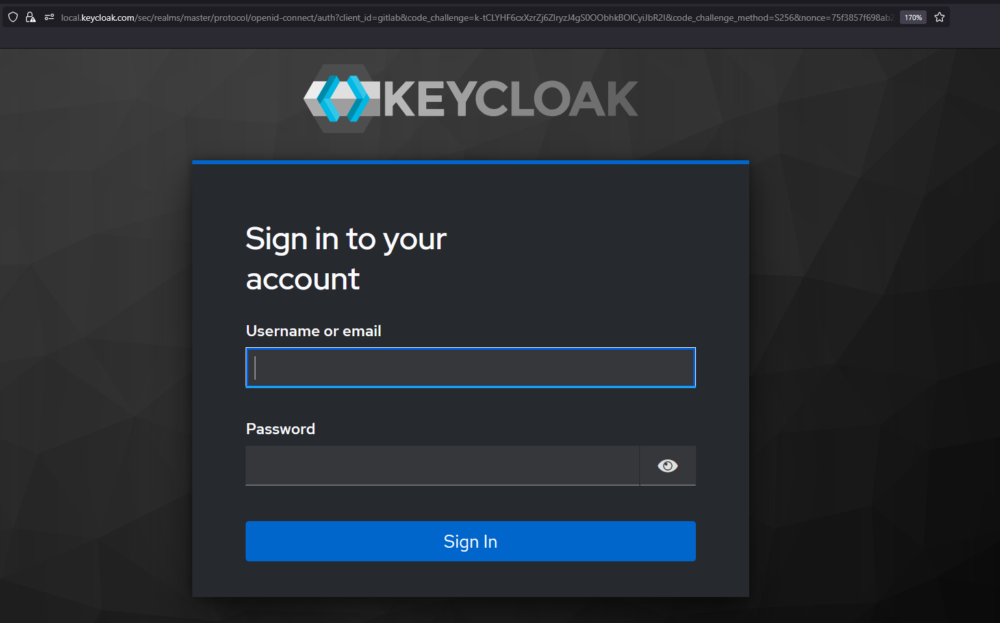

# Enterprise Cybersecurity & DevSecOps Environment Project – Phase 5: GitLab CI/CD & Secret Management

## Overview

In Phase 5, we introduce the infrastructure required for implementing DevSecOps workflows, starting with the installation and configuration of `GitLab CE` for source control and CI/CD.

This phase does not yet implement a CI/CD pipeline but prepares the necessary tools and services to support secure software development and delivery in future phases.

---

## Virtual Machines Used

| VM Name          | Role                   | Description                                                                  |
|------------------|------------------------|------------------------------------------------------------------------------|
| **GitLab VM**    | Code Hosting & CI/CD   | Hosts `GitLab CE (Community Edition)`. Provides source control, CI/CD engine, runner management, and container registry. |

---

## Services Setup

### GitLab CE (Core)
- GitLab Community Edition installed and accessible internally (via reverse proxy)
- Hosted in the internal network, accessible via:
  - `http://192.168.20.4`
- Features to enable:
  - Projects and repositories
  - GitLab Runners (to be configured later)
  - CI/CD templates and integrations

---

## Phase Goals

By the end of this phase:

- `GitLab CE` is fully installed, configured, and reachable
- `Keycloak IAM` provides users, permissions, and identities rather than `GitLab CE`
- All systems are ready to begin building secure CI/CD pipelines in the next phase
- Architecture now supports:
  - Secure source code management
  - Secrets lifecycle management
  - Separation of code, config, and credentials

---

## Testing Scenarios

- Access `GitLab` from Admin via: `http://192.168.20.4`
- Delegate authentication to `Keycloak IAM`, and login with it to `GitLab`
- Create test `GitLab` project and repository
- Add sample CI/CD variables and securely use them

---

## Demo & Results – Non-Technical Overview 

In this phase, we have prepared the environment to securely execute CI/CD pipelines by installing and configuring `GitLab`. `Gitlab` is a CI/CD server that allows us to automatically execute pipeline. These pipeline can automatically build, test, configure, run, and deploy our code, thereby improving delivery speed, consistency, reliability, and correctness. 

1. First, we installed and hosted a local `GitLab` server via `Docker`, and exposed it to only to admins. The admins can only access the `GitLab` internally, keeping it secure from public access.

  

2. We then integrated `Keycloak IAM` with it, allowing for centralized management of identities, access control, permissions, and roles.

  

As the image shows, the `"Keycloak"` button will redirect `GitLab` users to login with their `Keycloak` credentials.

  

3. We then created a simple seeding pipeline for the `Next.js` [Chatting App](https://github.com/abdrnasr/Chat-App-with-Keycloak-IAM). That is, the pipeline creates and ensures that the `MySQL` database used by the chatting app has the tables correctly created.

  

The pipeline successfully ran, while securely handling the secrets needed for the seeding process. 

4. Finally, we have analyzed the logs of the CI/CD job to ensure: no secrets were exposed and that the pipeline successfully ran.

  

The image shows that the our `Next.js` app, hosted at `https://local.keycloak.com`, was successfully seeded, and the pipeline passed. For this pipeline, we have defined two simple variables: `APP_BASE_ADDRESS` and `SEEDING_SECRET`. These values were not hardcoded in the pipeline to allow for secure handling and variation if needed for future.

For instance, if the `SEEDING_SECRET` was leaked, we can easily assign a new `SEEDING_SECRET` to pipeline without any major changes. Similarly, if we decide to host out chatting app on a different server, we can change the `APP_BASE_ADDRESS`.

Overall, we completed the setup of the tooling needed for more advanced CI/CD pipelines, as we will be doing in the next phase.

## Security Design

| Feature                         | Description                                                                 |
|----------------------------------|-----------------------------------------------------------------------------|
| Internal-only access             | GitLab is only accessible through the DMZ reverse proxy         |
| Admin access via SSH             | SSH into the GitLab VMs is only possible via the DMZ jump host       |
| Protected CI/CD variables        | Secrets are stored securely as masked variables, never exposed in logs |

---

## **For Technical Readers:**  
See **[Lab Steps – Phase 5](lab-steps-phase-5.md)** for detailed VM setup, network configuration, and service installation instructions.

---
## Next Step

In **Phase 6**, we will implement secure CI/CD pipelines using GitLab, integrating:
- SAST (Static Application Security Testing)
- DAST (Dynamic Application Security Testing)
- Secret injection (via GitLab)
- Deployment automation to internal app environments

