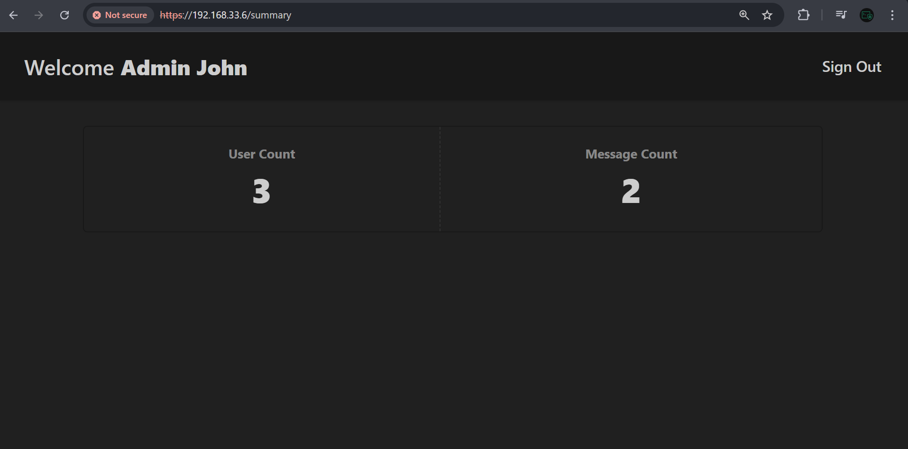
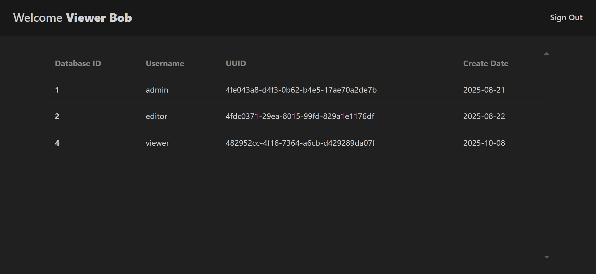
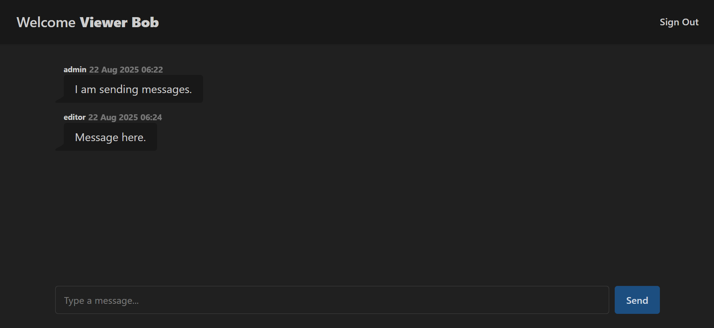
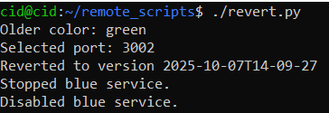
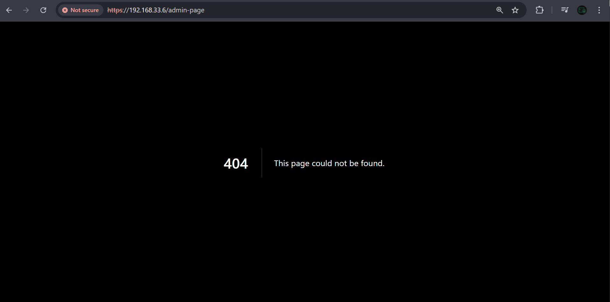

# Testing The Pipeline With a New Feature

Until this point, the pipeline stages were only tested with very few code changes, as we were mostly focusing on the `.gitlab-ci.yml` file. Here, however, we test the pipeline with new code pushed into the repository. We will not change the pipeline configuration file as it is now in a ready state.

The goal of this exercise is to validate whether we can securely deliver new features securely through the pipeline without facing issues. You may have to write your own feature here to test the pipeline’s capability, unless you have started the project without the `"Summary"` or `"admin-page"` features.

## The New Feature

The `"Summary"` feature simply reports to an admin the total number of users and messages. Users who have the `"summary.view"` permission will be allowed to see the summary.

In the current version of the app, the summary feature was not written, and so navigating to https://192.168.33.6/summary will show a `not-found error`.

<p align="center">
  
</p>

**Notice here that we are accessing the app externally using https://192.168.33.6/. A successful pipeline should build the full application, including the new feature, and expose it externally.**

## Making The Changes

Now we implement the new feature. The feature should already be implemented under `./app/summary/page.tsx` in the [chat-app](https://github.com/abdrnasr) repository. So, you may want to write your own feature. However, the process should be similar.

1. We begin by adding a new permission in `authcheck.ts`. The permission `"summary.view"` allows its owner to view the summary page.

```ts
// @/lib/authcheck.ts

// Each role has a list of allowed permissions
const ROLE_PERMISSIONS: Record<string, readonly string[]> = {
    // Summary.view permission added for chat-admin
  'chat-admin': ["post.create", "post.edit", "post.delete", "post.view","summary.view"],
  'chat-editor': ["post.create", "post.edit", "post.view"],
  'chat-user': ["post.view", "post.create"],
};
```

2. Next, we create the database queries needed to count the number of users/messages.

```ts
// @/lib/dbquery.ts

export async function getUserCount(): Promise<number> {
  const [rows] = await pool.query("SELECT COUNT(*) AS count FROM users");
  return (rows as any)[0].count;
}

export async function getMessageCount(): Promise<number> {
  const [rows] = await pool.query("SELECT COUNT(*) AS count FROM messages");
  return (rows as any)[0].count;
}
```

3. Finally, we implement the page under `@/app/summary/page.tsx`.


## Writing Unit Tests

Without unit tests, `SonarQube` will flag the commit and prevent it from continuing. The new code must have at least 80% coverage to be accepted. For this new feature, a new test file `@/test/comps/summary/summarypage.test.tsx` was created, and another file `@/test/lib/dbquery.server.test.ts` was edited to add new unit tests to it.

Running the unit and coverage test locally should show `100%` coverage for the files edited, namely:
- `lib/dbquery.ts`
- `lib/authcheckts.ts`
- `app/summary/page.tsx`

<p align="center">
  
</p>

Now that these changes were made, running a **dev** server, and logging in with an admin account should show a summary of the messages. 

<p align="center">
  
</p>

These numbers are a reflection that local `MySQL` database. The production database may contain different numbers.

## Before Pushing

Before pushing the changes to the pipeline, it is wise to perform the various tests you could do directly on your workstation. For example:

```bash
# Audit for vulnerable packages
npm audit

# Vitest Unit & Coverage Testing  
npm run coverage

# Linting may cause a build failure
npm run build
```

## Pushing The Changes

Now that the feature is implemented, we can push the code to `GitLab` and let it do its job building and deploying it. By the end of the pipeline, the endpoint https://192.168.33.6/summary should be **externally** accessible to admins.

### First Time Failure

Running the pipeline for the first, `SonarQube` stage failed due to some code quality issues.

<p align="center">
  
</p>

The fourth stage is the **SAST** scan, so we investigate the `SonarQube` results.

<p align="center">
  
</p>

The issues marked were trivial and easy to fix. Thus, they were fixed and the code is pushed as a new commit with the fixes.

### Second Time Push Success

Running the pipeline with the fixes all the stages succeed without issues.

<p align="center">
  
</p>

Checking `SonarQube`, there are no issues.

<p align="center">
  
</p>

## Investigating The New Build

### Deploy Stage Logs 

The deploy stage logs provide us with insight about how the deployment process went.

<p align="center">
  
</p>

In the above log image, we can see the following line:

```bash
Deploying - green 2025-10-07T14-09-27: at http://192.168.20.2:3002
```

This directly tells us in which spot was the new version deployed.

### Additional Verification Spots

If you would like to take the logs produced by `GitLab` for granted, you can check the environment directly to identify the deployment spot of the application. We can do this by checking:
- the `Nginx` configuration file on the `DMZ VM`.
    - If the port is 3001, then `blue` was chosen, and `green` otherwise.
- the system service in `APP VM`.
    - We can do this by checking both services to see which started more recently.

| Verification Site | Image | Explanation |
|--------------|----|-----|
| `Nginx` Proxy Pass on the `DMZ VM` || Port 3002 indicates that the build was deployed in the `green` spot. |
| `systemctl` on the `APP VM` | | The `green` service started later than the `blue `service, indicating that our build was deployed on the `green` version, which is hosted at `192.168.20.2:3002` .|

### `"Summary"` Feature Accessibility 

Navigating to https://192.168.33.6/summary shows that the new version has indeed been deployed.

<p align="center">
  
</p>

Thus, our external users now can use this new feature. Most importantly, the entire deployment process was fully automatic.

---

# Preparing for The `Blue-Green` Version Restore

Now that the new feature was successfully deployed onto the `green` spot, we would like to introduce a new faulty version. The faulty version will be deployed, and its impact will be demonstrated. Then, we use our `Blue-Green` setup to revert to the previous functioning version. Since the `green` spot was chosen for the last build, the next build should naturally be deployed in the `blue` spot. However, we will not turn off the `green` version for the simple reason to be able to revert quickly.  

This strategy might be expensive for larger infrastructures, but is manageable for this lab.

## Subtly Vulnerable Code

When developing software, some bugs are naturally so subtle that they may not be easily caught with unit testing. In these cases, our environment needs to be ready to revert to an older version of the software, while minimizing the amount of disruption.

For example, suppose we change the permission file as follows

```ts
// @/lib/authcheck.ts

// Each role has a list of allowed permissions
const ROLE_PERMISSIONS: Record<string, readonly string[]> = {
  'chat-admin': ["post.create", "post.edit", "post.delete", "post.view","summary.view"],
  'chat-editor': ["post.create", "post.edit", "post.view"],
  // simple chat-user now has access to the summary page, which is not what we want
  'chat-user': ["post.view", "post.create","summary.view"],
};
```

The above code now grants `chat-user`s access to the summary page. Since this is an admin-only feature, normal users of the app might be able to access that portion without authorization.

Such a problem is not uncommon in software development. This can happen more often than not, especially in rapid environments where more and more features are being added. What makes this problem even more dangerous is that fact that **unit tests** and coverage may not be affected by this change. This is because existing tests cases already cover this part of the code with existing tests. Therefore, test must be written with care.

## Introducing the `"admin-page"` Feature

The `"admin-page"` feature allows the admins to see the details of the registered users in the app. This feature is only supposed to be viewed by admins with `"summary.view"` permission. The admins can access this feature via the `/admin-page` endpoint of the app.

<p align="center">
  
</p>

### Writing The Feature & Tests

Here again, we write the feature and its tests. Ensure that you do pre-tests: `npm audit`, `npm run build`, & `npm run coverage`.

<p align="center">
  
</p>

### Introducing The Vulnerability

The vulnerability we are going to introduce comes from granting the `chat-user` the `"admin.view"` permission, which allows non-admin users to access admin pages.

```ts
// @/lib/authcheck.ts

const ROLE_PERMISSIONS: Record<string, readonly string[]> = {
  'chat-admin': ["post.create", "post.edit", "post.delete", "post.view","summary.view","admin.view"],
  'chat-editor': ["post.create", "post.edit", "post.view"],
  // Admin page is now accessible to the any chat-user, which might not be intended
  'chat-user': ["post.view", "post.create","admin.view"],
};
```

### Easing The Pipeline's Restrictiveness 

To speed up the build process, you may want to edit the pipeline to skip a few stages. For instance, if you want the SAST scan to not stop the pipeline, you can use the ```allow_failure: true``` directive.

```yml
## The rest of the file ...

sonar-scan:
  stage: sast-scan
  needs:
  - job: test-coverage
    artifacts: true
  image: 
    name: sonarsource/sonar-scanner-cli:11
    entrypoint: [""]
  cache:
    policy: pull-push
    key: "sonar-cache-$CI_COMMIT_REF_SLUG"
    paths:
      - "${SONAR_USER_HOME}/cache"
      - sonar-scanner/
      
  script: 
  - sonar-scanner -Dsonar.host.url="${SONAR_HOST_URL}"
  allow_failure: true ## Ensure this is added 

## ...
```


## Running The Pipeline

This time running the pipeline, we do not see any errors.

<p align="center">
  
</p>

### Deploy Log Analysis

<p align="center">
  
</p>

The deployment log shows that the app was successfully deployed onto the `blue` spot at http://192.168.20.2:3001.

### Accessing The Feature Externally

<p align="center">
  
</p>

Notice the difference between the database's data. The initial image used a local `MySQL` database, while this image is using the production database. 

## Demonstrating The Problem

To demonstrate the problem, I have created a new user `viewer` whose role is `chat-user`.   

<p align="center">
  
</p>

Now, if we log in with this user, and visit the `/admin-page` endpoint, we will be able to view the all of the users registered.

<p align="center">
  
</p>

To further prove that this user is not authorized to do this operation, going to the homepage, we see that the user does not have the other admin functionality.

<p align="center">
  
</p>

An admin should have edit/delete icons above every message, which is not the case here.

---

# Testing `Blue-Green` Reversion

Currently this is the environment setting:

| Color | Timestamp | `systemctl` Service Start Time | Is Nginx Target?  | Internal Host Address |
| ---- |--------|---------|------|---|
| `Blue` | `2025-10-08T03-31-28`  |  | Yes -> Newer Version | `http://192.168.20.2:3001` |
| `Green` | `2025-10-07T14-09-27` |  | No -> Older Version| `http://192.168.20.2:3002` |

We also check `Nginx`'s current destination.

<p align="center">
  
</p>

## Reversion Expectation

With our current setup, the reversion operation should simply point `Nginx` from `Blue (port 3001)` to `Green (port 3002)`. Since we are using a `Blue-Green` strategy, the downtime is expected to be close to zero. 

After the reversion, any new features (the `"admin-page"` in our case) will be lost. Thus, we should always strive to catch these problems earlier. However, we are going to minimize the loss by not introducing any downtime.

## The `revert.py` `Python` Script

To be able to revert to an older version, we can do this manually using a simple remote SSH command. For example:

```bash
# Here, we instruct Nginx to point to the green (port 3002) spot

# From The DMZ VM
sudo /etc/nginx/templates/reload-nginx.sh 3002
# OR
# From the CI/CV VM Switch 
ssh dmz@192.168.10.2 "sudo /etc/nginx/templates/reload-nginx.sh 3002"
```

However, it would be much better to have an automatic script do this kind of task for us. The [`revert.py`](files\revert.py) script provided does this kind of task remotely. To use this script properly, you need to place it on the `CI/CD VM`. This is because it relies on the fact that `ssh` is already setup to connect with the `DMZ VM` and `APP VM`. We have already done this for the last stage on the `CI/CD VM`. For this lab, the script was placed in the `~/remote_scripts/revert.py`.

<p align="center">
  
</p>

To run the script, simply execute it as follows:

```bash
# No Arguments Needed
python3 ~/remote_scripts/revert.py
```

The script only functions when the two `chatapp@.service` instance are running on the `App VM`. It uses `systemctl` to determine which of the two services (`chatapp@green.service` or `chatapp@blue.service` ) was started first. Then, the older service is kept running, and `Nginx` is pointed at it. The newer service, which we want to **revert from**, is only shutdown after successfully switching to the older version. Here, our assumption is that the newer release has an issue possibly, and we want to revert to the older version (which we know is functioning correctly).

## The Reversion in Action

Before we execute the script, we would like to ensure that we can still access the new feature.

<p align="center">
  
</p>

Now, on the `CI/CD VM` execute the `revert.py` script.

<p align="center">
  
</p>

```bash
cid@cid:~/remote_scripts$ ./revert.py
Older color: green
Selected port: 3002
Reverted to version 2025-10-07T14-09-27
Stopped blue service.
Disabled blue service.
```

As expected, the older `green` deployment was chosen, which has has a timestamp of `2025-10-07T14-09-27`. The reversion script only took a few seconds to complete from the moment the script was executed. The downtime, however is so close to zero, since the downtime only occurs when `Nginx` is reloading. That is, we first check that the older build is ok. If it is ready, the switch happens.

## The Fallout of The Reversion

### Access Loss to New Features

First, no one can now access the `"admin-page"` feature, as we reverted to the older version .

<p align="center">
  
</p>

The older version has the `"summary"` feature, and we can still access this.

<p align="center">
  
</p>

### `Nginx` Destination

On `Nginx`, the port has been changed to point to the `green` build at http://192.168.20.2:3002.

<p align="center">
  
</p>

### App `systemctl` Services

Finally, as a part of the script, the newer version is shutdown after the switch is completed.

| Color | Timestamp | `systemctl` Service Start Time | Is Nginx Target?  |
| ---- |--------|---------|------|
| `Blue` | `2025-10-08T03-31-28`  |  | No -> Newer Faulty Version |
| `Green` | `2025-10-07T14-09-27` |  | Yes -> Older Version|

---

# General Discussion

Sometimes, if this a large risk of data exposure or loss, we may rely on shutting down the service entirely. This is especially true if reverting to an older version takes long time. This, however, depends on the environment, type of exposure, risk involved. Here, since this a simulated environment, this kind of discussion is inapplicable. 

From another perspective, `Blue-Green` deployment may not be the most appropriate way to choose in production. Because `Blue-Green` strategy requires the production environment to be duplicated, it doubles the resources needed. For larger infrastructures, this can be extensively costly.

An alternative strategy would be to use Canary Builds. Canary builds gradually deploys the newer versions of the software, depending how it is performing in production. For example, when a new release is to be deployed, we first allocate 10% of the resources to the new release and keep the older version on the 90% rest. If we start seeing errors or problems, we do not proceed deployment.

If, however, the new release is performing well, we can continue gradually increasing the portion of the environment to the new release.

---

# Summary

The pipeline test successfully validated the secure and automated delivery of new features, specifically the `"Summary"` feature, which displays the total number of users and messages for roles with the `"summary.view"` permission. The pipeline successfully passed all tests, and achieved `100%` coverage in unit test coverage for updated code files. The deployment proceeded automatically to the `green` environment, confirming that the CI/CD setup can handle new features without manual intervention.

Later, a faulty version introducing an authorization flaw in the `"admin-page"` feature was deliberately deployed to demonstrate rollback. Using the `revert.py` script, traffic was switched from the `blue (faulty)` deployment back to the `green (stable)` one through the `Blue-Green` strategy, achieving **near-zero downtime**. This confirmed the pipeline’s resilience, reliability, and ability to revert to a stable version seamlessly after identifying a bad release.