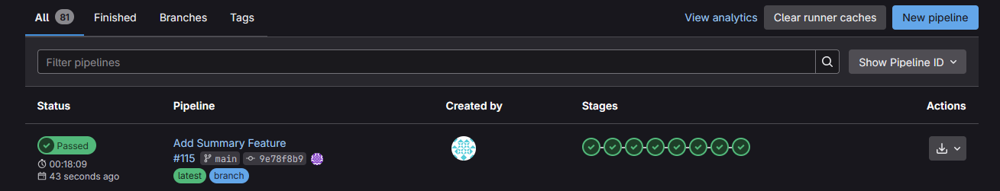
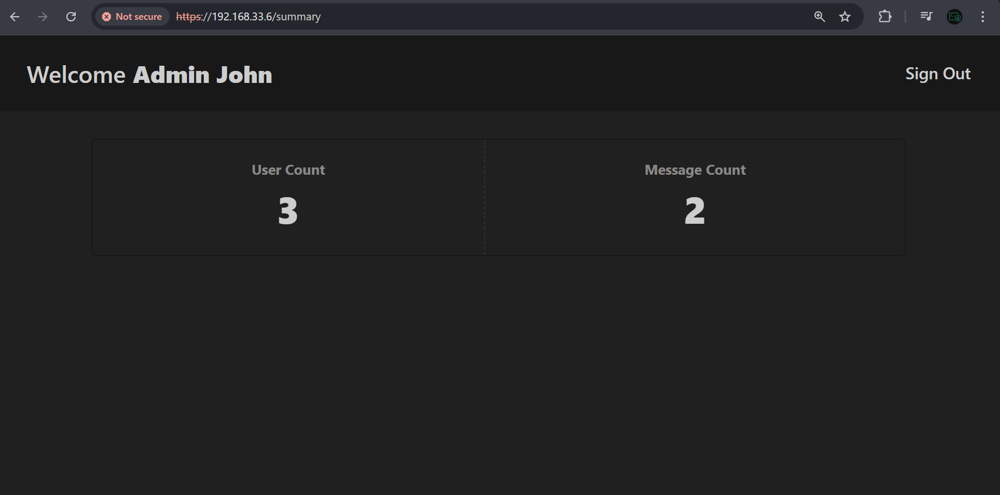
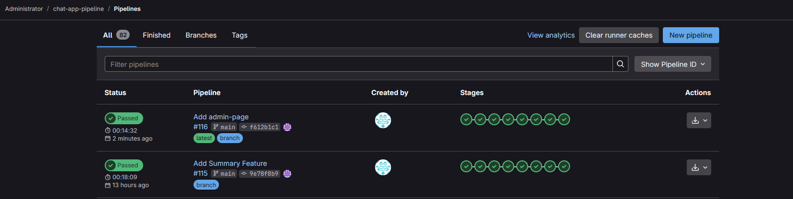
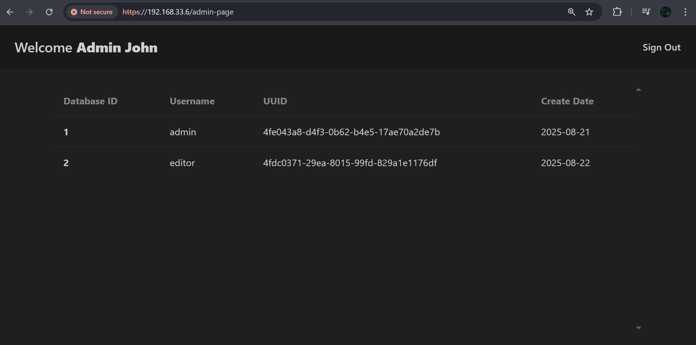
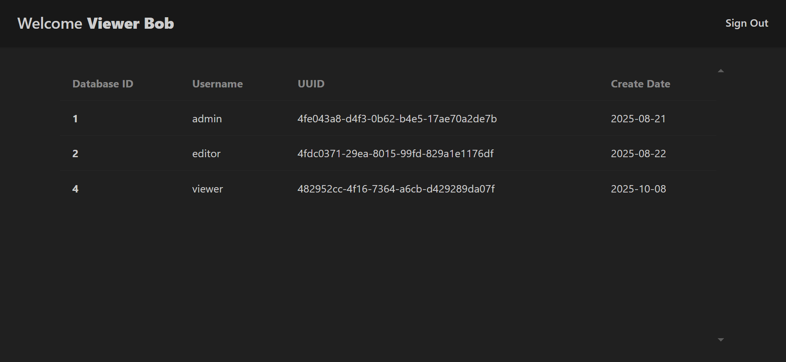
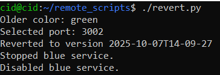
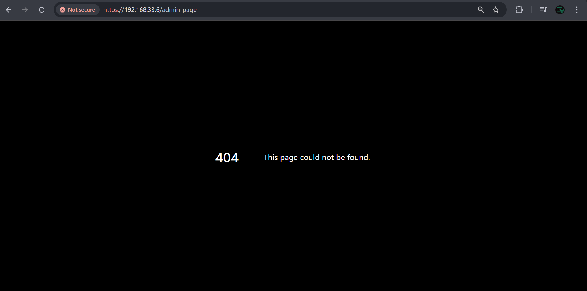

# Enterprise Cybersecurity & DevSecOps Environment Project – Phase 6: Secure CI/CD Pipeline

## Overview

In phase 6.1, we extend the existing CI/CD pipeline by introducing a new feature to the internal `Next.js` application and testing the entire deployment process end-to-end. The goal is to ensure that the pipeline correctly builds, tests, and deploys the updated version without disruption.

Once the new feature is successfully deployed, we deliberately introduce a **bugged version** to validate the **blue-green zero-downtime deployment** strategy. Using this approach, we confirm that the system can instantly **revert traffic** to the **previously stable environment** (`blue` or `green`) while maintaining continuous service availability. This phase verifies that feature rollouts, automated testing, and rollback mechanisms function seamlessly within the secure CI/CD framework.

---

## Phase Goals

By the end of this phase:

- Successfully validate the CI/CD pipeline by deploying and testing the new feature end-to-end.
- Verify blue-green deployment behavior, ensuring zero-downtime and confirming that automatic reversion to the last stable version functions as intended.

---

## Testing Scenarios

- Implement a new feature `"Summary"`
  - Ensure the CI/CD pipeline executes all stages, including build, security scanning (SAST, DAST, dependency, and secret scanning), and testing.
  - The new feature is successfully integrated, automatically delivered, and deployed to the `App VM`.
- Introduce a faulty release
  - The build passes all automated pipeline stages to simulate an undiscovered production bug.
  - The faulty feature will be visible in the application for demonstration purposes.
  - Using the `blue-green` deployment strategy, revert traffic to the previous stable version with **zero-downtime**.

## Demo & Results – Non-Technical Overview 

Here, we have two scenarios to test. First, we will implement a `"Summary"` feature for the [chat-app](https://github.com/abdrnasr/Chat-App-with-Keycloak-IAM). This feature allows admins to see the total number of messages and users in the database. This feature should be pushed to the pipeline, passing all pipeline stages correctly, and get deployed to production

Next, we introduce another feature `"admin-page"`, which allows admins to see all of the user's details. However, this version will have an unauthorized access vulnerability. To be specific, the admin page is only supposed to be accessible by admins, and the vulnerability that we will intentionally inject is to allow normal chat users to access this page.

The reason we inject the vulnerability is to test the `Blue-Green` deployment strategy. We will describe it later in the following sections.

### Implementing a New Feature

For the "Summary" feature, we wrote the code required and pushed it to the repository on `GitLab`. `GitLab` automatically triggers a full build of the pipeline.

  

Here, we see that all the security tests, scans, and processes were successful, and the build was deployed correctly.

  

Admins who want to access this feature can visit `https://192.168.33.6/summary`.

## Introducing a Faulty Release to Test Blue-Green Deployment

`Blue-Green` deployment means you keep two versions of your system running, one `Green (current)` and one `Blue (new)`. When you release an update, you send users to the new `Blue` version while keeping the `Green` version ready as backup. If anything goes wrong, you can instantly switch everyone back to `Green`. This approach lets you update software with little or no downtime and reduces risk during releases.

The current released version of the `chat-app` has the `"Summary"` feature which is functioning well. This good version is currently sitting in the `Green` deployment. Now, when we introduce a new version of the app, it should naturally take the `Blue` spot.

### Implementing The New Feature in A Faulty Release

The new version we are going to introduce has the `"admin-page"` feature. As we discussed earlier, the feature itself will not have a problem, but the problem will be in the permissions enforced. That is, a normal `chat-user` can view the information of all other users in the app. This is a kind of information exposure vulnerability. 

After implementing the feature, we push it to `GitLab`, and the pipeline starts.

  

The feature was deployed to production, despite the pipeline showing a success. This indicates that not all code problems can be detected by automatic scanners and manual code reviews are necessary.

  

Now, this feature can be accessed by visiting https://192.168.33.6/admin-page.

### Demonstrating The Problem

To demonstrate the problem, we log in as a non-admin user and visit https://192.168.33.6/admin-page.

  

As you can see, the user `Viewer Bob` is not an admin, but still sees the page. 

### Reverting To a Good State

The newest version with the `"admin-page"` feature was deployed onto the `blue` deployment. The second newest version with `"Summary"` feature is still running in the `green` deployment. The system is currently pointing to the `blue` deployment.

Because the `blue` deployment that is currently running has **vulnerable code**, we must revert to an older version, which is known to be in a good state. This is where the `green` deployment comes in. Now, we can configure the environment to instead use the `green` deployment. Since the `green` deployment is already ready with a **"good version"** of the app, the switch can happen instantly with near zero-downtime.

The benefit of this strategy is that rollbacks are quick to perform, and we can revert to an older version in near zero-downtime. However, since there will be two versions of the app running, the resources required to use this strategy are roughly doubled. For this reason, other strategies may be used such as **Canary Builds**.

Before reverting, we can still access the `"admin-page"`.

  

Then, we perform the revert operation.

  

The logs confirm that we successfully switched back to the `green` deployment, which is the deployment with the `"Summary"` feature. 

As a consequence of reversion, we lose access to the `"admin-page"` feature.

  

For this reason, the earlier these issues are mitigated, the better. Now, assume that we had other features in the last deployment in addition to the `"admin-page"`; all of these will be lost as a consequence.

---

## **For Technical Readers:**  
See **[Lab Steps – Phase 6.1](lab-steps-phase-6.1.md)** for detailed VM setup, network configuration, and service installation instructions.

---

## Next Step

In **Phase 7**, we will tackle operational monitoring using the ELK Stack.
This includes validating application releases, tracking latency and error trends, and generating alerts for performance anomalies. The goal is to ensure every deployment is stable, observable, and quickly recoverable.

