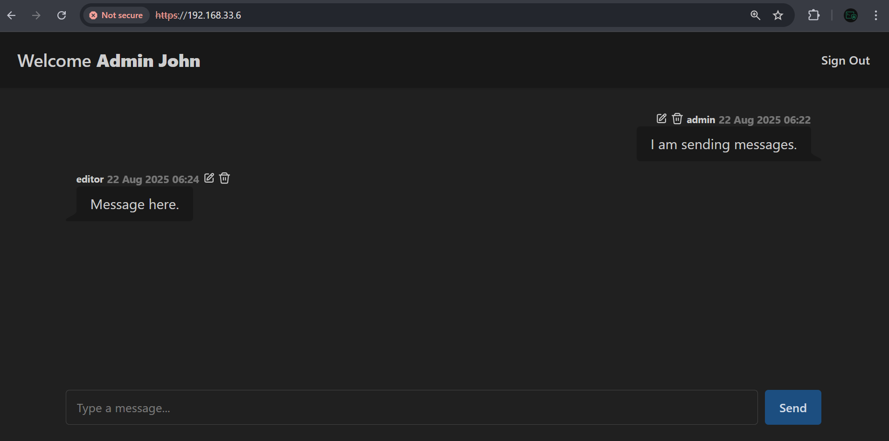
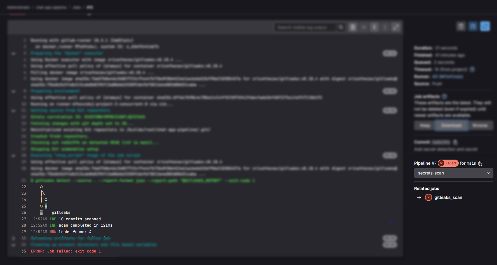

# 🔐 Enterprise Cybersecurity & DevSecOps Environment Project – Phase 6: Secure CI/CD Pipeline

## 🧩 Overview

In Phase 6, we implement a **secure Continuous Integration / Continuous Deployment (CI/CD) pipeline** using **GitLab CI**, focused on integrating **security testing and analysis** into the software development lifecycle (SDLC). This phase leverages the `GitLab` instance deployed in Phase 5 and targets the **Next.js app** hosted internally. It also introduces a **blue-green deployment** strategy to enable zero-downtime releases and instant rollback by alternating traffic between two identical environments (`blue` and `green`). This phase also continues with the concept of **secrets handling** via `GitLab` CI/CD variables to keep sensitive values (DB passwords, API keys, tokens) out of code.

---

## 🔐 CI/CD Pipeline Stages

| Stage                   | Objective / Purpose                                                                | Tools / Implementation                                                                |
| ----------------------- | ---------------------------------------------------------------------------------- | ------------------------------------------------------------------------------------- |
| **Secret scanning**     | Detect exposed secrets in commits / merge requests and block leaks                 | `Gitleaks` |
| **Dependency scanning** | Identify vulnerable or malicious `npm` packages and generate supply-chain evidence   | `npm audit`                        |
| **Test**                | Run automated unit tests and report coverage for further analysis               | `Vitest` (unit tests + coverage reporting)                                            |
| **SAST**                | Static analysis to find insecure coding patterns, logic flaws and crypto issues    | `SonarQube` (static code analysis, quality gates)                                     |
| **Build & Release**               | Install dependencies, compile the `Next.js` application, and deploy the artifacts to `App VM`. The app is then run is `test-mode` in preparation for dynamic testing | `npm install`, `npm run build` (`Next.js`)   |
| **DAST**                | Black-box testing against the running instance to find runtime / endpoint issues     | `OWASP ZAP` Baseline   |
| **Deploy**              |  Using a Blue/Green strategy, the app is started and exposed to external users       | `rsync` / `ssh` with configured SSH keys for remote access |

---

## 🎯 Phase Goals

By the end of this phase:

- Every Git push triggers a **secure CI/CD pipeline**
    - Secrets leakage is prevented before deployment
    - Third-party dependency vulnerabilities are identified
    - Automated unit tests run and coverage is enforced — the build fails on test failures or if coverage falls below the defined gate.
    - Static code issues are detected and flagged automatically
    Dynamic Application Security Testing (DAST) is run against the deployed staging instance; critical/high runtime vulnerabilities block promotion to production.
- The `App VM` is deployed to the internal server **only when clean**
- This setup emulates enterprise-grade DevSecOps practices

---

## 🧪 Testing Scenarios

- Push a clean commit
    - Expect full pipeline success and deployment
    - The app is deployed and exposed successfully
- Introduce a secret (e.g., Seeding key)
    - The presence of the secret should be flagged by Gitleaks, causing a failure in the pipeline
    - The secret will be cleaned manually from the pipeline
    - Successfully removing the secret should lead to a successful pipeline
- Add a vulnerable dependency
    - Flagged by npm audit and the pipeline fails
    - The vulnerable dependency must be removed for the pipeline to succeed
    - Successfully removing the vulnerable dependency should lead to a successful pipeline
- Introduce a failing unit test
    - The failing test causes the pipeline to fail
    - The test must be fixed or removed for the pipeline to proceed
    - Once all tests pass, the pipeline should succeed
- Introduce insufficient test coverage
    - Low coverage is flagged, causing the pipeline to fail
    - Additional tests must be added to raise coverage
    - Once coverage thresholds are met, the pipeline should succeed
- Introduce a code quality issue (SonarQube - SAST)
    - A code quality/security issue is introduced (e.g., hardcoded credentials, SQL injection risk, unused variables).
    - The issue is flagged by SonarQube’s SAST analysis, causing the pipeline to fail.
    - The problematic code must be refactored or removed.
    - Once SonarQube reports no critical/blocker issues, the pipeline should succeed.

## 📽️ Demo & Results – Non-Technical Overview 

We have introduced `GitLab` in the last stage for CI/CD, and in this part, we use it to build an End-to-End DevSecOps pipeline, including various essential security testing and scanning processes. 

### Full Pipeline With A Clean Commit 

The actual pipeline consists of 8 stages. When a clean commit is pushed, the pipeline starts working, performing security scans, building the app, and deploying it. Here, we push a clean commit.

  

As the image shows, a clean commit passes all stages without problems. For example, one of the stages employs a Static Application Security Scanning (SAST), called `SonarQube`. This tool analyzes the code files of the app and detects quality, security, and maintainability issues in the code. `SonarQube` has scanned the codebase and found no problems:  

  

In addition to passing all of the stages, the pipeline successfully deployed the app, and it is accessible externally through https://192.168.33.6.

  

### Introducing a Secret

Many modern applications utilize secrets that must not be exposed. Developers can accidentally expose these secrets when the push code that has hard-coded secrets. As a part of the DevSecOps pipeline, we introduce a tool called `GitLeaks`. This tool automatically scans the code for secrets, notifying us when it is found. For instance, here is an example of where the pipeline failed because of a leaked secret.

  

These secrets were intentionally injected to check the pipeline's capability to catch secrets. In a real security leakage incident, this tool would greatly help us detect the exposure quickly, so that we can revoke, reissue, and rotate new secrets.

### Adding a Vulnerable Dependency

Modern application are built on top of packages available for developers use (also called dependencies). These packages occasionally receive updates by their developers to resolve bugs/security issues found in these dependencies. A dependency that has not been patched and has security vulnerabilities are considered dangerous. Thus, we need a way to detect unpatched dependencies is needed. Since our app is built on top of `Node.js`, and we download our packages with `npm`, we can use the `npm cli` tool. This tool scans the versions of the dependencies and alerts when any vulnerability is detected. 

In the pipeline, a vulnerable package has been intentionally added to test if the tool would detect it. Running `npm cli` reveals that there are two vulnerabilities, 1 moderate and 1 high.

  

On the pipeline, we made the same test too.

  

The image shows that the pipeline is capable of doing this test, and that it can stop vulnerable code from being deployed.

### Introducing a Failing Unit Test

Another aspect of important to secure software development is unit testing. Unit testing helps us test our code; whether it is working as intended or not. For this project, `Vitest` was used to write these unit tests.

  

Now, if any of the unit tests suddenly fail, it can indicate that a portion of our code has been changed incorrectly and a bug maybe introduced. For that reason, we execute these unit tests, when ever we want to push any new code to the codebase. On the pipeline, these tests are executed and if any bad test is detected the pipeline should fail.

Here, we introduce a bad unit test, to see if the if the pipeline fails correctly.

  

As the image shows, the pipeline correctly fails when a unit test fails. This prevents bad code from being deployed.

### Introducing Insufficient Test Coverage

In addition to unit testing, `Vitest` provides the ability to compute code coverage. Code coverage is a measure of how well the written tests covered the lines of code in the codebase. For instance, if we had 1000 lines of code, and the tests covered 900 lines, then our coverage is (900/1000) = 90%. Low coverage indicates that many code paths have not been tested, which may contain software issues.

  

The test cases that were written for the chat-app produce a coverage of 100%. To test the pipelines capability to detect low coverage, we fine tuned the coverage computation and lowered the percent below the accepted threshold. 

  

Now, we push the code and wait for the pipeline's reaction.

  

As you can see, low coverage is not accepted in the pipeline and the process is discontinued.

### `SonarQube` Security Gate Failure

As we discussed earlier, `SonarQube` is a great tool to statically scan code for issues. It also allows us to define the set of "rules" that would make a commit acceptable. A [`Quality Gate`](https://docs.sonarsource.com/sonarqube-server/quality-standards-administration/managing-quality-gates/introduction-to-quality-gates) defines the set of conditions that must be met. Not meeting the quality level defined will cause the pipeline to fail. For instance, one condition that is usually defined in `SonarQube` default settings is the "zero code issues" policy. If any issue is present, no matter how severe it is, then the pipeline fails. This forces programs to always introduce only introduce quality code into production.

We can test this capability by introducing problematic code and pushing it to the code repository. 

  

Here, the code violated two conditions: it had one software issue (must be 0), and had low coverage (must be above 80%). This ensures that our code always meets a quality standard.

---

## 🔒 Security Design

| Security Layer        | Description                                                                                              |
| --------------------- | -------------------------------------------------------------------------------------------------------- |
| Secrets injection     | Uses `GitLab` CI/CD variables                                                                              |
| Isolated runners      | CI/CD Jobs are run inside isolated `Docker` images for isolation and sand-boxing                           |
| Approved dependencies | Requires clean audit reports to proceed to deploy                                                        |
| Secret scanning       | Detects leaked credentials/tokens in repo/commits (pipeline secret-detection).        |
| Dependency scanning   | SCA that finds vulnerable/transitive OSS deps (fail on `high`/`critical` CVEs).               |
| SAST                  | Static application security testing (source-code analysis for injection, auth, crypto issues).           |
| DAST                  | Dynamic testing against running app (authenticated scans and runtime vulnerabilities). |
| Deployment over `rsync` (secured by SSH)  | Ensures secure transport to the `APP VM`                       |

---

## 📄 **For Technical Readers:**  
See **[Lab Steps – Phase 6](lab-steps-phase-6.md)** for detailed VM setup, network configuration, and service installation instructions.

---

## ✅ Next Step

In **Phase 7**, we will enhance the environment by:
- Logging, alerting, and reporting from CI/CD security scans

