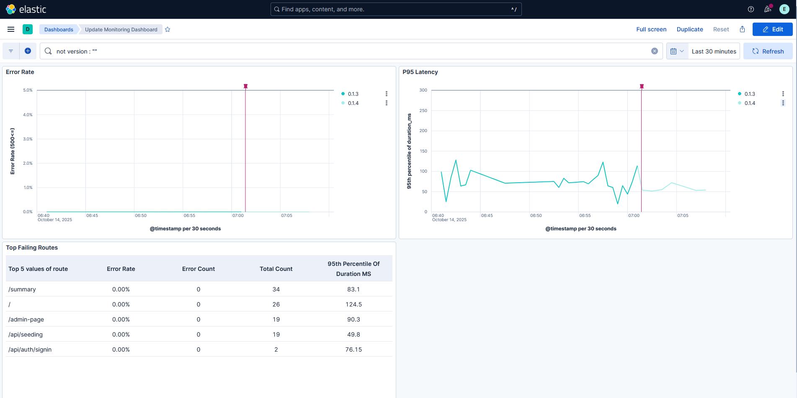
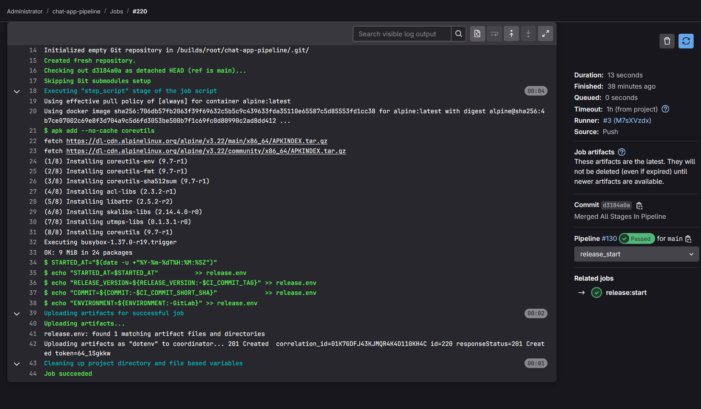
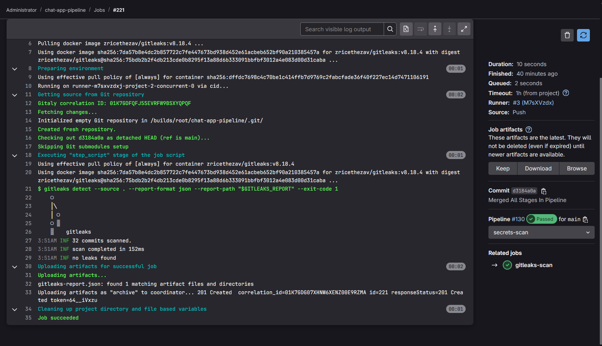
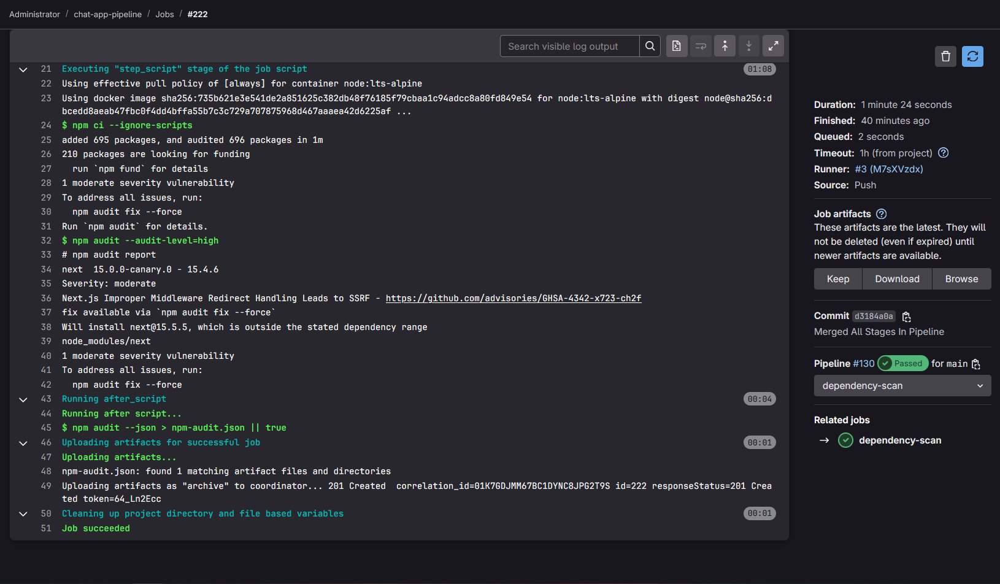
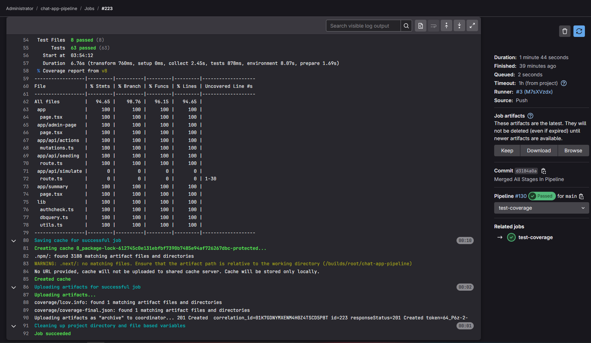
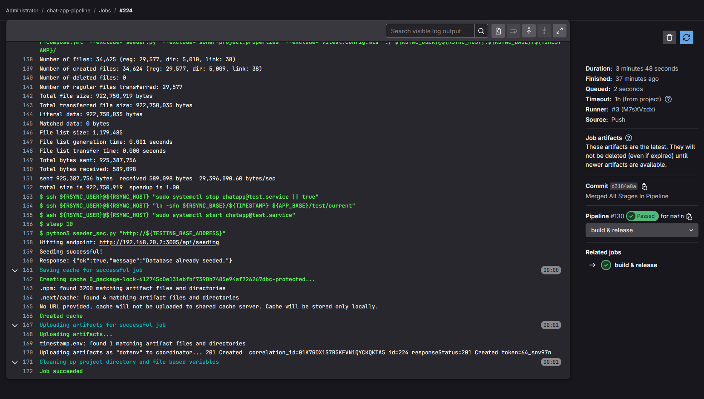
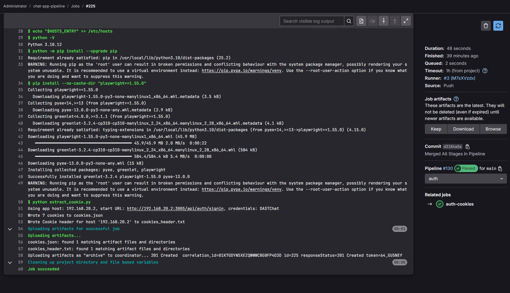
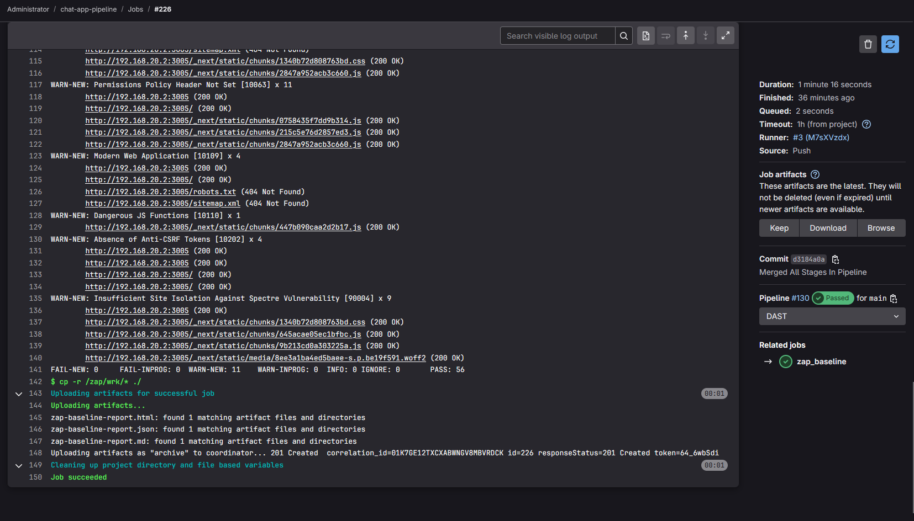
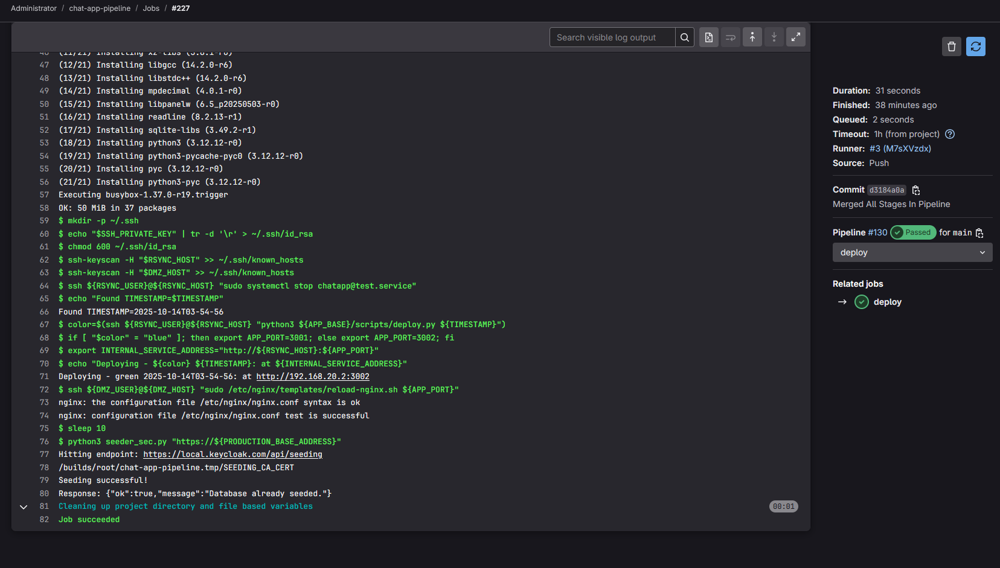
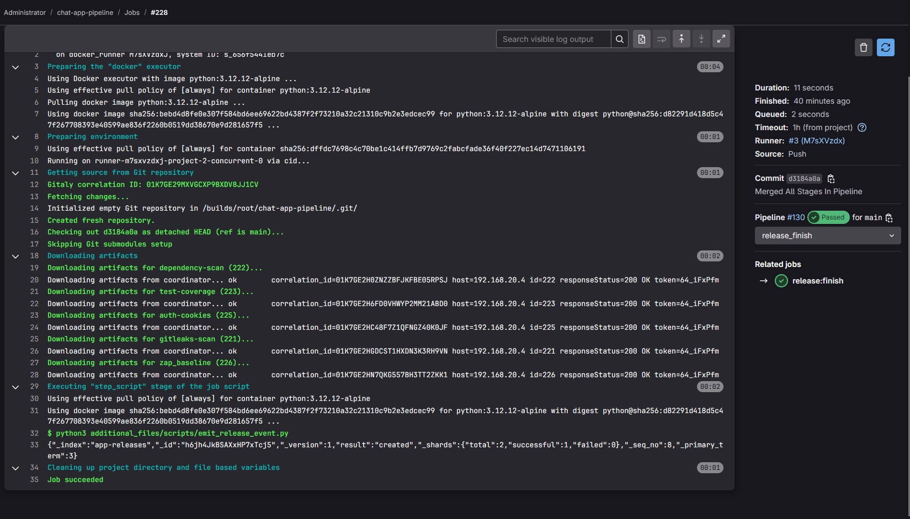

# Full DevSecOps Pipeline With Monitoring

This file will summarize the output logs produced by `GitLab`, and show that the upgrade from version `0.1.3` to `0.1.4` was smooth, correct, and fully automatic.

First, we interact with the app on version `0.1.3` and build a baseline. Then, the code is pushed into the pipeline. We continue interacting with the app to keep the traffic visible on the dashboards.

  

On `GitLab`, all the stages succeeded without issues. This confirms that the app was deployed successfully on the `App VM`. Now, we move to `Elasticsearch` to see how the dashboards look like.

  

From the dashboards, we notice that:
- the old version was `0.1.3` and the new version is `0.1.4`. This is clearly shown by the disconnected line charts on the graph.
- The red vertical line indicates the point in time the "new release" signal was sent to `Elasticsearch`. Roughly at this point, `0.1.3` line was discontinued, and `0.1.4` started.
- All metrics are within safe thresholds, including `latency_ms` and `error rate`.

# Per Stage Log

Below is the output of each stage, with a brief description of its function:

1. **release_start**

- Sets up the release environment and logs key details. It records the `start time`, `commit hash`, `version`, and `environment`, then saves them in `release.env` for later stages to use.

  

2. **secrets-scan (gitleaks-scan)**

- Scans the repository for exposed credentials or secrets using `Gitleaks`.
If sensitive information (like API keys or passwords) is found, the job fails. A JSON report is stored for review.

  

3. **dependency-scan**

- Uses `npm audit` to detect security vulnerabilities in dependencies.
High or critical issues cause the job to fail, while all findings are saved in `npm-audit.json` for visibility.

  

4. **test-coverage**

- Runs automated tests and generates a coverage report. This ensures code functionality and measures how much of the project is covered by tests before moving forward.

  

5. **build & release**

- Builds the `Next.js` application in production mode. Files are synchronized to the app VM via `rsync`, a test service is started, and the test database is seeded automatically for validation.

  

6. **auth (auth-cookies)**

- Generates authentication cookies using a `Playwright Python` script. These cookies are needed for authenticated scanning in the next stage.

  

7. **DAST (zap_baseline)**

- Runs an `OWASP ZAP baseline` scan against the test environment. It checks for web vulnerabilities like insecure headers or input handling and outputs detailed reports (HTML, JSON, MD).

  

8. **deploy**

- Handles blue-green deployment to production. It deploys the new version, updates `Nginx` routing, and seeds the production database to make the new release live with minimal downtime.

  

9. **release_finish**
- Finalizes the pipeline by running a `Python` script that emits a release event for tracking and observability.

  

