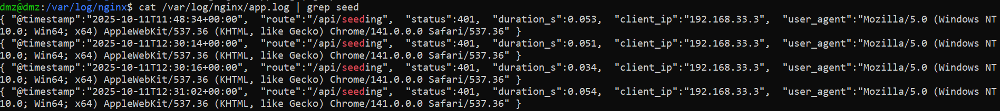
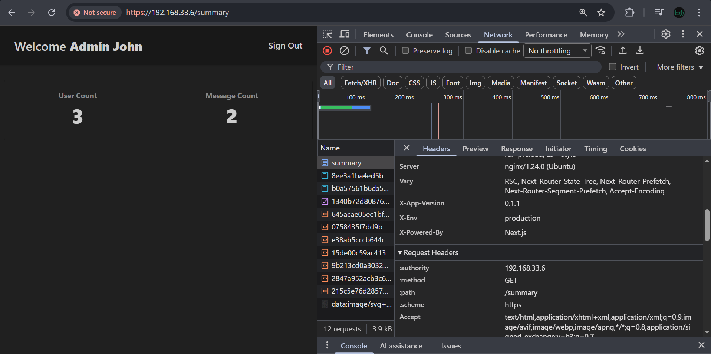
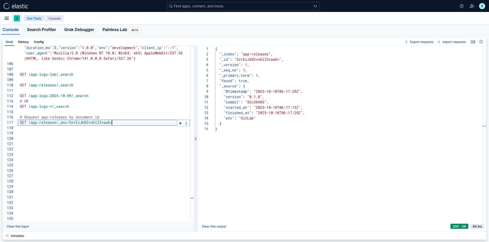
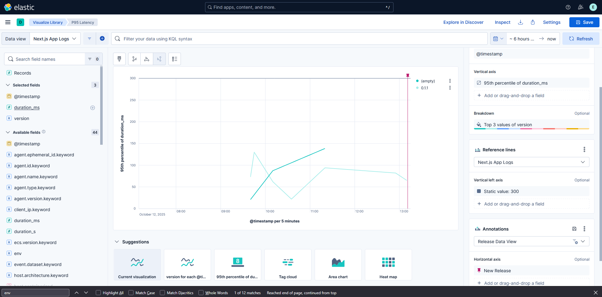
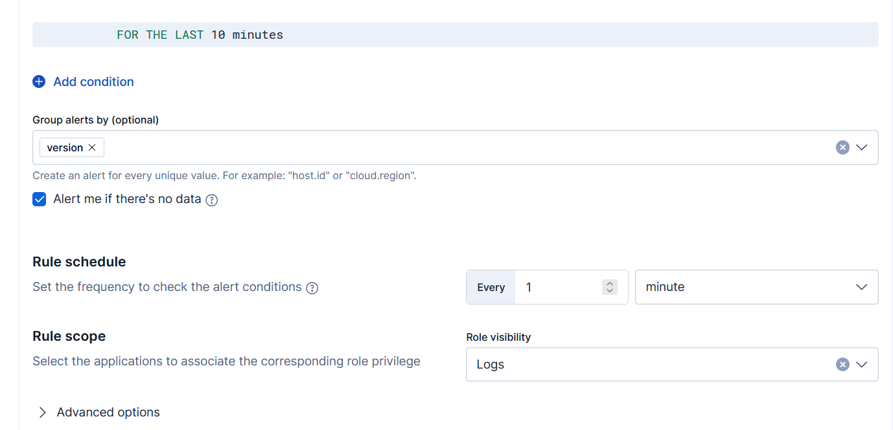
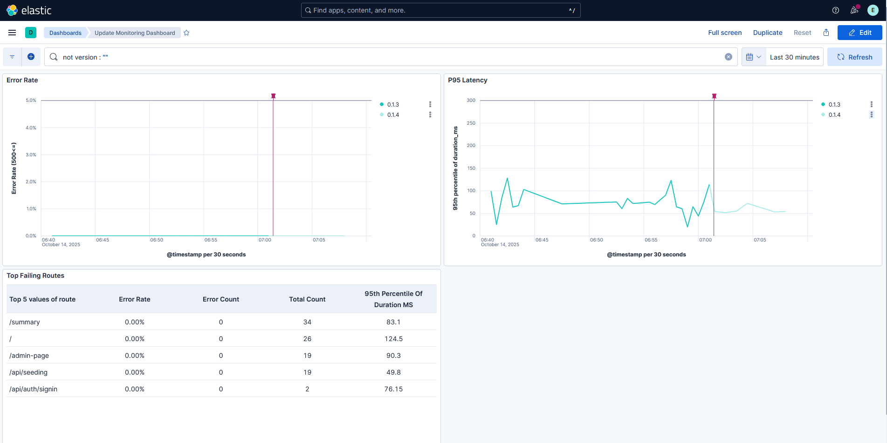

# Resource Utilization Reduction

Running yet another VM with `Elasticsearch` may not be possible because of the lack of sufficient resources. In this case, you may want to find ways to reduce its usage. Here are some ways that you can use to do this:
- Merge multiple VMs together ( i.e., the `APP VM` and `IAM VM` )
- Turn off existing services, such as `SonarQube`

The method chosen here was to remove `SonarQube`, which requires 2 GB of memory. Internally, `SonarQube` uses `Elasticsearch`.

## Stopping The `SonarQube` Container

We ran `SonarQube` with `docker compose up` using a `docker-compose.yml` file, because `SonarQube` also required a database (`PostgreSQL`). Therefore, we need to stop both containers. In your `CI/CD VM`, navigate to the location where you placed that `docker-compose.yml` file, and execute `docker compose down`.

**Note: we made two `docker-compose.yml` files, one for `GitLab` and the other `SonarQube` & `PostgreSQL`. Make sure not to stop the wrong one.**

```bash
cid@cid:~/sonarqube$ docker compose down
[+] Running 3/3
 ✔ Container sonarqube        Removed                                                                              3.2s
 ✔ Container sonar-postgres   Removed                                                                              0.6s
 ✔ Network sonarqube_default  Removed                                                                              0.3s
```
<p align="center">
  
</p>

If you have set up your volumes correctly, this command should not remove them. `docker-compose down` only removes anonymous `volumes`.

## Reduction

In my case, stopping `SonarQube` led to a 2 GB decrease in memory usage. Then, on `VirtualBox`, we can reduce the memory allocated to this VM.

<p align="center">
  
</p>

## Editing The Pipeline

As a result of removing `SonarQube`, it should also be removed from the CI/CD pipeline, so that it does not cause failures.


```yml
stages:
  - secrets-scan
  - dependency-scan
  - test-coverage
  # - sast-scan - commented to stop using it
  - "build & release"
  - auth
  - DAST
  - deploy

  # Remove/comment out the SAST stage
```

---

# `Elasticsearch` Setup

If you have not already set up `Elasticsearch` & `Kibana`, you should install both services in your environment. You can either install them in one of the existing machines or run them on an entirely new VM. The setup steps are available in [lab-steps-phase-3.md](../phase3_monitoring/lab-steps-phase-3.md#elasticsearch-vm). 

## Accessing Kibana

As before, since `Elasticsearch` & `Kibana` are installed on an internal VM, we need to use the DMZ for proxying in. 

```bat
REM Windows CMD for SSH
ssh -D 1080 -N dmz@192.168.33.6
```

On your browser, do not forget to use this proxy. Now, you can visit `Kibana` at  http://192.168.20.5:5601.


| Proxy | Kibana |
| -----|--------|
| | |


## Configuring `Elasticsearch`

In `Elasticsearch`, we need to create the appropriate **indices**, **pipelines**, **index templates** and **data stream**. All of these can be configured directly on `Kibana` through `Dev Tools`. 

<p align="center">
  
</p>


In the `Dev Tools`, execute the following requests:

```json
PUT _ingest/pipeline/app_logs_v1
{
  "processors": [
    { "convert": { "field": "status", "type": "integer", "ignore_missing": true }},
    { "convert": { "field": "duration_ms", "type": "long", "ignore_missing": true }},
    { "set": { "field": "event.dataset", "value": "nextjs" }},
    { "user_agent": { "field": "user_agent", "target_field": "ua", "ignore_missing": true }},
    { "geoip": { "field": "client_ip", "ignore_missing": true }}
  ]
}

PUT _index_template/app-logs
{
  "index_patterns": ["app-logs"],
  "data_stream": {},
  "template": {
    "settings": { "index.default_pipeline": "app_logs_v1" },
    "mappings": {
      "properties": {
        "@timestamp": { "type": "date" },
        "route": { "type": "keyword" },
        "status": { "type": "integer" },
        "duration_ms": { "type": "long" },
        "version": { "type": "keyword" },
        "env": { "type": "keyword" },
        "outcome": { "type": "keyword" }
      }
    }
  },
  "priority": 500
}

PUT _data_stream/app-logs

PUT _index_template/app_releases
{
  "index_patterns": ["app-releases"],
  "template": {
    "mappings": {
      "properties": {
        "@timestamp":  { "type": "date" },
        "version":     { "type": "keyword" },
        "commit":      { "type": "keyword" },
        "started_at":  { "type": "date" },
        "finished_at": { "type": "date" },
        "env":         { "type": "keyword" }
      }
    }
  },
  "priority": 500
}
```

In `Elasticsearch`, **indexes**, **data-streams**, **mappings**, and **pipelines** define how data is stored, processed, and structured. An **index** is like a database table that holds documents. Each document (like a log entry) is stored with fields (e.g., `status`, `route`, `version`). A **mapping** defines the structure and data types of those fields, whether a field is a date, number, or keyword. A **pipeline** preprocesses incoming data before indexing, similar to a filter or parser. A **data stream** represents a logical name (for example, `app-logs`) that automatically manages one or more hidden backing indices behind it (for example, `app-logs-000001`, `app-logs-000002`, and so on).

In the code above:

1. The first block creates an **ingest pipeline** called `app_logs_v1`. It converts `status` and `duration_ms` fields to numeric types, adds a fixed value (`event.dataset = "nextjs"`), and enriches logs with browser (`user_agent`) and location (`geoip`) data if available.
2. The second and the third commands tell `Elasticsearch` how to store and process the application logs in a clean, organized way. 
- The first part, `PUT _index_template/app-logs`, creates an **index template** that defines what your log data should look like and what to do with it before saving it. Every time new logs come in, `Elasticsearch` automatically runs them through the `app_logs_v1` pipeline (the one we created in the last step), which cleans and formats the data. The template also defines the structure of each log: when it happened (`@timestamp`), what `route` or `version` it came from, which `environment` it belongs to, and the time it took the request to be serviced (`delay_ms`).
- The second part, `PUT _data_stream/app-logs`, actually creates the data stream that will hold all these logs. Instead of putting everything into one big index, `Elasticsearch` automatically splits the data over time into smaller, manageable chunks (like .`ds-app-logs-000001`, `.ds-app-logs-000002`, and so on). This makes storing, searching, and visualizing logs in `Kibana` much faster and easier. 
3. The last block defines another **index template** for `app-releases`, which stores deployment metadata (`version`, `commit hash`, `start/finish time`, `environment`). Each release event becomes a document that records when and how a release happened.

All the requests should return `acknowledged`.

<p align="center">
  
</p>

To actually create the indices, we send API requests directly, using the index name. This can be tested manually in `Dev Tools` too using:

```json
// Put a new document in the app-logs data stream
POST app-logs/_doc
{ 
    "@timestamp":"2025-10-09T08:30:00Z",
    "route":"/",
    "status":200,
    "duration_ms":12,
    "version":"1.0.0",
    "env":"lab",
    "client_ip":"8.8.8.8",
    "user_agent":"Mozilla/5.0" 
}
// Puts a new document in the "app-releases" index
POST app-releases/_doc
{
  "@timestamp": "2025-10-09T10:00:00Z",
  "version": "1.0.3",
  "commit": "a8f2c1d",
  "started_at": "2025-10-09T09:45:00Z",
  "finished_at": "2025-10-09T09:59:00Z",
  "env": "lab"
}

// List All Documents in app-logs Index
GET /app-logs/_search

// List All Documents in app-releases Index
GET /app-releases/_search
```

Internally, `Kibana` packages these queries as HTTP REST requests to `Elasticsearch`. The indices are automatically created on the first document insertion.

## Logging & Forwarding App Request-logs

Using `Elasticsearch` we would like to store the log data produced by the webapp. There are two ways to handle the issue of sending the requests to `Elasticsearch`.

1. **Forward `Nginx` Logs**

Since we are using `Nginx` in front of the app, we can log all requests received by `Nginx`.  However, since we are also serving `Keycloak` through `Nginx`, we have to be careful not to include `Keycloak` logs too.

The traffic is entirely encrypted until the `DMZ VM` using TLS. When the traffic is received by `DMZ VM`, the traffic is decrypted (TLS terminated). So, logging is possible here.

2. **Configure The `Next.js` App To Log**

In the app itself, we can introduce a wrapper handler that captures all the requests before the actual handler, starts a timer, performs the request & return the result, and finally produce the log. The benefit of logging here is that it can be simpler to structure the JSON requests, since we have access to many libraries for handling JSON-like data.

However, this also means that we will need to change the existing code and that we need to rebuild the same code in every patch of the program. 

### Logging

For this project, we will use the first method. So, we open the `Nginx` **template file**. If you remember, we must not directly edit the `/etc/nginx/sites-available/default`. This is because this file keeps getting replaced, when a new deployment occurs.

1. The first change that needs to be made is under the `/etc/nginx/templates/app.conf.template`.

```nginx
server {
    location / {
        proxy_pass http://192.168.20.2:${APP_PORT};
        
        # Only these two lines were added
        access_log /var/log/nginx/access.log combined;
        access_log /var/log/nginx/app.log app_json;
    }
}
```
Full File: [app.conf.template](files/app.conf.template)

2. Next, create a new file `/etc/nginx/templates/log_format.conf`. The content of this file is the JSON log format needed by `Elasticsearch`.
[log_format.conf]()

```nginx
# Loaded inside `http {}` via include (next step)
log_format app_json escape=json
  '{ "@timestamp":"$time_iso8601",'
  '  "route":"$uri",'
  '  "status":$status,'
  '  "duration_s":$request_time,'
  '  "client_ip":"$remote_addr",'
  '  "user_agent":"$http_user_agent" }';
```

- This defines a new logging format called `app_json`.

3. Next, we need to `include` this format in the **main** `Nginx` configuration file `/etc/nginx/nginx.conf`.

```nginx
http {
        ##
        # Logging Settings
        ##
        ## This line added 
        include /etc/nginx/templates/log_format.conf;
        access_log /var/log/nginx/access.log;
}
```

4. Finally, do not forget to regenerate the `Nginx` configuration file using `reload-nginx.sh`.

Now, upon any request, the console produces a correctly structured log as follows:

```json
{ "@timestamp":"2025-10-11T11:48:34+00:00",  "route":"/api/seeding",  "status":401,  "duration_s":0.053,  "client_ip":"192.168.33.3",  "user_agent":"Mozilla/5.0 (Windows NT 10.0; Win64; x64) AppleWebKit/537.36 (KHTML, like Gecko) Chrome/141.0.0.0 Safari/537.36" }
```

<p align="center">
  
</p>

A few things to note here:
  - The entire JSON log must be on a single line. So, **pretty printing** must not be used.
  - The duration `"duration_s"` reported by `Nginx` is in seconds, so we need to transform it to milliseconds to store the correct value in the index.
  - The values of the keys `"version"` and `"env"` are not directly available in `Nginx`, so we have to configure the `Next.js` app to set them through HTTP headers.

#### Taking Care of The `duration_s` Value

Initially, we have defined a pipeline `app_logs_v1`, which accepts `duration_ms`. However, this is incompatible because `Nginx` reports the latency in seconds `duration_s`. The benefit of a pipeline is that we can now change it to take into account the new log form without changing the `app-logs` index. On the `Dev Tools` page, execute this command:

```json
PUT _ingest/pipeline/app_logs_v1
{
  "processors": [
    {
      "script": {
        "if": "ctx.duration_s != null",
        "source": "ctx.duration_ms = Math.round(ctx.duration_s * 1000)"
      }
    },
    { "convert": { "field": "status", "type": "integer", "ignore_missing": true }},
    { "convert": { "field": "duration_ms", "type": "long", "ignore_missing": true }},
    { "set": { "field": "event.dataset", "value": "nextjs" }},
    { "user_agent": { "field": "user_agent", "target_field": "ua", "ignore_missing": true }},
    { "geoip": { "field": "client_ip", "ignore_missing": true }}
  ]
}
```

The `script` tag specifies that, if there is a `duration_s`, then it should be transformed into `duration_ms` by multiplying by 1000 and rounding.

<p align="center">
  
</p>

You can verify that this structure works using the `Dev Tools`.

<p align="center">
  
</p>

#### Adding The Missing `env` & `version` Variables To Logs

We need to change the `/etc/nginx/templates/log_format.conf` file with the following:

```nginx
log_format app_json escape=json
  '{ "@timestamp":"$time_iso8601",'
  '  "route":"$uri",'
  '  "status":$status,'
  '  "duration_s":$request_time,'
  '  "client_ip":"$remote_addr",'
  '  "user_agent":"$http_user_agent",'
  '  "env":"$upstream_http_x_app_env",'
  '  "version":"$upstream_http_x_app_version" }';
```

This tells `Nginx` that it should expect the `x-app-env` and `x-app-version` values in the HTTP response headers. Thus, we need to set these values in the `Next.js` app. If they are not set by `Next.js`, the values filled will be empty.

#### Sending `x-app-env` And `x-app-version` As Headers

In a `Next.js` app, there is a file called `middleware.ts`. This file allows us to intercept requests before they are sent to the actual handler of the request. In this file, we will tell it to put these headers in any response generated by `Next.js`.

```ts
export default async function middleware(req: NextRequest) {

  // These add the headers to responses
  const res = NextResponse.next();

  res.headers.set("x-app-version", process.env.APP_VERSION || "unknown");
  res.headers.set("x-env", process.env.NODE_ENV || "dev");
  
  return res;
}
```

The `APP_VERSION` is read from the `project.json` file. The `NODE_ENV` is automatically set by `Next.js`.

<p align="center">
  
</p>

Now, we see the headers in responses. 

#### Making A Small Deployment

If you would like now to test that the headers are being actually used by `Nginx`, the app needs to be deployed on the `APP VM`, so that `Nginx` can capture the headers in the requests. 

You can make a quick deployment by removing all security tests from the `.gitlab-ci.yml`. The only two stages needed are the `build & release` and `deploy` stages.

<p align="center">
  
</p>

If you have deployed it correctly and set up `Nginx`, the logs now will display the `version` and the `environment` in the logs.

<p align="center">
  
</p>

### Forwarding

**Logging** and **Forwarding** are two different activities in monitoring systems. With **logging**, logs are passed into a stream, like standard out or standard error, or to a local file in the system, primarily for storage. Forwarding, on the other hand, takes these logs and **forwards** them to through some communication channel to an analysis engine. 

Currently, we have logs being stored in the `/var/logs/nginx/app.log`. We need a monitoring agent reads and sends these logs to `Elasticsearch`. A well-known tool that is used for this job is `Filebeat`. This tool monitors the log files that we specify and ships them to `Elasticsearch`.

### Forwarding With `Filebeat`

We will use `Filebeat`, which will monitor the `/var/log/nginx/app.log` file. On each new log, `Filebeat` will take the log and send it to `Elasticsearch`. 

Reference: 
- https://www.elastic.co/docs/reference/beats/filebeat/filebeat-installation-configuration#installation
- https://www.elastic.co/docs/reference/beats/filebeat/setup-repositories

#### Installing `Filebeat`

On `DMZ VM`, we perform the following steps to forward the logs using `Filebeat`.

1. We begin by installing `Filebeat` with `APT`:
```bash
sudo apt-get update && sudo apt-get install filebeat
```

2. Next, we need to copy the TLS certificate from the `Monitoring VM` to the `DMZ VM`. 
  - Since we are using HTTPS, this must be done. 
  - On `Monitoring VM`, the public key certificate is located at `/etc/elasticsearch/certs/http_ca.crt`. 
  - On the `DMZ VM`, place it under `/etc/filebeat/certs/http_ca.crt`.
  - On the `DMZ VM`, you can test connectivity to the `Monitoring VM` using `curl`.

<p align="center">
  
</p>

3. Next, you need to configure the connectivity to `Elasticsearch` under `/etc/filebeat/filebeat.yml`.
  - Add/uncomment the following lines
  - You need to generate an API key from `Stack Management -> API Keys`.
  - Ensure that no other similar directives already exist in the file. For instance, `filebeat.inputs` & `output.elasticsearch` may already exist in the file.

```yml

filebeat.inputs:
  - type: filestream
    paths: [/var/log/nginx/app.log]
    # We do not include logs with these lines because they will cause noise
    # These belong to Nextjs statically generated content
    exclude_lines:
      - '\/_next\/static\/'
      - 'favicon(\.ico)?'
    
    # The parser does not alter the JSON. 
    # It only takes the json log as is and adds more to it.
    parsers:
      - ndjson:
          target: ""              # keep flat JSON
          add_error_key: false
          overwrite_keys: false
    processors: []


output.elasticsearch:
  hosts: ["https://192.168.20.5:9200"]
  preset: balanced
  protocol: "https"
  api_key: "Generate_On_Kibana"
  index: "app-logs"
  ssl:
    enabled: true
    certificate_authorities: ["/etc/filebeat/certs/http_ca.crt"]
```

4. Restart `Filebeat`.

```bash
sudo systemctl restart filebeat.service
```

If this works, you should be able to query `app-logs` and see some logs in the `Dev Tools`. Be sure to access the website through the external IP (e.g., https://192.168.33.6) to generate some logs. For example, after accessing the `/summary` page, you should see the log when you query the index.

<p align="center">
  
</p>

## Forwarding Build Release-logs

The next step is to forward build logs. Here, we will simply introduce two new stages in the CI/CD pipeline, one to capture the timestamp and is executed before all other stages, the other to send the request after the build and deployment. In the latter stage, we will execute a `Python` script, which will grab all the environment variables and send the request to `Elasticsearch`. 

1. First, place the script in the repository at `./additional_files/scripts/emit_release_event.py`.
- [emit_release_event.py](files/emit_release_event.py)

2. Next, add two new stages to your CI/CD pipeline. For testing purposes, we will only use the two stages. Once it is working correctly, you can merge it to the entire pipeline.

```yml
stages:
  - release_start
  - release_finish

variables:

  # Required CI/CD variables (set in GitLab → Settings → CI/CD → Variables):
  # ES_URL (e.g., https://es.example.com:9200)
  # ES_API_KEY

  # ES_CA_CERT  (type = File; trusted CA bundle)  ← optional but recommended/required for self-signed certs
  # Optional: ES_SKIP_TLS_VERIFY=1 -> disables TLS verification

  # Automatically SET: RELEASE_VERSION, ENVIRONMENT, ES_INDEX (default: app-releases)

  ES_INDEX: "app-releases"
  ES_URL: "https://192.168.20.5:9200"

release:start:
  stage: release_start
  image: alpine:latest # or alpine:3.22.2 for pinning
  script:
    - apk add --no-cache coreutils
    - STARTED_AT="$(date -u +"%Y-%m-%dT%H:%M:%SZ")"
    - echo "STARTED_AT=$STARTED_AT"          >> release.env
    - echo "RELEASE_VERSION=${RELEASE_VERSION:-$CI_COMMIT_TAG}" >> release.env
    - echo "COMMIT=${COMMIT:-$CI_COMMIT_SHORT_SHA}"             >> release.env
    - echo "ENVIRONMENT=${ENVIRONMENT:-GitLab}" >> release.env
  artifacts:
    reports:
      dotenv: release.env
    expire_in: 1 day

release:finish:
  stage: release_finish
  image: python:3.12.12-alpine
  #needs: ["release:start"]
  script:
    - python3 additional_files/scripts/emit_release_event.py
```
Full File: [1-release-logs-only.gitlab-ci.yml](files/1-release-logs-only.gitlab-ci.yml)

3. Ensure that you read and set all the environment variables needed. The most important variables are `ES_URL`, `ES_API_KEY`, & `ES_CA_CERT`. 
  - `ES_URL` is the address of `Elasticsearch`, which can be either HTTPS or HTTP, depending on your case
  - For `ES_API_KEY`, you generate a new API key specifically for the pipeline
  - For `ES_CA_CERT`
    - It is not required if you set the variable `ES_SKIP_TLS_VERIFY=1`
    - It is required for TLS with self-signed certificates
    - The certificate path must be provided (either place the certificate in the repository or use CI/CD Settings -> FILE Variable)

<p align="center">
  
</p>

4. Finally, push the changes to the repository.

<p align="center">
  
</p>

If the pipeline succeeds, then you should see a response by `Elasticsearch`.

<p align="center">
  
</p>

```json
{
  "_index": "app-releases",
  "_id": "SzrEzJkB2vnblI3vaa6v", // Note, the ID here. It will be different for you.
  "_version": 1,
  "result": "created",
  "_shards": {
    "total": 2,
    "successful": 1,
    "failed": 0
  },
  "_seq_no": 1,
  "_primary_term": 1
}
```

5. Finally, you can query for the newly inserted value through the `Dev Tools` on `Elasticsearch` using the `"_id"`.

<p align="center">
  
</p>

---

# Testing A Build Pipeline 

Now that application logs and release are working, we can now integrate them into the full CI/CD pipeline. For speed, you may want to remove all security testing stages, and later enable them when everything works correctly.

## Changing The CI/CD File

The pipeline file was slightly changed to only include 4 stages, and the other stages were disabled for speed.

```yml
stages:
  - release_start
  # - secrets-scan
  # - dependency-scan
  # - test-coverage
  # - sast-scan
  - "build & release"
  # - auth
  # - DAST
  - deploy
  - release_finish
```

[2-release-with-build.gitlab-ci.yml](files/2-release-with-build.gitlab-ci.yml)

After making these changes, push the code and let the pipeline run.

<p align="center">
  
</p>

## Validating Logging

Now we want to validate that logging is working. We will check a few places to validate this.

### Last Stage Logs

First, we would like to verify that the app release logs work correctly.

<p align="center">
  
</p>

Here, we see that there is a response log from `Elasticsearch` with an `"_id"`. We can then query `Elasticsearch` directly.

<p align="center">
  
</p>

### App Logs

Next, we would like to test if app logs are being delivered. Visit the external version of the app, e.g., https://192.168.33.6/admin-page

<p align="center">
  
</p>

This should have generated a log that clearly states that the endpoint is `/admin-page`.

<p align="center">
  
</p>

As you can see, checking `Elasticsearch` with today's date shows the log induced by our visit to the `/admin-page`.

---

# Working With `Kibana`

`Elasticsearch` now stores the data into the `app-release` and `app-logs` indices. In addition, we can query the data and perform our own analysis on it now directly. This approach is inconvenient because it requires manual parsing, plotting, and analysis. This slows down the analysis of the data.

`Kibana` offers these features with easy-to-set-up steps. It allows us to easily build dashboards, alerts, and visualize the data with minimal effort. 

## Additional Security Setup

To use some of the advanced `Kibana` features like alerting, you need to set up encryption keys. This can be done on the `Monitoring VM`, by executing the `kibana-encryption-keys` command.

```bash
mon@mon:~$ sudo /usr/share/kibana/bin/kibana-encryption-keys  generate
[sudo] password for mon:
## Kibana Encryption Key Generation Utility

The 'generate' command guides you through the process of setting encryption keys for:

xpack.encryptedSavedObjects.encryptionKey
    Used to encrypt stored objects such as dashboards and visualizations
    https://www.elastic.co/guide/en/kibana/current/xpack-security-secure-saved-objects.html#xpack-security-secure-saved-objects

xpack.reporting.encryptionKey
    Used to encrypt saved reports
    https://www.elastic.co/guide/en/kibana/current/reporting-settings-kb.html#general-reporting-settings

xpack.security.encryptionKey
    Used to encrypt session information
    https://www.elastic.co/guide/en/kibana/current/security-settings-kb.html#security-session-and-cookie-settings


Already defined settings are ignored and can be regenerated using the --force flag.  Check the documentation links for instructions on how to rotate encryption keys.
Definitions should be set in the kibana.yml used configure Kibana.

Settings:
xpack.encryptedSavedObjects.encryptionKey: xxxxxx
xpack.reporting.encryptionKey: xxxxxx
xpack.security.encryptionKey: xxxxxx
```

Next, you need to copy the three generated `xpack.*` lines and paste them in your `kibana.yml`.

```bash
sudo nano /etc/kibana/kibana.yml

#And paste the three lines generated:
xpack.encryptedSavedObjects.encryptionKey: xxxxxx
xpack.reporting.encryptionKey: xxxxxx
xpack.security.encryptionKey: xxxxxx
```

Finally, you need to restart the `Kibana` service. If everything goes well, you should be able to access `Kibana` again.

## Kibana Data Views

`Kibana` requires a **data view** to query, visualize, or explore data in tools like Discover, Visualize, and Dashboards. The data view tells `Kibana` which `Elasticsearch` indices to read from and how to interpret fields.

You can find **Data Views** settings by navigating to `Stack Management -> Data Views`. 

We then create two data views to capture app request logs and release. 

<p align="center">
  
</p>

<p align="center">
  
</p>

Both of these views should have detected their corresponding indices. Confirming, you should be taken to a page describing the fields found in these views.

<p align="center">
  
</p>

To validate that the view is working, you can visit the `Discover` page in which you can select the new **data views**.

<p align="center">
  
</p>

Once you select the **data view**, make sure you extend the date ranges above, or your data may not appear. The default value is **15 minutes** before the current time.

<p align="center">
  
</p>

Once you change the date range to an appropriate value, you can now look at the data and perform various kinds of searches. For example, click on the `route` field, a popup will appear showing the most frequently used endpoints.

<p align="center">
  
</p>


## Creating Visualizations

To create dashboards, you will need to create the visuals that will be displayed on it. The visual can be created using `Visualize Library` located on the left of the homepage. From there, press on `Create new Visualization -> lens`.

### 95th Percentile Latency

One common metric to monitor is the 95th percentile of request latency. The way this value is computed is quite technical, but this is the value we will display on this visual. This graph should use the `duration_ms`.

<p align="center">
  
</p>

<p align="center">
  
</p>

The things that needs to be configured for this indicator:
- Type: `Line Graph`
- Data View Top Left: `Nextjs App Logs`
- Horizontal Axis: `@timestamp`
- Vertical Axis:
  - Name: `95th percentile of duration_ms`
  - Field: `duration_ms`
  - Percentile: `95`
- Breakdown:
  - Fields: `version`
  - Number of values: `3`
- Reference Line: 
  - Static value: `300`
- Annotations
  - Data View Under Annotations: `Release Data View` 
  - Annotation Query: `env:"production"` 
  - Target Date Field: `finished_at`

These configurations should look like the following.

<p align="center">
  
</p>

The resulting graph shows the `95th percentile` of the vertical axis and the time on the horizontal axis. The **reference line** adds a visual for the `300ms` mark to clearly show the "slow" baseline. The **breakdown** splits the data into different lines for each version, so comparison is easy. The **annotation** adds the vertical indicators showing the points in time when a "release event" has occurred. This helps us compare between the delay of requests before and after the release event.

Finally, you save the visualization.

<p align="center">
  
</p>

### Error Rate

The next metric we will monitor is the error rate.

<p align="center">
  
</p>

For Visualization 2:
- Type: `Line Graph`
- Data View Top Left: `Nextjs App Logs`
- Horizontal Axis: `@timestamp`
- Vertical Axis: Custom formula - `count(kql='status >= 500') / count()`
    - Name: `Error Rate (500<)`
    - Display: `Percent`
    - Decimals: `1`
- Breakdown:
  - Fields: `version`
  - Number of values: `3`
- Reference Line: 
  - Static value: `5%`
- Annotations
  - Data View Under Annotations: `Release Data View` 
  - Annotation Query: `env:"production"` 
  - Target Date Field: `finished_at`

<p align="center">
  
</p>

The resulting graph shows the percentage of errors on the vertical axis, and the time on the horizontal axis. The other components were explained before.

### Summary Error Rate, Error Count, Total Count & Latency Table

One last visualization that we will create is the `"Top Failing Endpoints"`. This table will show us the percentage error, the count of errors, total count, and the latency for each endpoint. This helps identify broken or buggy endpoints, with an easy to interpret table.

<p align="center">
  
</p>

For Visualization 3:
- Type: `Table`
- Data View Top Left: `Nextjs App Logs`
- Row:
  - Type: `Top Values`
  - Field: `route`
  - Number of Values: `5`
  - Rank By: `Custom`
    - Rank Function: `Count`
    - Rank Direction: `Descending`
- Metrics:
  - Error Rate:
    - Formula: `count(kql='status >= 500') / count()`
  - Error Count:
    - Formula `count(kql='status >= 500')`
  - Total Count:
    - Count
  - 95th Percentile Of Duration MS
    - Percentile: `95`

---

These visualizations should suffice as a demonstration.

## Creating Dashboards

Next, we create the dashboards to display these visualizations in it. From the home page, go to `dashboard -> Create new dashboard`.

<p align="center">
  
</p>

Then, we add the visualizations that we have created.

<p align="center">
  
</p>

Now, choose an appropriate date range.

| Date Range | Image |
|--------|-----|
| `Last 1 Day ` | |
| `Last 1 Hour` | |

As you can see, different time ranges entail different results. Though, our goal here is for post deployment monitoring, so we choose a small duration, such as `Last 1 Hour`.

Finally, save the dashboard for future reuse.

## Simulating a Slow Endpoint

One of the reasons we deployed this entire stack is to understand where the bottleneck or low performance exist in the environment. To test our capability to detect slow endpoints, a deliberately slow endpoint is introduced in a new version. 

```ts
//@/app/api/simulate/route.ts

export async function GET(req: NextRequest) {
  const { searchParams } = new URL(req.url);
  const scenario = searchParams.get("scenario");
  
  //...
  
  if (scenario === "slow") {
    await new Promise((r) => setTimeout(r, 500));
    return NextResponse.json({ status: "ok", delay: "500ms" }, { status: 200 });
  }
}
```

The endpoint exists under `/api/simulate`. However you also need to pass a search parameter; `/api/simulate?scenario=slow`. The reason we parameterize this endpoint is that we will also introduce a failing case that returns a server error.

With this addition, push the code directly `GitLab` and let it build. Be sure to increase the version, so that the visualization works correctly.

### Before Pushing

Before pushing, be sure to interact with the app, so that you have some baseline of comparison. After pushing, a new version will appear on the dashboard and you will be able to view the latency difference caused by the slow endpoint.

<p align="center">
  
</p>

### After Pushing

Once the `GitLab` has deployed the new version, the `/api/simulate` endpoint will be available externally. We can use it by visiting https://192.168.33.6/api/simulate.

### Interaction Result Analysis

Interact with the application for a bit and use the `https://192.168.33.6/api/simulate?scenario=slow`. This endpoint will return after a 500ms wait, which simulates a slow api.

<p align="center">
  
</p>

Firstly, notice that the versions are clearly separated in both graphs. This makes comparison easier. Next, we see that after the update, no errors are present. This is the expected behavior, because there are no problems in the new version. Finally, we see an increase in the `duration_ms`. The graph on the top does not show which specific endpoint is causing the delay. 

This is where the `Top Failing Routes` table becomes relevant. We can see clearly from the table which route is causing the delay. The table shows that the 95th percentile of the requests to endpoint `/api/simulate` took 526.7 ms, exceeding the baseline shown on the graph.

Without this "per-route breakdown", we would not have been able to identify the cause of the delay quickly. That is not to say that the line-graph is ineffective; rather, each visualization serves a distinct purpose in monitoring performance. Thus, when creating dashboards, we should always think about how to meaningfully tailor the dashboards for different monitoring purposes.

### Reacting To The Slow Endpoint

Now that we have found out there is a slow endpoint, we may revert back to the previous version. 

```bash
# On the CI/CD VM
python3 ~/remote_scripts/revert.py
```

However, if the impact of the slow endpoint is not significant, then we can rather keep it and deploy a fix in the next update. In addition, you must validate that the cause of the performance degradation is the new update. 

## Alerting And Simulating An Erroneous Endpoint

If we are not actively monitoring the dashboard, there is a chance that we miss detecting problems, such as high latency or errors. To mitigate this, we use alerts, which are automatically executed every few minutes. If the condition is met, some action is taken, such as informing system administrators through email or `Slack`.

We will demonstrate the alert feature with another common scenario. The scenario involves introducing an endpoint that returns with a server error code. The endpoint will intentionally return an error, which causes an increase in the error rate. 

For this, we will edit the same endpoint file we used before.
```ts
//@/app/api/simulate/route.ts

export async function GET(req: NextRequest) {

  if (scenario === "error") {
    return NextResponse.json(
      { error: "Server error simulation" },
      { status: 500 }
    );
  }
  return NextResponse.json({ status: "ok" }, { status: 200 });
}
```

Here, we pass `"error"` as an argument to the `scenario` parameter, which would return an error.

### Setting Up Rules For Alerts

Alerts are generated when a `Rule` is violated. Rules can be configured from `Stack Management -> Rules`.

<p align="center">
  
</p>

From there, create a `Custom Threshold`.

<p align="center">
  
</p>

<p align="center">
  
</p>


For the options:
- Data View: Next.js App Logs (The data view that points to Nginx generated logs)
- Filter: `env:"production"`
- Aggregation A: `Count(status>=500)`
- Aggregation B: `Count()`
- Equation: `A / B` Is ABOVE `0.05`
- FOR THE LAST `10` MINUTES
- Group Alerts: `version` (Be sure to choose the correct `version` as there are many)
- Rule Schedule: Every 1 Minute
 
This rule checks all production related `Nginx` logs. It computes the error rate using `Count(status>=500)/Count()`. If this value exceeds 0.05 in the last 10 minutes, an alert is raised. The `Group Alerts` ensures that two different computations for each different version of the app.

<p align="center">
  
</p>

While it would be useful to set up an automated action as a result of an alert, we will not be configuring any action because it requires the premium version of `Kibana`.

### Before Pushing

As before, we interact with the app to build some baseline for comparison.

<p align="center">
  
</p>

### After Pushing

After pushing, interact with the app again, but also visit the slow endpoint for a few times (e.g., https://192.168.33.6/api/simulate?scenario=error).  

<p align="center">
  
</p>

The error rate has increased on the line chart, and from the table we see that `/api/simulate` is the cause of the increase in the error rate. We then check if the rule has been triggered by this increase in error rate.

<p align="center">
  
</p>

Clearly, the rule was triggered as a result of the increase in error rate. We can even see the version that caused the alert to arise, which is `0.1.3`. Knowing this, we can now initiate an investigation to determine whether the cause of the high error rate is due to the update, not any other issue.

---

# One Last Test

In the previous sections, pushing the code and monitoring the behavior was based only on the 4 essential build stages. However, we also want to be sure that the deployment works even with the other pipelines in place. Therefore, we reconfigure the `.gitlab-ci.yml` file to include all stages (besides `Sonarqube` as it was removed).

```yml
stages:
  - release_start
  - secrets-scan
  - dependency-scan
  - test-coverage
  # - sast-scan
  - "build & release"
  - auth
  - DAST
  - deploy
  - release_finish

## The rest of the file...
```
Full File: [3-full-monitoring-no-sast.gitlab-ci.yml](files/3-full-monitoring-no-sast.gitlab-ci.yml)

1. We begin with pushing the code to the repository and wait for the pipeline to finish.
  - During the build, interact with the app to build some history of traffic.

<p align="center">
  
</p>

2. The pipeline shows a success, so now we can view the dashboards.

<p align="center">
  
</p>

3. As you can see, the newly introduced version managed to pass the pipeline, correctly user activity on the application, send a release event, and switch to the newer version. 

With that, we have a semi-enterprise ready DevSecOps pipeline. To view the details of this build, visit [full-pipeline-with-monitoring](./full-pipeline-with-monitoring.md). 

---

# Discussion
## HTTP Header Data Exposure

Putting headers into the responses without filtering the data before it reaches the server exposes some important information. For instance, sending the `version` back to the browser allows attackers to know which version is currently being run on the server. Attackers commonly use versions to look up exploit databases for public exploits. This can be solved by maintaining regular software updates, and cleaning up headers at `Nginx`. For the latter solution, `Nginx` is capable of removing certain headers, if they can pose risk. However, this must be explicitly configured.

## Log Volume

One of the problems with log management is that large amounts of data can be generated. This poses a storage-related challenge that needs to be carefully considered. There are various ways to deal with large amounts of log data.
- **Filtering and Exclusion:** In the `filebeat.yml`, we have excluded any line that matches `'\/_next\/static\/'` and `'favicon(\.ico)?'`. The former relates to how `Next.js` works, and does not provide much value. The number of logs produced by these files is very large, and so we do not send them to `Elasticsearch`.
  - Comparing the number of logs that have `/_next/static` with those that do not, we see that there is a significant difference.
  - A better approach might be to configure `Nginx` not to log them entirely as they can still take up space in the `DMZ VM`.
<p align="center">
  
</p>

- **Single Point Of Failure:** Currently, if the `Monitoring VM` goes down, we will lose all of the data stored in `Elasticsearch`. For larger infrastructures where data loss and availability is crucial, we can use `shards` and `replicas` provided by `Elasticsearch`. These help us improve performance and data reliability, at the cost of requiring more nodes and system resources.

## What To Log

The type of information to log is also an important thing to consider. In the current setup, we do not log payloads, headers, or search arguments. The inclusion of these has advantages and disadvantages.
  - A major advantage of including these items is that logs become richer. This leads to easier monitoring and debugging.
    - Take the `/api/simulate` endpoint as an example. Since different arguments for the `scenario` parameter lead to different outcomes, having this information helps us greatly determine the cause of problems.
  - On the other hand, problems may arise when including these items.
    - These items may contain sensitive information, such as passwords, credit-card information, session keys, and web tokens. 
      - Therefore, we risk violating user privacy requirements set by many security standards.
    - Furthermore, storing such information securely is a challenge on its own. This includes techniques like [data anonymization](https://www.datacamp.com/blog/what-is-data-anonymization) and encryption at rest.
    - Finally, this can increase the amount of storage used.

## Determining What to Monitor

This is slightly similar to the last point with a subtle difference. Here, we decide what assets or items needed to be monitored, instead of determining what information to log. In other words:
- This process help us answer us answer:
  - Do we need to monitor the application logs?
  - What about the `Keycloak IAM`?
- The other process help us answer:
  - Do we need the search query in the HTTP requests?
  - Is it useful to also include th headers?
Remember, the more you collect, the more setup is needed and the more data to be stored. The cost can exponentially increase with the increase in the number of assets to monitor.

## How To React

Automatic responses to alerts are generally not recommended. Alerts may naturally arise due to an unexpected event, such as a sudden increase in user requests. This may inherently slow down the servers, and they are not a sign of an internal failure. However, knowing that such a surge is possible allows us to plan better in the future. For instance, if our application is not deployed in a scalable environment, we now know that we should start considering scalability.

Another issue with alerts is the selection of the alert threshold. The threshold value should not be arbitrarily selected, as it may lead to false-positives and false-negatives. A high threshold means we may miss problematic surges, and a low threshold means we get a lot of alerts which can be overwhelming. A balanced approach would be to monitor the environment, identify a suitable baseline through averages, and keep adapting the thresholds in the process.

Finally, an incorrect response to an alert can have negative consequences. Therefore, the alert should be used as a starting point for investigation, rather than as a signal to perform a specific action. Going back to the example we had, the cause of the delay and increase in error rate was indeed the new application version. In this case, a simple revert may be a feasible action. However, if the `MySQL` database was down, and it was causing 500-level HTTP errors, the reversion to an old version will not solve the problem.

In this case, we can have a small guide telling the administrator how to investigate this problem. Here is an example:

**"High Error Rate" Response Table**

| **Category** | **Details** |
|---------------|-------------|
| **Possible Causes** | - `MySQL` database is down <br> - Broken application update <br> - Misconfigured application environment variables |
| **Response Steps** | 1. Check the dashboard. <br> 2. If **multiple endpoints** show errors → investigate the **database** status. <br> 3. If **only one endpoint** is affected → check that endpoint's **configuration** and confirm whether a recent **update** caused the issue. |

The table should be concise yet accurate and descriptive. Generic instructions may only help those who are very familiar with the deployment.

As an example of how to be specific, let us go back to the [`/api/seeding`](https://github.com/abdrnasr/Chat-App-with-Keycloak-IAM/blob/main/app/api/seeding/route.ts) endpoint.

What you will notice is the outcome can either be:
- `200` -> Seeding succeeds or database already seeded
- `401` -> When a request is made without a seeding secret
- `500` -> `SEEDING_SECRET` environment variable is not set in the `.env`
- `500` -> For database or other errors.

So, if we notice that the only endpoint returning 500-level errors is `/api/seeding` on the dashboard, then this is a very clear indication that the `SEEDING_SECRET` is not set in the `APP VM`. On the other hand, if all endpoints return 500, then it is much more likely a wider problem, such as a stopped `MySQL` database. 

## Visualization

Visualizations with dashboards can simplify the interpretation and analysis of log data and help communicate with non-technical stakeholders. 

1. **Most Popular Services**

A **C-suite** level executive may want to know regularly which services are most popular. We can easily show this using a pie chart where endpoint (`/`, `/summary`, `admin-view`) frequency represents popularity. That is, if we see in the logs that our users are always visiting the `/summary` endpoint, we could infer that this feature is popular within our users. This allows us to make informed decisions in addition to having monitoring. 

2. **Failing Endpoints**

If errors suddenly appear in certain endpoints, then we can easily discover that through `Kibana`. Without the visualizations, monitoring will be harder, specifically at detecting trends. 

In addition to alerting, we may want to visualize what is occurring over time. This can help us correlate between failures and their possible cause. 

## Log Security

Logs must be protected like any sensitive data.

1. **Access Control**: Restrict access with RBAC and authentication on tools like Kibana and Elasticsearch.
Encryption: Use TLS for transmission and encrypt logs at rest to prevent interception or theft.
2. **Data Retention**: Keep logs only as long as needed; securely delete or archive expired ones.
3. **Tamper Protection**: Store logs as append-only and verify integrity with hashes or signatures.

These practices keep logs secure while preserving their value for monitoring and audits.

---

# Summary

# Lab Summary

This lab focused on optimizing resource utilization, setting up `Elasticsearch` and `Kibana` for monitoring, and integrating structured logging from a `Next.js` application through `Nginx` and `Filebeat`. The process began with reducing VM memory usage by removing `SonarQube`, which internally runs its own `Elasticsearch` instance. The freed resources were then reallocated to support a dedicated monitoring environment. 

`Elasticsearch` was configured with pipelines, index templates, and data streams for both application logs (`app-logs`) and release metadata (`app-releases`). `Nginx` was modified to output structured JSON logs containing timestamps, routes, statuses, request durations, client IPs, and custom headers (`x-app-version`, `x-app-env`). `Filebeat` was installed on the `DMZ VM` to forward these logs securely to `Elasticsearch` over HTTPS using an API key and TLS certificates.

The CI/CD pipeline was extended to automatically send release events to `Elasticsearch`, creating a link between deployment activity and runtime behavior. `Kibana` was then configured with data views, dashboards, and visualizations showing metrics such as 95th percentile latency, error rate, and top failing routes. Alerts were created to detect spikes in latency or errors, demonstrating real-time operational monitoring.

Finally, simulated slow and failing endpoints were deployed to validate monitoring accuracy and alert responsiveness. The lab concluded with a discussion on data volume management, deciding what to log, alert thresholds, and visualization strategies. Overall, this setup provided an end-to-end demonstration of observability, covering log generation, forwarding, storage, analysis, and alerting within a resource-constrained environment.