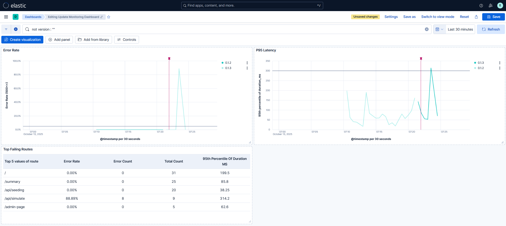
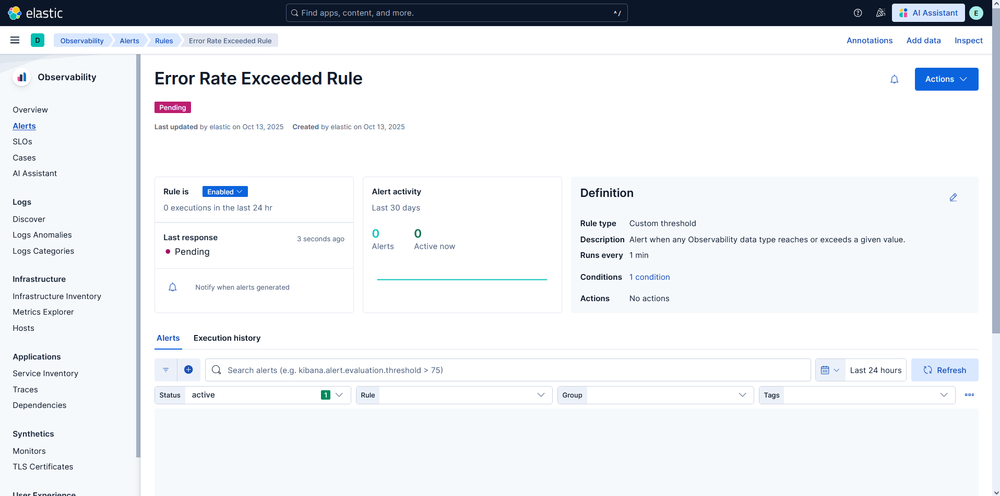
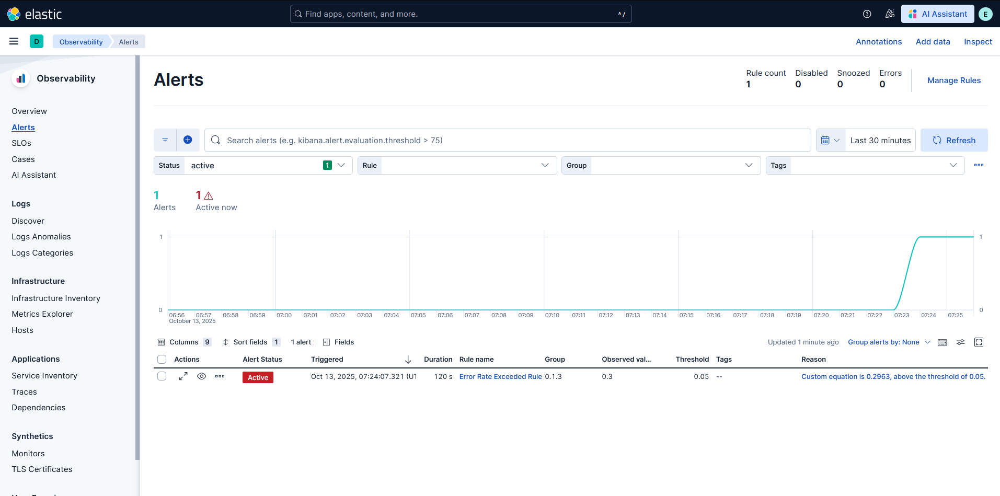

# Enterprise Cybersecurity & DevSecOps Environment Project – Phase 7: Operational Observability (ELK Actualization)

## Overview

In Phase 7, we focus on **observability**, proving that each new release of the internal app works correctly after deployment. The goal is to make sure every update runs smoothly, without hidden performance issues.

Using the ELK stack, we monitor the web application's response time and error rate for each version right after it goes live. This helps detect problems early and take quick action if something goes wrong.

---

## Phase Goals

By the end of this phase:
- Confirm each new release is healthy by watching key performance indicators.
- Automatically collect logs from the app and CI/CD pipeline into `ELK Stack`.
- Display real-time data in a simple dashboard showing version, latency, and error trends.
- Set up an alert that triggers when there is a sudden increase in the error rate.
- Maintain a short rollback or hotfix guide for quick action.
- Ensure visibility into each deployment within 30–60 minutes after release.

---

## Testing Scenarios

- Deploy a normal (healthy) release and verify that it appears in the dashboard with stable latency.
- Deploy a faulty version that intentionally increases latency.
    - Then, use the rollback procedure to switch back to the previous stable version and confirm metrics return to normal.
- Deploy a faulty version that causes error rate to increase
    - Then, we confirm that alerts trigger correctly.
---

## Demo & Results – Non-Technical Overview 

The ELK stack comprises `Elasticsearch`, `Logstash`, & `Kibana` each serving a distinct purpose in the stack.
- `Elasticsearch`: keeps and organizes data so it can be quickly searched or analyzed.
- `Logstash`: gathers and cleans data before sending it for storage.
- `Kibana`: shows the data in charts and dashboards so it is easy to understand.

For this lab, we only needed to use `Elasticsearch` and `Kibana`.

### Deploy A Healthy Release

The first scenario that we cover is to deploy a **healthy release** to production. We start by pushing the code into the repository and letting the pipeline do its job.

  

Pushing the code into the repository resulted in a successful pipeline execution. The DevSecOps pipeline executes several security checks, builds the code, and deploys it in production. Moreover, the pipeline reports important information, such as the exact release timestamp. This timestamp is used to add clear vertical markers on the dashboards, helping visualize trends caused by newer releases.

  

The dashboard contains three key figures:
- The top-left: The error rate over time (How often an error occurs compared to a success?)
- The top-right: The delay over time (How much time did it take to serve the request?)
- The bottom-left: A break down of each endpoint, including its error rate, error count, total count, and the delay.

After this brief overview of the dashboard, you should notice the following:
- The old version was `0.1.3` and the new version is `0.1.4`. This is clearly shown by the disconnected line charts on the graph.
- The red vertical lines indicate the point in time the "new release" signal was raised. Roughly at this point, `0.1.3` line was discontinued, and `0.1.4` started. 
- Before the release, the app was functioning without problems.
- After the release, the app is still functioning within the safe thresholds (horizontal black lines are the thresholds). 

So, the newly introduced version had no negative impact on the performance. Most importantly, we are not blindly claiming that the app is performant, rather we rely on objective metrics.

### Deploy A Faulty Version

The next scenario involves introducing a faulty version that increase the latency and error rate. Here again, we push the code into the pipeline and let it work.

  

Looking at the "delay-over-time" (top-right graph):
- We have two line plots for each version `0.1.1` & `0.1.2`.
- Before the red vertical line, the latency was lower than the baseline. 
- After the red line, the latency significantly increased, exceeding the threshold line (horizontal line).

The update has caused a degradation in the speed of the app, leading to a high latency. We managed to return to a safe state using the same procedure described in [Phase 6.1](../phase6.1_feature_writing_and_reversion/readme.md).

  

There is no event for reverting to the previous version, but the logs will automatically show the correct version. The faulty version was `0.1.2` and the good version `0.1.1`. On the dashboard, we see that the version `0.1.1` is the only version present, telling us that the revert has occurred correctly, and that we are currently back to version `0.1.1`

## A Version With High Error Rate

In the final scenario, we introduce a version that causes an increase in the error rate. The error rate is simply computed by identifying the total number of failures over the total number of access. For example, if a user has visited "admin-page" 10 times, 3 of which returned with a failure. Then the error rate is `3/10 = 30%`.

### Dashboard Analysis

  

Here, we use the graph on the top left:
- Notice again that we have two versions plotted on the same graph, each belonging to a distinct version (`0.1.2` & `0.1.3`).
- Before the red line, the error rate was `0%`. 
- However, after it, we see a large spike in the rate.

### Alert Setup

In addition to the dashboard visuals, an alert was configured to be raised when the error rate value exceeds a certain threshold. An alert notifies us of the problem even if we were not monitoring the dashboard. This helps us shift our attention to the problem when it occurs.

#### Before Exceeding The Rate

  

Before the new release, no alerts are present, because there were no errors in the current version.

#### After Exceeding The Rate

  

After the new release, we observed a sudden error surge, and an alert was raised. Notice that the alert clearly tell us that the broken version is `0.1.3`, so that we can focus our attention on this specific broken version. 

### "High Error Rate" Response Table

In addition to configuring an alert, a table was created to help administrators and maintainers debug the cause of the problem.

**You do not need to understand the table, rather know that this table was created as guidance.**

| **Category** | **Details** |
|---------------|-------------|
| **Possible Causes** | - `MySQL` database is down   - Broken application update   - Misconfigured application environment variables |
| **Response Steps** | 1. Check the dashboard.   2. If **multiple endpoints** show errors → investigate the **database** status.   3. If **only one endpoint** is affected → check that endpoint's **configuration** and confirm whether a recent **update** caused the issue. |

---

# Responding

The response depends on the nature of the error. We begin by identifying which component is affected, application, database, or configuration. Using the dashboard, we isolate the faulty version and affected endpoints, then follow the response table to verify database availability, recent code changes, or misconfigurations. Once the root cause is confirmed, we either roll back to the last stable release or apply a targeted fix to restore normal operation.

---

## **For Technical Readers:**  
See **[Lab Steps – Phase 7](lab-steps-phase-7.md)** for detailed VM setup, network configuration, and service installation instructions.

---

## Next Steps

Now that the full pipeline is operational, this marks a significant milestone in building a **complete enterprise-grade cybersecurity** and **DevSecOps environment**. You have successfully moved from foundational network architecture to automated, secure software delivery, integrating security, observability, and resilience into every layer.

At this stage, you should have gained a practical understanding of how real-world organizations integrate security engineering into their development and deployment workflows. You have seen how individual components, from IAM and monitoring to CI/CD and attack simulation, cooperate to form a cohesive, secure system.

While this project now stands as a fully functional ecosystem, there are several meaningful ways to extend and refine it:
- **Enhance automation**: Introduce Infrastructure-as-Code (IaC) using tools like `Terraform` or `Ansible` to provision and manage the environment more efficiently.
- **Advance observability**: Expand the `ELK` integration with real-time tracing and synthetic monitoring to capture user experience metrics.
- **Extend CI/CD security**: Add container image scanning (e.g., `Trivy`) and policy enforcement using Open Policy Agent (OPA) or `GitLab's Compliance Framework`.
- **Integrate cloud services**: Migrate parts of the setup to a public cloud (`AWS`, `Azure`, or `GCP`) to simulate hybrid architectures and cloud-native security controls.
- **Automate response**: Connect `Wazuh` alerts with remediation scripts or ticketing tools to demonstrate a closed-loop detection-and-response workflow.
- **Document and share**: Transform this repository into a portfolio or internal training resource. Adding summaries, diagrams, and walkthrough videos can help others learn from your work.

Completing this journey means you have built, secured, and operated a miniature version of a real enterprise infrastructure. Whether you continue expanding this lab or adapt its principles in professional settings, you now possess a solid foundation in designing, defending, and delivering modern secure systems.