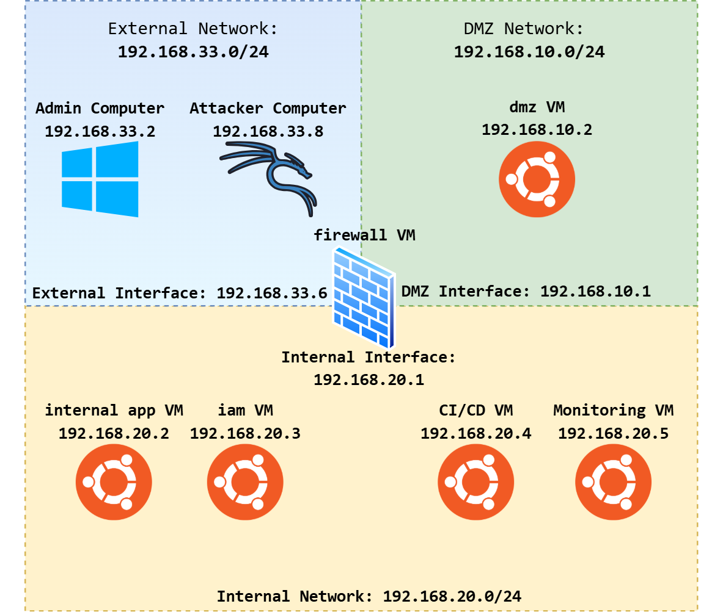

#  Enterprise Cybersecurity & DevSecOps Environment Project 🔐
## 📚 Content

- [🔐 Overview](#overview)
- [🎯 Project Goals & Progress](#project-goals)
- [📅 Project Phases](#project-phases)
  - [Phase 1 – Core Network Infrastructure](phase1_infra/readme.md)
  - [Phase 2 – Internal Web App + IAM](phase2_app_iam/readme.md)
  - [Phase 3 – Monitoring & Visibility](phase3_monitoring/readme.md)
  - [Phase 4 – Attack Simulation & Detection](phase4_attack_simulation/readme.md)
  - [Phase 5 – GitLab & Secrets Management Setup](phase5_gitlab_vault/readme.md)
  - [Phase 6 – Secure CI/CD Pipeline](phase6_secure_pipeline/readme.md)
  - [Phase 7 – Secrets Management & Access Control](phase7_secrets_access/readme.md)
- [🏗️ Architecture](#architecture)
- [⚙️ Project Requirements](#project-requirements)
- [🚀 How to Use This Repository](#how-to-use-this-repository)
  - [Non-Technical Readers](#non-technical-readers)
  - [Technical Readers](#technical-readers)
- [📜 License](#license)

## 📌 Overview

This repository documents a complete, multi-phase **Cybersecurity, Software Engineering, and DevSecOps Project** designed to simulate a realistic enterprise environment. The project covers:

- Network segmentation
- Secure service development and deployment
- IAM (Identity and Access Management)
- Centralized monitoring
- Attack simulation
- Secure CI/CD
- Secrets management

**Primary purposes of this repository:**

- **Showcase, hone, and improve** my skills in **cybersecurity**, **software engineering**, and **DevSecOps**.
- Provide **non-technical viewers** with clear results and overall outcomes.
- Enable **technical audiences** to follow along step-by-step through the project build process.
- Serve as an **aspiration and learning resource** for other aspiring cybersecurity professionals.
- Offer a **clear blueprint** for building a comprehensive, realistic, and security-focused lab environment.
- **Demonstrate the cybersecurity mindset** — for example, when deploying a firewall, consider:
  - What traffic should be allowed or denied
  - How rules affect internal vs. external access
  - How logging and alerting will be handled
  - How this control integrates with the overall security architecture
---

## 🎯 Project Goals & Progress

- Build a **realistic enterprise security architecture** in a controlled environment
- Implement **segmented networks** with DMZ and internal zones
- Deploy **IAM** for user authentication and authorization
- Implement **centralized logging and monitoring**
- Simulate and detect **real-world cyberattacks**
- Uses CI/CD to deliver and deploy new feature for a [custom chatting app](https://github.com/abdrnasr/Chat-App-with-Keycloak-IAM).
- Secure **software delivery pipelines** using DevSecOps practices
- Protect and manage **secrets** in CI/CD and infrastructure

---

## 📅 Project Phases

| Phase | Title | Description |
|-------|-------|-------------|
| [**Phase 1**](phase1_infra/readme.md) | Core Network Infrastructure | Set up 3 VMs: Firewall, DMZ, and Kali attacker. Configure SSH beacon and reverse proxy in DMZ. |
| [**Phase 2**](phase2_app_iam/readme.md) | Internal Web App + IAM | Deploy internal Next.js app with database and Keycloak IAM server, accessible via DMZ reverse proxy. |
| [**Phase 3**](phase3_monitoring/readme.md) | Monitoring & Visibility | Deploy Wazuh + ELK Stack for SIEM & Security. Agents installed on all VMs. |
| [**Phase 4**](phase4_attack_simulation/readme.md) | Attack Simulation & Detection | Use Kali to simulate real-world attacks and validate detection and alerting in Wazuh.
| [**Phase 5**](phase5_gitlab_vault/readme.md) | GitLab & Secrets Management Setup | Install and configure GitLab CE for source control and CI/CD. Optional: Deploy HashiCorp Vault for secure secret storage. |
| [**Phase 6**](phase6_secure_pipeline/readme.md) | Secure CI/CD Pipeline | Build a GitLab CI/CD pipeline integrating SAST, DAST, dependency scanning, and secret scanning for the Next.js app. |
| [**Phase 7**](phase7_secrets_access/readme.md) | Secrets Management & Access Control | Integrate Vault (or GitLab secrets) into CI/CD. Implement RBAC, audit logging, and secure deployment workflows. |

---

## 🏗️ Architecture

  

This architecture represents a balanced approach between simplicity and security, making it practical and effective for the scope of this project.

It uses three segmented networks — External, DMZ, and Internal — with a firewall VM at the center to control traffic flow. The design is straightforward enough to be easily managed, while still enforcing a layered security model:

- The External Network handles administrative access and potential simulated threats.
- The DMZ Network isolates public-facing services, reducing the risk of direct exposure to the internal systems.
- The Internal Network securely hosts core applications, IAM services, CI/CD pipelines, and monitoring tools, ensuring critical resources remain protected.

By separating functions and limiting cross-network communication through defined interfaces, this setup achieves the necessary security for testing and operations without overcomplicating deployment or management. It’s lean, functional, and purpose-built for this project’s goals.

---

## ⚙️ Project Requirements

- Virtualization software: VirtualBox, VMware, or Proxmox (I will use VitrualBox)
- Minimum hardware recommendation:
  - **CPU:** 8 cores
  - **RAM:** 16 GB (32 GB preferred for smoother multi-VM operation)
  - **Disk:** 200 GB free space
- Networking: Ability to configure host-only, NAT, and bridged adapters on the virtualization software
- Virtual OS Images:
  - [Ubuntu Server](https://ubuntu.com/download) — Here, we will be using Ubuntu Server for the internal servers (VMs), as I am most familiar with it.
  - [Kali Linux](https://www.kali.org/get-kali/#kali-platforms)— Kali comes with a lot of test tools that will allow us to simulate attacks against our network.
- Internet access for package installations

---

## 🚀 How to Use This Repository

### Non-Technical Readers
In each section of the project, you will find a summary of **outcomes and results** that demonstrate the impact of the work done in that phase.   You don’t need to follow the technical steps — instead, focus on:
- The **before vs. after** state of the environment
- The **problems addressed** in each phase
- The **improvements in security posture**
- Any **visual results** such as dashboard screenshots, architecture diagrams, or attack/detection examples

This will give you a clear understanding of **why** each phase matters and how it contributes to building a secure, enterprise-like environment.

---

### Technical Readers
First of all, I expect that readers have some proficiency with Linux, virtualized environments, and basic networking concepts. Some steps in this guide will be explained very briefly, and you may need to consult external resources for deeper understanding or troubleshooting. The goal here is to outline the major steps and structure of the project, not to provide exhaustive tutorials for every tool or command.

#### Technical Summary (per phase)

At the end of each phase, you will find a **Technical Summary**.  This section is for readers who want a high-level but slightly technical overview without going through every single command.  
Each summary may include:  
- Main Tools/Services Introduced  
- Key Configurations or Architecture Changes  
- Expected Outcome  

In addition to the summary, there is usually a section **before** the summary that discuses some other critical points for the phase.
#### How to Work Through the Labs
1. Start from **Phase 1** and follow the `README.md` & `lab-steps.md` in each phase folder.  
2. Each phase may include:
   - Overview and Objectives  
   - VM/Service Setup  
   - Configuration Details  
     - Commands  
     - Configurations
     - Discussions
     - Software Installs  
     - Code Files (mostly embedded) 
   - Testing Scenarios  
   - Technical Summary  

---

## 📜 License

This project is for educational and research purposes. Use responsibly and do not deploy insecure configurations to production environments.

