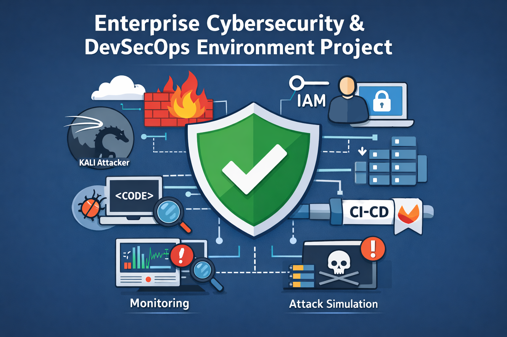
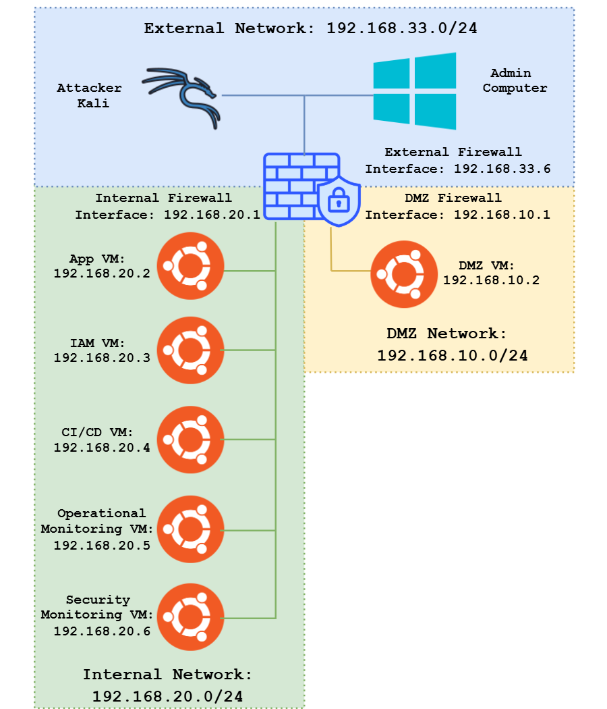

#  Enterprise Cybersecurity & DevSecOps Environment Project

  

## Content
- [Overview](#overview)
- [Project Goals & Progress](#project-goals)
- [Project Phases](#project-phases)
  - [Phase 1 – Core Network Infrastructure](phase1_infra/readme.md)
  - [Phase 2 – Internal Web App + IAM](phase2_app_iam/readme.md)
  - [Phase 3 – Monitoring & Visibility](phase3_monitoring/readme.md)
  - [Phase 4 – Attack Simulation & Detection & Response](phase4_attack_simulation/readme.md)
  - [Phase 5 – GitLab & Secrets Management Setup](phase5_gitlab/readme.md)
  - [Phase 6 – Secure CI/CD Pipeline](phase6_secure_pipeline/readme.md)
    - [Phase 6.1 - Feature Writing, Pipeline Validation, & Blue-Green Recovery](phase6.1_feature_writing_and_reversion/readme.md)
  - [Phase 7 – Operational Observability ](phase7_operational_observability/readme.md)
- [Architecture](#architecture)
- [Project Requirements](#project-requirements)
- [How to Use This Repository](#how-to-use-this-repository)
  - [Non-Technical Readers](#non-technical-readers)
  - [Technical Readers](#technical-readers)
    - [Technical Summary (Per Phase)](#technical-summary-per-phase)
    - [How to Work Through the Labs](#how-to-work-through-the-labs)
- [Technical Highlights](#technical-highlights)
- [License](#license)

## Overview

This repository documents a complete, multi-phase **Cybersecurity, Software Engineering, and DevSecOps Project** designed to simulate a realistic enterprise environment. The project covers:

- Network segmentation
- Secure service development and deployment
- IAM (Identity and Access Management)
- Centralized monitoring
- Attack simulation
- Secure CI/CD
- Secrets management

**Primary purposes of this repository:**

- **Showcase, hone, and improve** my skills in **cybersecurity**, **software engineering**, and **DevSecOps**.
- Provide **non-technical viewers** with clear results and overall outcomes.
- Enable **technical audiences** to follow along step-by-step through the project build process.
- Serve as an **aspiration and learning resource** for other aspiring cybersecurity professionals.
- Offer a **clear blueprint** for building a comprehensive, realistic, and security-focused lab environment.
- **Demonstrate the cybersecurity mindset** for example, when deploying a firewall, consider:
  - What traffic should be allowed or denied
  - How rules affect internal vs. external access
  - How logging and alerting will be handled
  - How this control integrates with the overall security architecture
---

## Project Goals & Progress

- Build a **realistic enterprise security architecture** in a controlled environment
- Implement **segmented networks** with DMZ and internal zones
- Deploy **IAM** for user authentication and authorization
- Implement **centralized logging and monitoring**
- Simulate and detect **real-world cyberattacks**
- Uses CI/CD to deliver and deploy new feature for a [custom chatting app](https://github.com/abdrnasr/Chat-App-with-Keycloak-IAM).
- Secure **software delivery pipelines** using DevSecOps practices
- Protect and manage **secrets** in CI/CD and infrastructure

---

## Project Phases

| Phase No. | Title | Description |
|-------|-------|-------------|
| [**Phase 1**](phase1_infra/readme.md) | Core Network Infrastructure | Set up 3 VMs: Firewall, DMZ, and Kali attacker. Configure SSH beacon and reverse proxy in DMZ. |
| [**Phase 2**](phase2_app_iam/readme.md) | Internal Web App + IAM | Deploy internal `Next.js` app with `MySQL` database and `Keycloak IAM` server, accessible via DMZ reverse proxy. |
| [**Phase 3**](phase3_monitoring/readme.md) | Monitoring & Visibility | Deploy `Wazuh` + `ELK Stack` for SIEM, Security & Logging. `Wazuh Monitoring Agents` installed on all VMs. |
| [**Phase 4**](phase4_attack_simulation/readme.md) | Attack Simulation & Detection & Response | Implement defensive controls in `Wazuh` against a specific real-world attack, then use `Kali Linux` to execute the attack in order to validate detection, alerting, and response effectiveness.
| [**Phase 5**](phase5_gitlab/readme.md) | GitLab & Secrets Management Setup | Install and configure `GitLab CE` for source control and CI/CD. |
| [**Phase 6**](phase6_secure_pipeline/readme.md) | Secure CI/CD Pipeline | Build a `GitLab CI/CD` pipeline integrating SAST, DAST, dependency scanning, and secret scanning for the `Next.js` app. |
| [**Phase 6.1**](phase6.1_feature_writing_and_reversion/readme.md) | Feature Writing, Pipeline Validation, & Blue-Green Recovery | Add new features to the `Next.js` app, validate the full CI/CD pipeline end-to-end, and test the `Blue-Green` deployment strategy with rollback to a stable version. |
| [**Phase 7**](phase7_operational_observability/readme.md) | Operational Observability | Activate and focus on **operational monitoring**. Logs, metrics, and traces from the `Next.js` app, **CI/CD pipelines**, `GitLab`, `Nginx` DMZ, and hosts are ingested into `Elasticsearch` and visualized in `Kibana`. |

---

## Architecture

  

This architecture represents a balanced approach between simplicity and security, making it practical and effective for the scope of this project.

It uses three segmented networks, External, DMZ, and Internal, with a firewall VM at the center to control traffic flow. The design is straightforward enough to be easily managed, while still enforcing a layered security model:

- The External Network simulates the internet, providing administrative access and potential simulated threats.
- The DMZ Network isolates public-facing services, reducing the risk of direct exposure to the internal systems.
- The Internal Network securely hosts core applications, IAM services, CI/CD pipelines, and monitoring tools, ensuring critical resources remain protected.

By separating functions and limiting cross-network communication through defined interfaces, this setup achieves the necessary security for testing and operations without over-complicating deployment or management. It's lean, functional, and purpose-built for this project's goals.

---

## Project Requirements

- Virtualization software: `VirtualBox`, `VMware`, or `Proxmox` (Here, `VitrualBox` will be used )
- Minimum hardware recommendation:
  - **CPU:** 8 cores
  - **RAM:** 24 GB (32 GB preferred for smoother multi-VM operation)
  - **Disk:** 200 GB free space
- Networking: Ability to configure host-only, NAT, and bridged adapters on the virtualization software
- Virtual OS Images:
  - [`Ubuntu Server`](https://ubuntu.com/download) — In this project, we will be using `Ubuntu Server` for the internal servers (VMs), as I am most familiar with it.
  - [`Kali Linux`](https://www.kali.org/get-kali/#kali-platforms)— Kali comes with a lot of test tools that will allow us to simulate attacks against our network.
- Internet access for package installations

---

## How to Use This Repository

### Non-Technical Readers
In each section of the project, you will find a summary of **outcomes and results** that demonstrate the impact of the work done in that phase. You don't need to follow the technical steps; instead, view the `readme` files of each phase that focus on:
- The **before vs. after** state of the environment
- The **problems addressed** in each phase
- The **improvements in security posture**
- Any **visual results** such as dashboard screenshots, architecture diagrams, or attack/detection examples

This will give you a clear understanding of **why** each phase matters and how it contributes to building a secure, enterprise-like environment.

---

### Technical Readers
First of all, I expect that readers have some proficiency with Linux, virtualized environments, and basic networking concepts. Some steps in this guide will be explained very briefly, and you may need to consult external resources for deeper understanding or troubleshooting. The goal here is to outline the major steps and structure of the project, not to provide exhaustive tutorials for every tool or command.

#### Technical Summary (Per Phase)

At the end of each phase, you will find a **Technical Summary**. This section is for readers who want a high-level but slightly technical overview without going through every single command.  
Each summary may include:  
- Main Tools/Services Introduced  
- Key Configurations or Architecture Changes
- Security Discussions  
- Outcomes

In addition to the summary, there is usually a section **before** the summary that discuses some other critical points for the phase.

#### How to Work Through the Labs
1. Start from **Phase 1** and follow the `README.md` & `lab-steps.md` in each phase folder.  
2. Each phase may include:
   - Overview and Objectives  
   - VM/Service Setup  
   - Configuration Details  
     - Commands  
     - Configurations
     - Discussions
     - Software Installs  
     - Code Files (mostly embedded within `GitHub`) 
   - Testing Scenarios  
   - Technical Summary  

# Technical Highlights

This section emphasizes the most notable parts of the project. These sections contain more technically significant or impactful details than others.

| **Phase** | **Task / File** | **Purpose / Description** |
|------------|-----------------|---------------------------|
| **Phase 1** | [VirtualBox Network Settings Configuration](phase1_infra/lab-steps-phase-1.md#virtualbox-network-settings-configuration) | Establishes the virtual network topology connecting all VMs. |
|  | [Firewall Routing Setup](phase1_infra/lab-steps-phase-1.md#firewall-routing-setup) | Configures the `Firewall VM` for proper traffic forwarding between External, DMZ, and Internal zones. |
| **Phase 2** | [Nginx TLS Encryption](phase2_app_iam/lab-steps-phase-2.md#nginx-tls-encryption) | Enables encrypted communication and secure reverse proxying. |
|  | [Keycloak Configuration](phase2_app_iam/lab-steps-phase-2.md#iam-installation) | Integrates IAM and OIDC for secure app authentication. |
|  | [Nat Hairpinning Problem & Temporary Solution](phase2_app_iam/lab-steps-phase-2.md#app-vm-to-dmz-connection-problem-discussion) | Explains and resolves internal routing edge cases for intra-network communication. |
|  | [Role-Based Access Control in the Chat App](phase2_app_iam/lab-steps-phase-2.md#the-chat-app-access-control) | Demonstrates IAM-enforced access control in a real web app. |
|  | [Nat Hairpinning Proper Solution](phase2_app_iam/lab-steps-phase-2.md#app-vm-to-dmz-connectivity-further-discussion) | Implements the proper NAT hairpinning configuration. |
| **Phase 3** | [Elasticsearch & Kibana VM Setup](phase3_monitoring/lab-steps-phase-3.md#elasticsearch-vm) | Installs `Elasticsearch` and `Kibana` for centralized monitoring and analytics. |
|  | [Wazuh Manager Installation](phase3_monitoring/lab-steps-phase-3.md#wazuh-vm) | Deploys endpoint detection and SIEM capabilities. |
|  | [Attack Detection Test](phase3_monitoring/lab-steps-phase-3.md#attack-detection-test) | Verifies detection pipeline and visibility of simulated attacks. |
|  | [Blind Spot Discussion](phase3_monitoring/lab-steps-phase-3.md#blind-spots--limitations) | Identifies monitoring gaps and defines Phase 4’s objectives. |
| **Phase 4** | [Threat Modelling](phase4_attack_simulation/lab-steps-phase-4.md#) | Maps potential threats to assets and defines defensive priorities. |
|  | [Addressing Port Scanning Blind Spot](phase4_attack_simulation/lab-steps-phase-4.md#addressing-port-scanning-blind-spot) | Implements detection rules and automated responses to port scanning activity. |
|  | [Responding To The Attack](phase4_attack_simulation/lab-steps-phase-4.md#responding-to-the-attack) | Automates incident response workflows in `Wazuh`. |
| **Phase 5** | [Installing GitLab via Docker](phase5_gitlab/lab-steps-phase-5.md#docker-compose-file) | Deploys self-hosted `GitLab` environment for CI/CD. |
|  | [Integrating Keycloak IAM with GitLab](phase5_gitlab/lab-steps-phase-5.md#integrating-keycloak-iam) | Enables single sign-on for centralized identity management. |
|  | [Bonus – Mapping Keycloak Roles to GitLab Roles](phase5_gitlab/lab-optional.md) | Synchronizes IAM permissions with `GitLab`’s access control model. |
|  | [Building a Test Pipeline](phase5_gitlab/lab-steps-phase-5.md#building-a-test-pipeline) | Implements a minimal CI/CD job that seeds the app database securely. |
| **Phase 6** | [Describing & Setting Up GitLab for The Pipeline](phase6_secure_pipeline/lab-steps-phase-6.md#describing--setting-up-gitlab-for-the-pipeline) | Defines all CI/CD stages and configuration. |
|  | [Building The Pipeline](phase6_secure_pipeline/lab-steps-phase-6.md#building-the-pipeline) | Builds and connects all CI/CD stages. |
|  | [Build & Release, DAST, and Deploy Using Blue-Green Strategy](phase6_secure_pipeline/lab-steps-phase-6.md#build--release-dast-deploy) | Implements build, DAST, and blue-green deployment strategy. |
|  | [Running The Build & Release, DAST, and Deploy Stages](phase6_secure_pipeline/lab-steps-phase-6.md#running-the-build--release-dast-and-deploy-stages) | Validates end-to-end execution of build, DAST, and deploy with environment verification. |
|  | [End-To-End Secure CI/CD (DevSecOps)](phase6_secure_pipeline/lab-steps-phase-6.md#end-to-end-secure-cicd-devsecops) | Combines all stages into one secure, continuous delivery pipeline. |
| **Phase 6.1** | [Testing The Pipeline With a New Feature](phase6.1_feature_writing_and_reversion/lab-steps-phase-6.1.md#testing-the-pipeline-with-a-new-feature) | Builds and delivers a new feature using the secure CI/CD pipeline. |
|  | [Preparing for The Blue-Green Version Restore](phase6.1_feature_writing_and_reversion/lab-steps-phase-6.1.md#preparing-for-the-blue-green-version-restore) | Pushes vulnerable code to prepare for rollback testing. |
|  | [Testing Blue-Green Reversion](phase6.1_feature_writing_and_reversion/lab-steps-phase-6.1.md#testing-blue-green-reversion) | Executes rollback to restore a stable version. |
| **Phase 7** | [Elasticsearch Setup](phase7_operational_observability/lab-steps-phase-7.md#elasticsearch-setup) | Prepares `Elasticsearch` to ingest application and release data. |
|  | [Filebeat Installation & Configuration](phase7_operational_observability/lab-steps-phase-7.md#forwarding-with-filebeat) | Forwards logs from app and CI/CD pipeline to `Elasticsearch`. |
|  | [Testing Build Completion Signal With A GitLab Pipeline](phase7_operational_observability/lab-steps-phase-7.md#testing-build-completion-signal-with-a-gitlab-pipeline) | Sends build completion signals from `GitLab` to `Elasticsearch`. |
|  | [Working with Kibana](phase7_operational_observability/lab-steps-phase-7.md#working-with-kibana) | Visualizes application and release metrics through dashboards. |
|  | [Full DevSecOps Pipeline With Monitoring](phase7_operational_observability/full-pipeline-with-monitoring.md) | Demonstrates a complete DevSecOps workflow integrating monitoring and CI/CD. |

---

##  License

This project is for educational and research purposes. Use responsibly and do not deploy insecure configurations to production environments.

